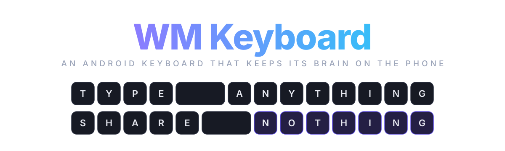
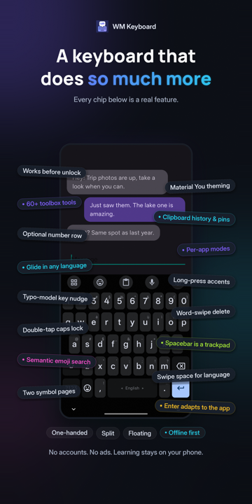
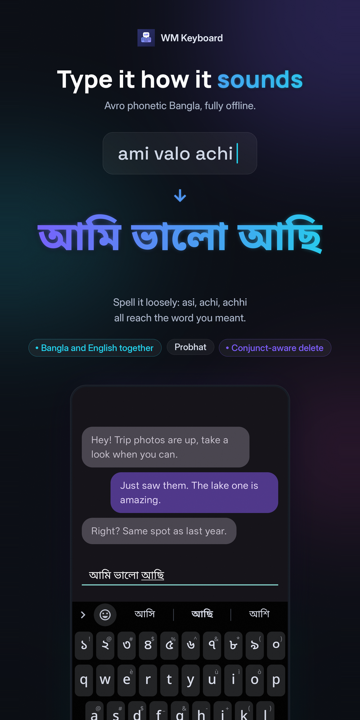
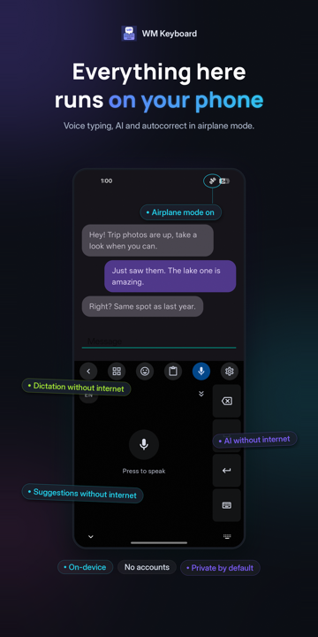
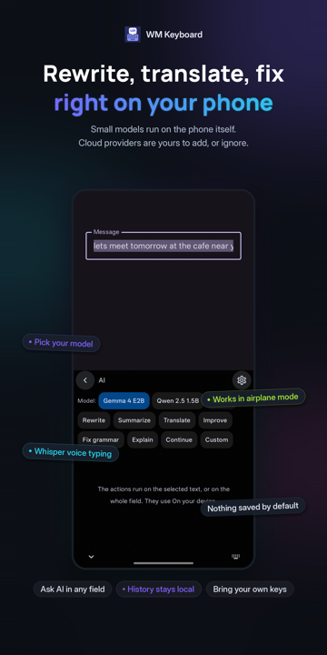
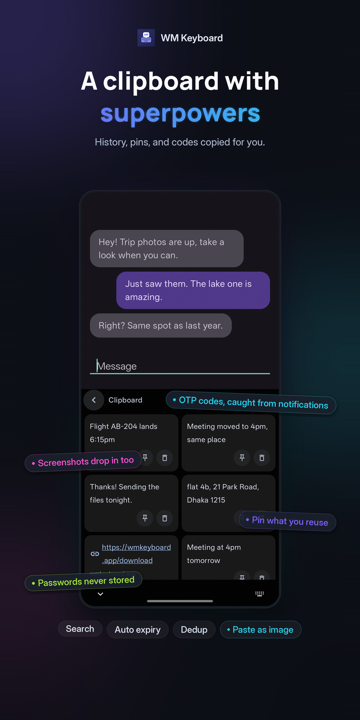
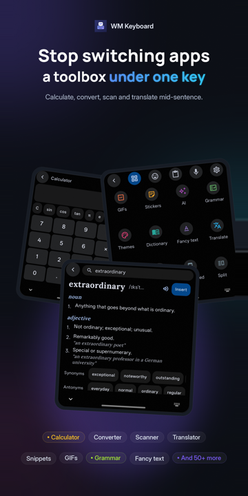
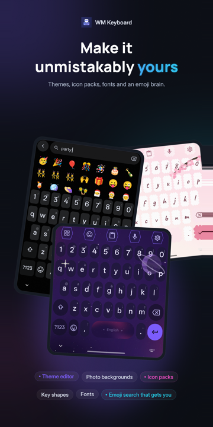
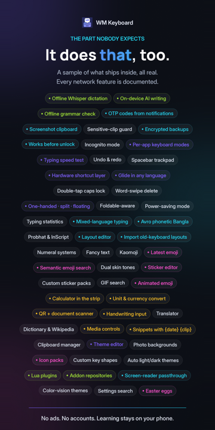

<div align="center">

<picture>
  <source media="(prefers-color-scheme: dark)" srcset=".github/media/banner-dark.svg">
  <source media="(prefers-color-scheme: light)" srcset=".github/media/banner-light.svg">
  
</picture>

### Private. Offline. Yours.

An open source multilingual Android keyboard with prediction, glide typing, transliteration,
emoji search and a 75+ tool toolbox that all run on the phone and never phone home.

<a href="https://github.com/wasi-master/wmkeyboard/releases/latest"></a>
<a href="https://f-droid.org/packages/com.wasimaster.wmkeyboard/"></a>
<a href="https://github.com/wasi-master/wmkeyboard/releases"></a>
<a href="https://github.com/wasi-master/wmkeyboard/actions/workflows/ci.yml"></a>
<a href="https://wmkeyboard.pages.dev"></a>
<a href="LICENSE"></a>

<a href="#install">Install</a> · <a href="#the-tour">Tour</a> · <a href="#languages">Languages</a> · <a href="#privacy">Privacy</a> · <a href="#editions">Editions</a> · <a href="#faq">FAQ</a> · <a href="#build-it-yourself">Build</a> · <a href="https://wmkeyboard.pages.dev"><b>Read the docs</b></a>

<br>

https://github.com/user-attachments/assets/3bd063a9-6701-4ccd-82ef-edd40a42b8e0

</div>

## Why I built this

A keyboard is the one app that sees everything you write. Your messages, your passwords, your
half-typed thoughts you deleted before sending. Somewhere along the way the popular keyboards
decided that was a business model. The prediction got better, and the price for that was a 
copy of your keystrokes getting sent to somebody else's server.

The keyboards that refused that deal were mostly forks of the same decade-old Android code. Good
bones, honest intentions, but no glide typing without a proprietary blob, no real toolbox, and
nothing for the language I actually type in. Bangla was an afterthought everywhere: either a
phonetic engine bolted on with no prediction, or a layout with no smart features behind it.

So I wanted a keyboard that did three things at once. Type Bangla the way Avro taught a whole
country to type it. Carry the features I reach for all day, clipboard, snippets, translate,
calculator, scanner, without leaving the text field. And keep all of that on the phone, where
it belongs. This is that keyboard. It is written from scratch in Kotlin and Jetpack Compose,
keyboard surface included, and the whole intelligence layer runs offline.

## A few screenshots

<table>
  <tr>
    <td></td>
    <td></td>
    <td></td>
    <td></td>
    <td></td>
    <td></td>
    <td></td>
    <td></td>
  </tr>
</table>

## It starts by understanding how you spell

Type a word the way it sounds in Latin letters, and the keyboard finds the word you meant.
Every one of these runs on the device, with no network and no delay.

| You type | You get | Engine |
|---|---|---|
| `ami valo achi` | আমি ভালো আছি | Avro-compatible Bangla phonetic, with a lenient index: `asi`, `achi` and `achhi` all reach আছি |
| `namaste` | नमस्ते | Hindi phonetic with a map of how people actually romanise Hindi |
| `aap kaise ho` | آپ کیسے ہو | Urdu phonetic, folding to the consonant skeleton the script itself spells with |
| `vanakkam`, `nenu`, `3arabi` | Tamil, Telugu, Arabic script | Phonetic layouts for eleven more languages, Arabizi digits included |
| `nihao` | 你好 | Pinyin, including a T9 nine-key variant |
| `konnichiwa` | こんにちは | Romaji to kana with conversion candidates |
| `xin chaof` | xin chào | Vietnamese Telex |

The same prediction engine sits behind every one of them, so glide typing, autocorrect and
next-word suggestions work in Bangla exactly as they do in English. 

## The tour

The features the keyboard has

### Typing

- **Prediction that learns, locally.** A trie-lattice beam decoder shared by tapping and glide,
  n-gram context ranking, and on-device learning of your words, bigrams and trigrams. One tap
  clears all of it.
- **Autocorrect you can argue with.** Corrections are gated by a likelihood ratio rather than a
  blunt threshold, an undo chip appears after each one, and a word you fix by hand is learned.
- **Glide typing in any language** with a word list, no proprietary library. English and Bangla
  ship with lists built in. Downloads cover 330+ more.
- **Gestures everywhere.** Spacebar as a trackpad, swipe backspace to delete words, swipe space
  to switch language, drag a modifier for chords, peek a layer by dragging off shift, and much more!
- **Modes.** One-handed, split, floating, and per-app modes that swap the whole keyboard, toolbar
  included, when a particular app opens.
- **Field awareness.** Enter, the number row, suggestions and learning all adapt to the field:
  passwords, code editors, terminals, URL bars, one-time-code fields.
- **Hardware keyboards** get a hotkey layer, hint overlays and tool shortcuts.

[Typing basics](https://wmkeyboard.pages.dev/typing/basics/) · [Glide](https://wmkeyboard.pages.dev/typing/glide-typing/) · [Gestures](https://wmkeyboard.pages.dev/typing/gestures/) · [Modes](https://wmkeyboard.pages.dev/typing/modes/) · [Autocorrect](https://wmkeyboard.pages.dev/smart/autocorrect/)

### Languages

- **867 languages, 1,700+ layouts** from one data-driven registry: native scripts, InScript
  variants, romanised entries, CJK, minority Cyrillic alphabets, and a dozen constructed ones. A
  fresh install starts in whatever your phone is already set to.
- **Bangla, done properly.** Avro phonetic, Probhat with aspirates on shift, Jatiya, Khipro,
  conjunct-aware backspace, and Bangla-English mixing in one field.
- **CJK input** with composers for pinyin, jyutping, kana and hangul, plus Vietnamese Telex.
- **Layouts you can edit**, build from JSON, or import from FlorisBoard, HeliBoard, FUTO, and Keyman.
- **Odd ones too:** musical notation, braille chording, Morse, fancy-text alphabets, and a
  T9 keypad for languages that had one.

[Languages overview](https://wmkeyboard.pages.dev/languages/overview/) · [Bengali](https://wmkeyboard.pages.dev/languages/bengali/) · [CJK](https://wmkeyboard.pages.dev/languages/cjk/) · [Custom layouts](https://wmkeyboard.pages.dev/languages/custom-layouts/)

### Emoji, GIFs and stickers

- **Semantic emoji search** in 126 languages. `party` finds 🎉 🥳 🍾 🎂, and so does the word
  for party in other languages.
- Emoji 17.0, per-person skin tones, kaomoji, and long-press to send Google's animated emoji.
- Sticker packs you make from your own photos, with a background cutout that runs on device.
  WhatsApp and Signal packs import directly.
- GIF search when you want it, off when you don't.

[Emoji picker](https://wmkeyboard.pages.dev/emoji/picker/) · [Stickers](https://wmkeyboard.pages.dev/emoji/stickers/)

### The toolbox

77 tools sit one tap behind the toolbar, and you drag the ones you use onto it. Most of them
work in airplane mode.

| | |
|---|---|
| **Text** | Clipboard with history, pins, search and screenshot capture. Snippets with `{date}` and `{clip}` variables. Text expansion. Undo and redo. Selection mode. A trackpad. Fancy text. |
| **Numbers** | A calculator in the suggestion strip. Unit and currency conversion. Calendars. |
| **Words** | Dictionary and Wikipedia lookup. Translate, on device in the Full edition. Grammar check with Harper, fully offline. Vocabulary practice. |
| **Camera** | Text scan (OCR, ML Kit or Tesseract for 100+ languages). QR and barcode. Document scanner. |
| **Phone** | Media controls. An app launcher. KDE Connect. Flashlight. One-time codes caught from notifications. |
| **Voice** | Android's recogniser with a continuous mode, or offline Whisper with a catalog of 29 models. |
| **Writing** | AI rewrite, summarise, translate and fix. On-device with a local model, or bring your own key for any provider that speaks the OpenAI shape. Nothing is enabled behind your back. |

[The toolbar](https://wmkeyboard.pages.dev/tools/overview/) · [Clipboard](https://wmkeyboard.pages.dev/tools/clipboard/) · [Whisper](https://wmkeyboard.pages.dev/tools/whisper/) · [AI tools](https://wmkeyboard.pages.dev/tools/ai/)

### Themes

- A full theme editor: palettes, fonts per script, key shapes, textures, decals, particles,
  photo backgrounds, per-key styles, with a live preview while you edit.
- Material You, AMOLED, and 29 built-in themes across 11 families, including Dracula, Nord,
  Solarized, Catppuccin and Tokyo Night.
- Icon packs, sound packs, and themes that export as files you can share.

[Themes](https://wmkeyboard.pages.dev/themes/overview/) · [The editor](https://wmkeyboard.pages.dev/themes/editor/)

### Privacy

The typing engine has no network code in it. Prediction, autocorrect, glide, layouts and
learning behave identically with the radio off.

- No analytics SDK, no crash reporting, no account, and no server of mine for the app to reach.
- Learned words, clipboard history and typing stats live in app storage and wipe in one tap.
- Password and secure fields turn off learning, suggestions and clipboard capture on their own.
  Incognito mode does the same on demand, and follows private browsing automatically.
- Every tool that touches the network says so on its own settings page and stays off until you
  open it. A network activity log shows every request the keyboard has made.
- Backups can be encrypted with a passphrase and written wherever you point them.
- The one exception worth naming: handwriting and the scanners in the Full edition are built on
  Google's ML Kit, which reports its own diagnostics to Google. The Lite edition carries no
  Google library at all, and a build flag can remove the internet permission entirely.

[Privacy at a glance](https://wmkeyboard.pages.dev/privacy/overview/) · [Network policy](https://wmkeyboard.pages.dev/privacy/network/) · [Your data on device](https://wmkeyboard.pages.dev/privacy/data/)

### Extend it

- **Addon repositories** serve 14 kinds of addon: themes, layouts, dictionaries, icon packs,
  sound packs, sticker packs and more. Host your own with a static JSON file.
- **Lua plugins** run sandboxed inside the keyboard and can add whole new tools, with a
  permission model and an in-app IDE.
- **Automation intents** let Tasker and friends switch layouts, modes and languages.

[Addons](https://wmkeyboard.pages.dev/addons/overview/) · [Plugins](https://wmkeyboard.pages.dev/plugins/overview/) · [Repository format](https://wmkeyboard.pages.dev/development/addon-repos/repo-format/)

<details>
<summary><b>The full inventory, if you want numbers</b></summary>

<br>

<a href="FEATURES.md"><code>FEATURES.md</code></a> tracks the surface across 12 areas, three levels deep.

| Area | Families | Features | Capabilities |
|---|---:|---:|---:|
| Typing core: prediction, autocorrect, learning, spell check | 9 | 50 | 205 |
| Input behaviour: glide, gestures, cursor, editing, keys | 11 | 80 | 219 |
| Languages, scripts, layouts, transliteration | 11 | 64 | 213 |
| Themes and appearance | 14 | 73 | 183 |
| Emoji, GIFs, stickers, kaomoji | 16 | 88 | 94 |
| Toolbar and the tool set | 10 | 85 | 311 |
| Clipboard, snippets, text expansion | 7 | 37 | 191 |
| AI, voice, handwriting, scanning | 11 | 70 | 162 |
| Privacy, backup, storage, statistics | 14 | 69 | 173 |
| Accessibility, form factors, platform integration | 13 | 61 | 111 |
| Extensibility: addons, plugins, imports, formats | 5 | 35 | 164 |
| Modes, rows, field adaptation, runtime | 12 | 97 | 203 |
| **Total** | **133** | **807** | **2,229** |

Entries marked `RARE` there are things few or no mainstream keyboards ship. There are over 400.

</details>

## Editions

One codebase, two APKs. Everything about typing, prediction, themes, languages and privacy is
identical. What differs is which on-device machine learning ships in the box.

| | Full | Lite |
|---|:---:|:---:|
| Handwriting, text scan, QR and document scanner | ✓ | |
| Grammar check (Harper) | ✓ | |
| Offline Whisper dictation | ✓ | |
| On-device local LLM | ✓ | |
| Google libraries on the compile classpath | ML Kit, LiteRT | none |
| APK, `arm64-v8a`, English UI | 85 MB | 12 MB |
| APK, `arm64-v8a`, all 48 UI languages | 132 MB | 57 MB |
| On F-Droid | | ✓ |

Sizes are from 0.5.12 and drift with dependencies. The UI-language choice only affects the
words the settings app shows you. Every layout and dictionary is in both.

[Full vs Lite](https://wmkeyboard.pages.dev/start/editions/)

## Install

<p>
<a href="https://f-droid.org/packages/com.wasimaster.wmkeyboard/"></a>
<a href="https://github.com/wasi-master/wmkeyboard/releases/latest"></a>
<a href="https://apps.obtainium.imranr.dev/redirect?r=obtainium://add/https://github.com/wasi-master/wmkeyboard"></a>
</p>

- **F-Droid** carries the Lite edition, built from source and checked byte-for-byte against the
  `-fdroid.apk` on the matching GitHub release.
- **GitHub releases** carry both editions, each in English-only and all-languages builds, for
  `arm64-v8a`, `armeabi-v7a`, `x86_64` and a universal APK. Almost every phone made since 2017
  wants `arm64-v8a`. A `SHA256SUMS.txt` sits next to them.
- **Obtainium** tracks the GitHub releases and updates you automatically. The release APKs also
  carry their own update check, which asks GitHub and shows a card on the Home screen.
- **Google Play** is coming.

Install the APK, open the app, follow the setup card. Android will warn you that a third-party
keyboard can see what you type. It says that about every keyboard, Gboard included, because that
is what a keyboard is. F-Droid and GitHub builds share a signing key from 0.5.10 on, so moving
between them is an ordinary update.

Needs Android 7.0 or newer.

[Installation](https://wmkeyboard.pages.dev/start/installation/) · [Setup](https://wmkeyboard.pages.dev/start/setup/) · [A two-minute tour](https://wmkeyboard.pages.dev/start/tour/)

## FAQ

<details>
<summary><b>Is anything sent to the cloud?</b></summary>
<br>
Not by typing, ever. Prediction, autocorrect, glide and the dictionaries all run on the device,
and there is no analytics SDK in the app. What needs the internet is a handful of tools that are
online services by nature: weather, translate (unless you download the on-device languages),
currency rates, Wikipedia, GIF search, web search, and any AI provider you set up with your own
key. Each one makes a request only while you are using it. Link previews are the one opt-in
background fetch, and it is off by default. <a href="https://wmkeyboard.pages.dev/privacy/network/">Network policy</a> lists every request, tool by tool.
</details>

<details>
<summary><b>Full or Lite?</b></summary>
<br>
Lite if you are short on storage or do not need handwriting, scanning, grammar check, offline
Whisper or the local LLM. Full for everything. They share a package name and a signing key, so
installing one over the other keeps all your data.
</details>

<details>
<summary><b>Why doesn't glide typing work in my language?</b></summary>
<br>
It has no word list installed yet. A swipe is decoded against the active language's dictionary.
English and Bangla ship with one. Every other language downloads its list from the language's
own settings page, and the suggestion strip offers the download the first time you need it.
</details>

<details>
<summary><b>Android says "install unknown apps" or Play Protect complains.</b></summary>
<br>
Standard behaviour for any APK from outside Google Play. Grant the install permission to
whichever app you opened the file with. If you would rather not, F-Droid installs it for you.
</details>

<details>
<summary><b>Does it use much battery or memory?</b></summary>
<br>
Very little. Nothing runs in the background out of the box. The heaviest things it can hold are
a Whisper model and a local LLM, and both are released the moment Android signals memory
pressure. A dedicated power-saving mode trims per-keystroke work further and can follow
Android's battery saver.
</details>

<details>
<summary><b>Where are my learned words, and how do I wipe them?</b></summary>
<br>
In a plain JSON file in the app's private storage. The Personal dictionary screen lets you
delete them one at a time. Privacy → Your data → Learned words wipes all 13 learning files in
one pass, and a running keyboard drops its in-memory copies the moment you close it.
</details>

<details>
<summary><b>I installed from F-Droid before 0.5.12 and it won't update.</b></summary>
<br>
Those builds were signed with F-Droid's own key, and Android will not update across keys.
Export a backup, uninstall, reinstall from F-Droid, import the backup. Every update after that
is ordinary.
</details>

The docs have a [longer FAQ](https://wmkeyboard.pages.dev/start/faq/) and a
[troubleshooting page](https://wmkeyboard.pages.dev/reference/troubleshooting/).

## Documentation

**<a href="https://wmkeyboard.pages.dev">wmkeyboard.pages.dev</a>** is the full manual: pages
with screenshots, a settings reference for every screen, and a "verify every claim in code" rule
for the people who write it. The [wiki](https://github.com/wasi-master/wmkeyboard/wiki) mirrors
the same pages for reading on GitHub.

| Start here | Go deeper |
|---|---|
| [Install and set up](https://wmkeyboard.pages.dev/start/installation/) | [Architecture](https://wmkeyboard.pages.dev/development/architecture/) |
| [A two-minute tour](https://wmkeyboard.pages.dev/start/tour/) | [Building from source](https://wmkeyboard.pages.dev/development/building/) |
| [Languages and layouts](https://wmkeyboard.pages.dev/languages/overview/) | [Dictionary formats](https://wmkeyboard.pages.dev/development/dictionaries/) |
| [The toolbar](https://wmkeyboard.pages.dev/tools/overview/) | [Plugin API](https://wmkeyboard.pages.dev/plugins/api-reference/) |
| [Privacy](https://wmkeyboard.pages.dev/privacy/overview/) | [Hosting an addon repository](https://wmkeyboard.pages.dev/development/addon-repos/repo-format/) |
| [Settings reference](https://wmkeyboard.pages.dev/reference/settings/) | [File formats](https://wmkeyboard.pages.dev/reference/file-formats/) |

The source lives in [`docs/`](docs/) and runs on Astro Starlight. `npm run dev` in that folder
gives you a local preview.

## Community

- **Bugs and feature requests:** [GitHub issues](https://github.com/wasi-master/wmkeyboard/issues).
  The About screen in the app has a Report a bug row that pre-fills one, and a bot turns a
  release crash trace into a readable one on your issue within a couple of minutes.
- **Questions and ideas:** [GitHub Discussions](https://github.com/wasi-master/wmkeyboard/discussions).
- **Chat:** [t.me/WasiMaster](https://t.me/WasiMaster) on Telegram.
- **Anything you would rather not or can't post publicly:** [arianmollik323@gmail.com](mailto:arianmollik323@gmail.com).
  Security reports go through [private vulnerability reporting](SECURITY.md).

## Build it yourself

You need a JDK 17 or newer to launch Gradle, and the Android SDK with compileSdk 36.1. Gradle
provisions its own toolchain through Foojay on the first build. Android Studio's bundled JBR works
well as `JAVA_HOME`.

```bash
./gradlew assembleFullIntlDebug   # every feature, every UI language
```

```bash
./gradlew assembleLiteEnDebug     # fewer tools, English UI, small
```

```bash
./gradlew unitTests               # the whole suite, ~7,000+ tests
```

```bash
./gradlew staticAnalysis          # detekt + Android Lint, 20+ minutes
```

The task name is the edition, then the UI-language build, then the build type. Two flags in
`local.properties` matter: the build channel (Play versus direct download), which decides
whether the ML models and LLM runtime ship inside the APK or download on demand, and a
no-internet switch that strips the permission entirely.

<details>
<summary><b>Project layout</b></summary>

<br>

27 Gradle modules, layered bottom-up. Every dependency points downward, and the engines under
`core/` keep `android.*` out of the files that do the real work, so they test on a plain JVM.

```
app/                  Settings app, manifest, resources, bundled assets, most unit tests
feature/
├── ime/              WMKeyboardService and the Compose keyboard UI (the keyboard itself)
├── addons/           Addon install, reconcile, download
├── tools/            Network tool clients: AI, GIF and sticker, search, link preview
├── llm/              On-demand LiteRT-LM runtime (Play channel only)
├── translate/        On-demand ML Kit translator (Play channel only)
├── litert/           On-demand LiteRT interpreter: offline Whisper, sticker cutout
└── handwriting/      On-demand ML Kit ink recogniser
core/
├── settings/         SettingsRepository (DataStore), KeyboardSettings, modes, power saving
├── intelligence/     Grammar (Harper JNI), local LLM, handwriting, spell checker service
├── feedback/         Key sounds and haptics
├── voice/            SpeechRecognizer plus offline Whisper dictation
├── plugins/          Lua plugin sandbox
├── addons/           Addon store and repository data layer
├── content/          Clipboard, snippets, fonts, media, stickers
├── tools/            Offline tool engines: calc, units, currency, symbols, calendars
├── kdeconnect/       KDE Connect client
├── icons/            Icon packs and the SVG parser
├── theme/            ThemeSpec, palettes, rendering
├── emoji/            Catalog loader, semantic search, usage tracking
├── prediction/       Trie, SuggestionEngine, UserLexicon, dictionaries, gestures
├── input/            Composers (CJK, cluster scripts) and the input pipeline
├── keyman/           Keyman keyboard import
├── language/         Scripts, layouts, transliteration
├── common/           Utilities, direct boot, debug log, shared contracts
└── config/           Build flags and API keys
tools/dictc/          Host-side dictionary compiler, shares :core:prediction sources
native/               Rust sources for the Harper grammar bridge
docs/                 The documentation site (Astro Starlight)
```

</details>

[Building](https://wmkeyboard.pages.dev/development/building/) · [Testing](https://wmkeyboard.pages.dev/development/testing/) · [Architecture](https://wmkeyboard.pages.dev/development/architecture/)

## Contributing

The easiest first contributions are testing out the app and submitting bug reports or feature
requests, not code. You can also update the data which lives in a companion repository,
[wasi-master/wmkeyboard-data](https://github.com/wasi-master/wmkeyboard-data):

- A word list for a language that has none, or a better one for a language that does.
- Emoji keywords in your language.
- A theme, a layout you miss from another keyboard, an icon pack.

For code: commits follow Conventional Commits, `type(scope): summary`. Run `unitTests` and
`staticAnalysis` before you open a pull request, since CI runs only the first. Open an issue
first for anything larger than a fix so we can agree on the shape of it.

[Contributing guide](https://wmkeyboard.pages.dev/development/contributing/)

## Credits

WM Keyboard stands on a lot of open work. The in-app About screen carries the full licence text
for each of these, and [`app/src/main/assets/licenses/`](app/src/main/assets/licenses/) holds
the same files.

- [Harper](https://github.com/Automattic/harper) for offline grammar checking, bridged from Rust.
- [whisper.cpp](https://github.com/ggml-org/whisper.cpp) and whisper-android for offline dictation.
- Google ML Kit and LiteRT for handwriting, scanning, on-device translation and the local LLM runtime, in the Full edition.
- [Tesseract](https://github.com/tesseract-ocr/tesseract) and Leptonica for OCR beyond the languages ML Kit covers.
- [Gemoji](https://github.com/github/gemoji), [KEmoji](https://invent.kde.org/libraries/kemoji) and Unicode CLDR for emoji names and keywords. [Noto](https://notofonts.github.io/) for fonts and animated emoji.
- [Keyman](https://keyman.com) for the keyboard import format, and [Khipro](https://khipro.khiproteam.com/) for the Bangla layout of the same name.
- [LuaJ](https://github.com/luaj/luaj) for the plugin sandbox. [Bouncy Castle](https://www.bouncycastle.org/) for backup encryption.
- Dracula, Nord, Solarized, Catppuccin and Tokyo Night for the palettes behind five built-in themes.
- The word-frequency lists, offensive-word lists and jyutping tables listed in `wordlist-sources.txt`, redistributed under their own licences.

## How this was made

This keyboard was developed entirely by me, with the assistance of Generative AI for certain planning tasks and more tedious aspects of the development process.

For most features, I write the code myself, occasionally using AI-assisted code completion within my editor. For more complex features, I use Claude Code with Anthropic’s frontier models to assist with planning and, where appropriate, generate boilerplate code. For particularly repetitive or time-consuming tasks, I may delegate the implementation to Claude Code in its entirety.

Regardless of how AI is used, I remain involved throughout the development process. I review everything it generates, make the necessary decisions and adjustments, and test the resulting implementation whenever possible. AI is an assistant in the workflow, not a replacement for my involvement or responsibility for the code.

If AI-assisted code is a boundary you are unwilling to cross, I completely respect that position. There are some quite good keyboards developed without AI assistance. However, I believe it is increasingly difficult to disregard AI as a valuable and increasingly integral part of modern software development workflows. Whether we welcome it or not, AI-assisted development is here to stay.

## License

MIT. See [LICENSE](LICENSE).
