# Screenshot review

103 shots taken, 220 still to go. Generated by `review.py` — re-run it after any import to pick up new shots.

**How to use this:** open in a Markdown preview, scan the contact sheet, click a thumbnail to jump to its details. Tick the **retake** checkbox under anything that looks wrong, save the file, then run:

```bash
python3 docs/screenshots/retake.py
```

That reads the ticked boxes and hands you the guide + import commands for exactly those shots. Retaking overwrites the image in place — the page already points at that path, so nothing else has to change.

## Contact sheet

### accessibility/  (5)

<table>
<tr>
<td align="center" width="190"><a href="#shot-accessibility-vision-group">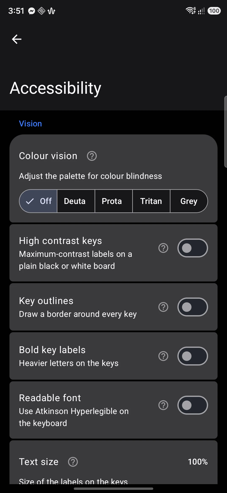</a></td>
<td align="center" width="190"><a href="#shot-accessibility-screen-reader-modes">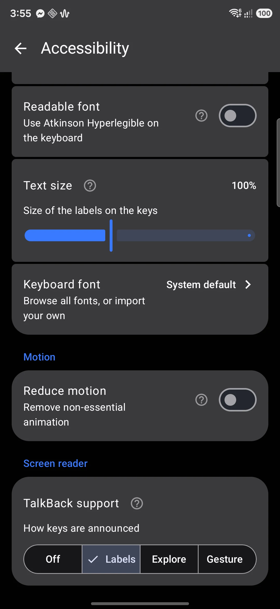</a></td>
<td align="center" width="190"><a href="#shot-accessibility-high-contrast-live">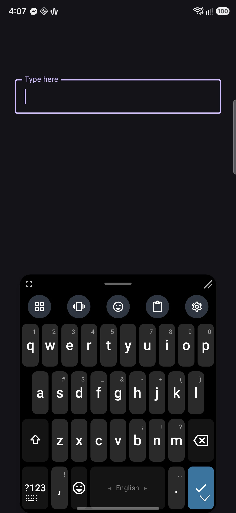</a></td>
<td align="center" width="190"><a href="#shot-accessibility-color-vision-live">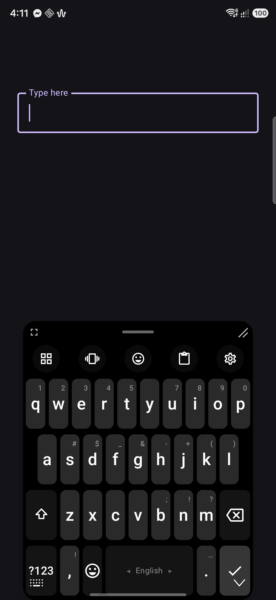</a></td>
</tr>
<tr>
<td align="center"><sub><code>vision-group</code></sub></td>
<td align="center"><sub><code>screen-reader-modes</code></sub></td>
<td align="center"><sub><code>high-contrast-live</code></sub></td>
<td align="center"><sub><code>color-vision-live</code></sub></td>
</tr>
<tr>
<td align="center" width="190"><a href="#shot-accessibility-touch-group">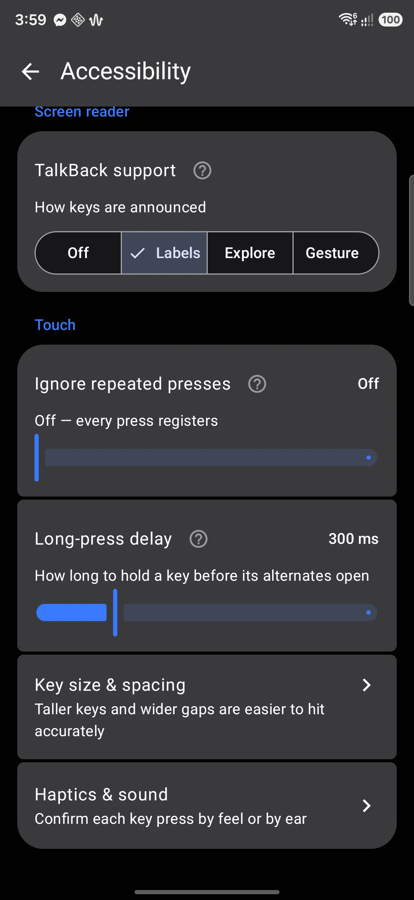</a></td>
</tr>
<tr>
<td align="center"><sub><code>touch-group</code></sub></td>
</tr>
</table>

### emoji/  (2)

<table>
<tr>
<td align="center" width="190"><a href="#shot-emoji-settings-overview">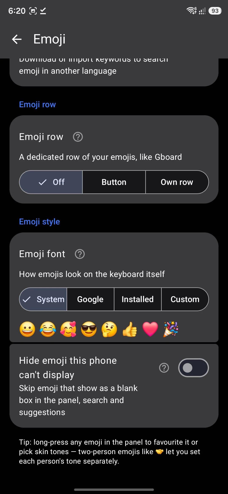</a></td>
<td align="center" width="190"><a href="#shot-emoji-keyword-packs"></a></td>
</tr>
<tr>
<td align="center"><sub><code>settings-overview</code></sub></td>
<td align="center"><sub><code>keyword-packs</code></sub></td>
</tr>
</table>

### privacy/  (10)

<table>
<tr>
<td align="center" width="190"><a href="#shot-privacy-backup-restore-screen">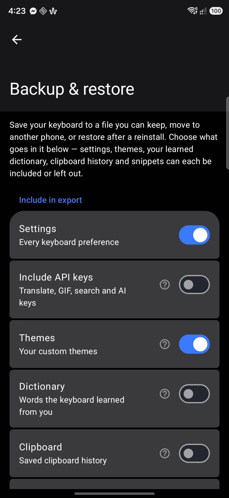</a></td>
<td align="center" width="190"><a href="#shot-privacy-backup-import-confirm">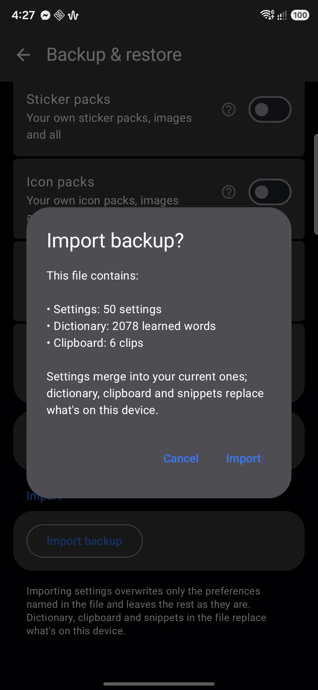</a></td>
<td align="center" width="190"><a href="#shot-privacy-on-device-learning-toggles"></a></td>
<td align="center" width="190"><a href="#shot-privacy-clear-learned-words-button">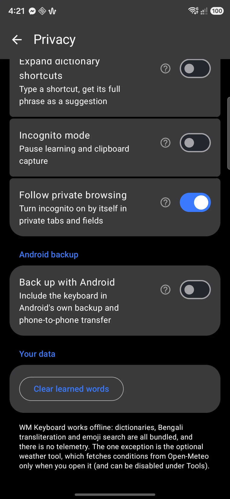</a></td>
</tr>
<tr>
<td align="center"><sub><code>backup-restore-screen</code></sub></td>
<td align="center"><sub><code>backup-import-confirm</code></sub></td>
<td align="center"><sub><code>on-device-learning-toggles</code></sub></td>
<td align="center"><sub><code>clear-learned-words-button</code></sub></td>
</tr>
<tr>
<td align="center" width="190"><a href="#shot-privacy-secure-field-no-suggestions"></a></td>
<td align="center" width="190"><a href="#shot-privacy-clipboard-settings-passwords">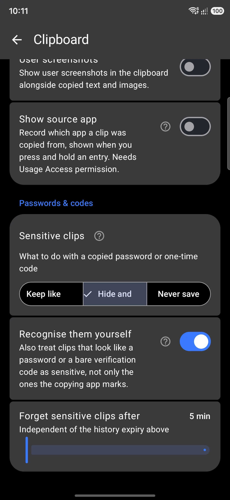</a></td>
<td align="center" width="190"><a href="#shot-privacy-tools-enabled-switches"></a></td>
<td align="center" width="190"><a href="#shot-privacy-ai-ollama-plain-http">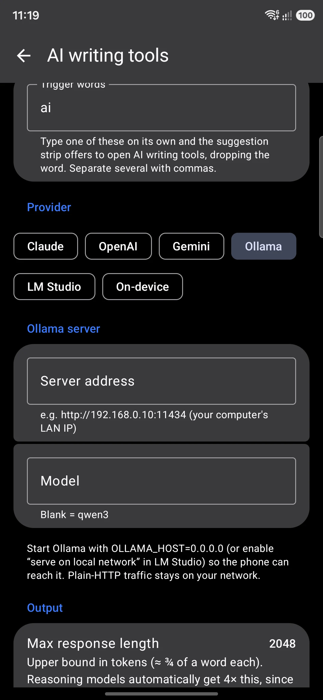</a></td>
</tr>
<tr>
<td align="center"><sub><code>secure-field-no-suggestions</code></sub></td>
<td align="center"><sub><code>clipboard-settings-passwords</code></sub></td>
<td align="center"><sub><code>tools-enabled-switches</code></sub></td>
<td align="center"><sub><code>ai-ollama-plain-http</code></sub></td>
</tr>
<tr>
<td align="center" width="190"><a href="#shot-privacy-privacy-screen-groups">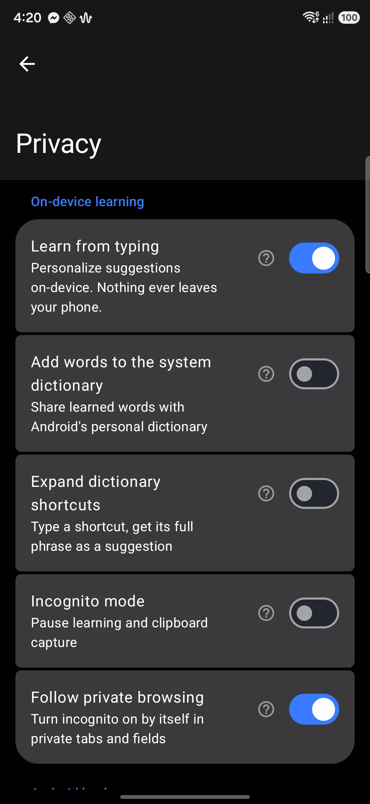</a></td>
<td align="center" width="190"><a href="#shot-privacy-smart-chips-currency-toggle">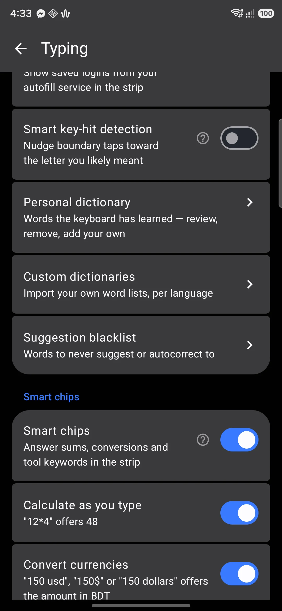</a></td>
</tr>
<tr>
<td align="center"><sub><code>privacy-screen-groups</code></sub></td>
<td align="center"><sub><code>smart-chips-currency-toggle</code></sub></td>
</tr>
</table>

### reference/  (25)

<table>
<tr>
<td align="center" width="190"><a href="#shot-reference-settings-deep-link-destination">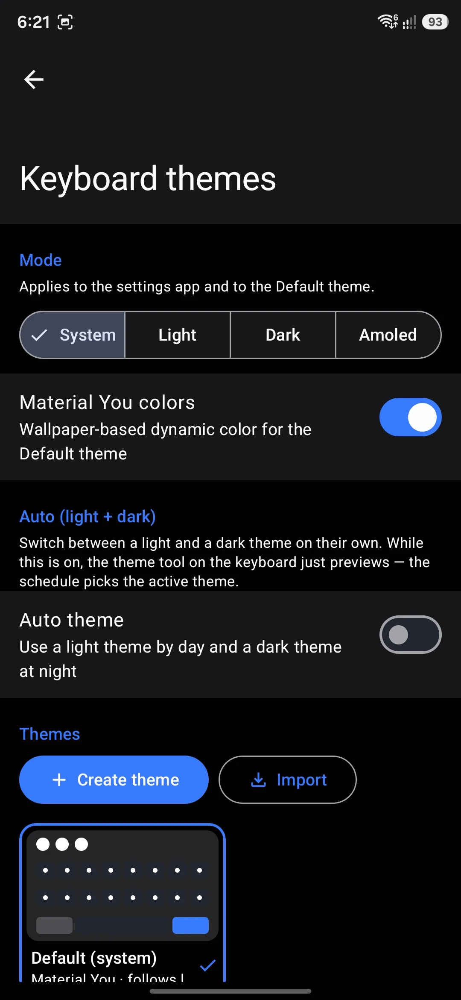</a></td>
<td align="center" width="190"><a href="#shot-reference-gestures-typing-screen">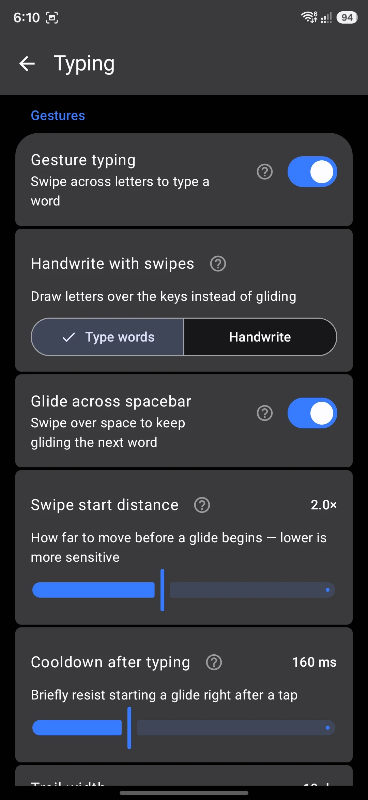</a></td>
<td align="center" width="190"><a href="#shot-reference-settings-home-screen">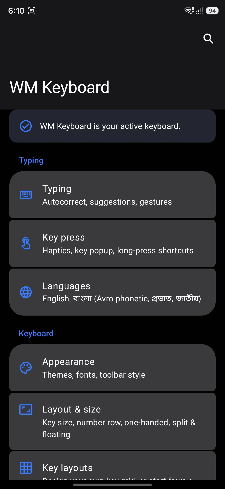</a></td>
<td align="center" width="190"><a href="#shot-reference-settings-search-results">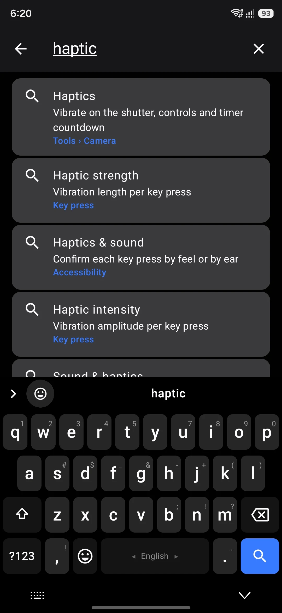</a></td>
</tr>
<tr>
<td align="center"><sub><code>settings-deep-link-destination</code></sub></td>
<td align="center"><sub><code>gestures-typing-screen</code></sub></td>
<td align="center"><sub><code>settings/home-screen</code></sub></td>
<td align="center"><sub><code>settings/search-results</code></sub></td>
</tr>
<tr>
<td align="center" width="190"><a href="#shot-reference-settings-accessibility-vision-group">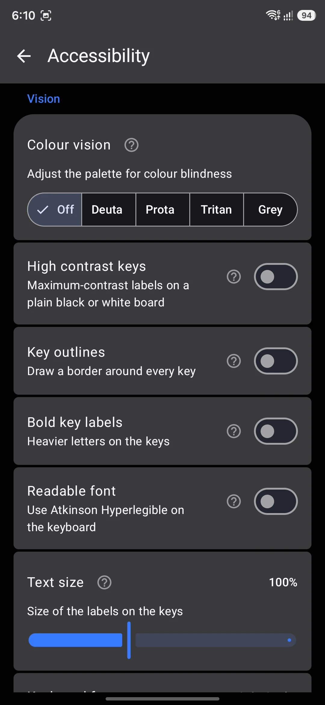</a></td>
<td align="center" width="190"><a href="#shot-reference-settings-backup-screen">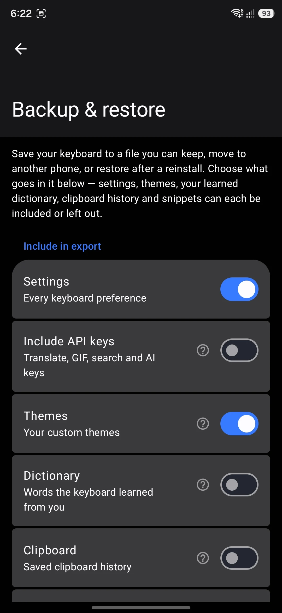</a></td>
<td align="center" width="190"><a href="#shot-reference-settings-dictionary-personal">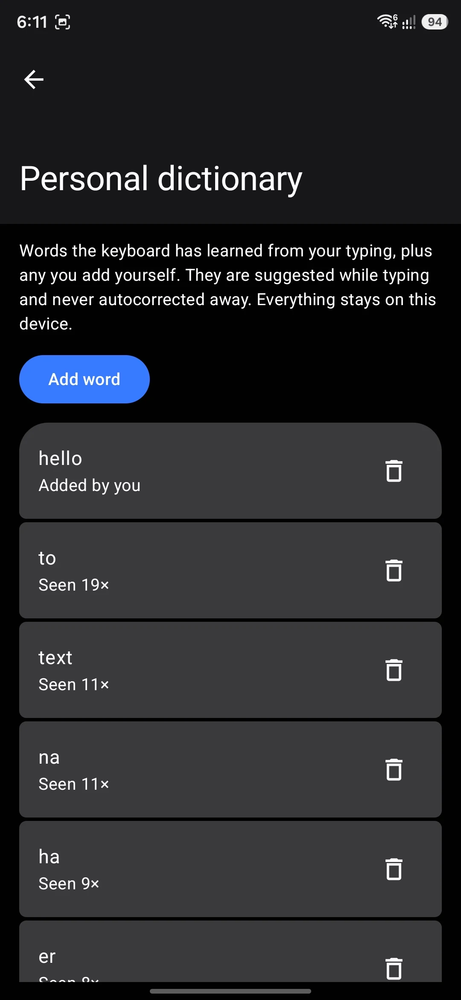</a></td>
<td align="center" width="190"><a href="#shot-reference-settings-dictionary-custom">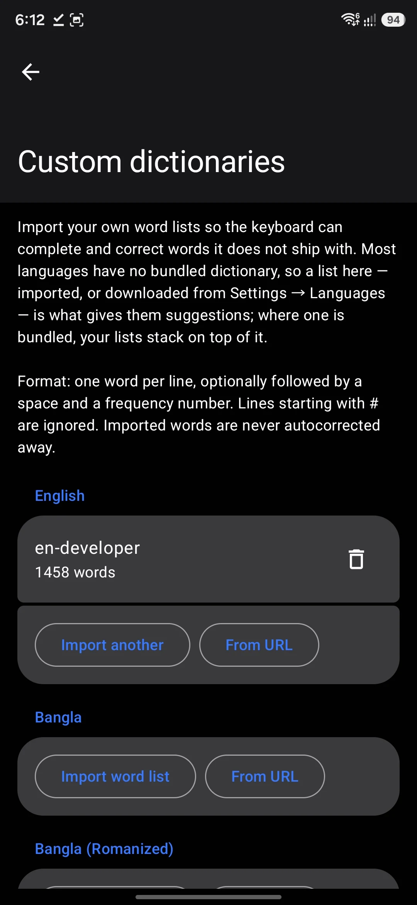</a></td>
</tr>
<tr>
<td align="center"><sub><code>settings/accessibility-vision-group</code></sub></td>
<td align="center"><sub><code>settings/backup-screen</code></sub></td>
<td align="center"><sub><code>settings/dictionary-personal</code></sub></td>
<td align="center"><sub><code>settings/dictionary-custom</code></sub></td>
</tr>
<tr>
<td align="center" width="190"><a href="#shot-reference-settings-dictionary-blacklist">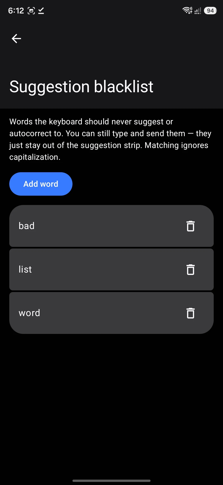</a></td>
<td align="center" width="190"><a href="#shot-reference-settings-dictionary-emoji-keywords">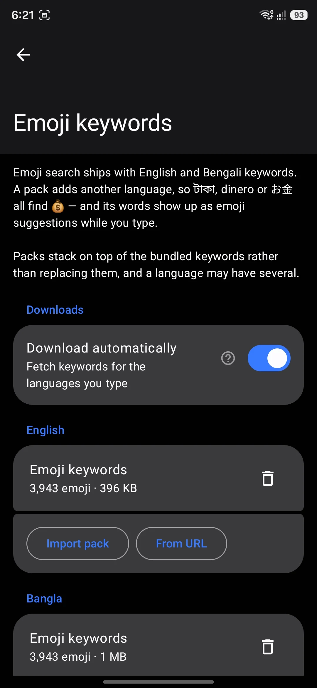</a></td>
<td align="center" width="190"><a href="#shot-reference-settings-themes-gallery-overview">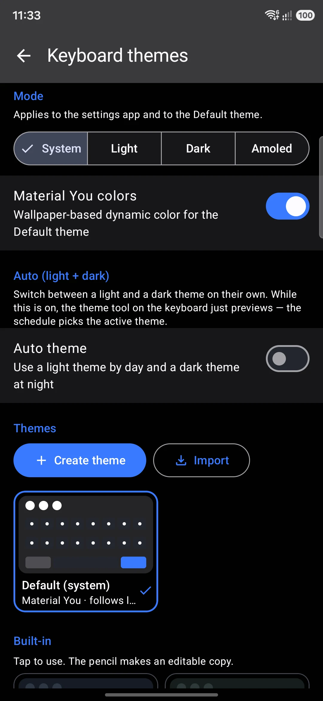</a></td>
<td align="center" width="190"><a href="#shot-reference-settings-themes-auto-schedule">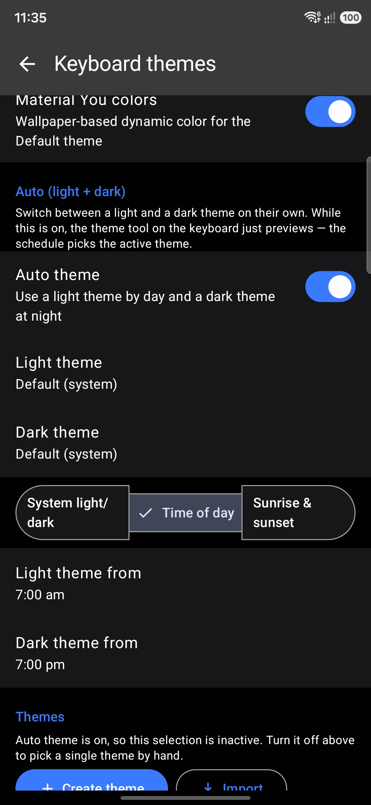</a></td>
</tr>
<tr>
<td align="center"><sub><code>settings/dictionary-blacklist</code></sub></td>
<td align="center"><sub><code>settings/dictionary-emoji-keywords</code></sub></td>
<td align="center"><sub><code>settings/themes-gallery-overview</code></sub></td>
<td align="center"><sub><code>settings/themes-auto-schedule</code></sub></td>
</tr>
<tr>
<td align="center" width="190"><a href="#shot-reference-settings-themes-delete-confirm"></a></td>
<td align="center" width="190"><a href="#shot-reference-settings-themes-editor-overview"></a></td>
<td align="center" width="190"><a href="#shot-reference-settings-themes-editor-crop"></a></td>
<td align="center" width="190"><a href="#shot-reference-settings-themes-editor-crop-still">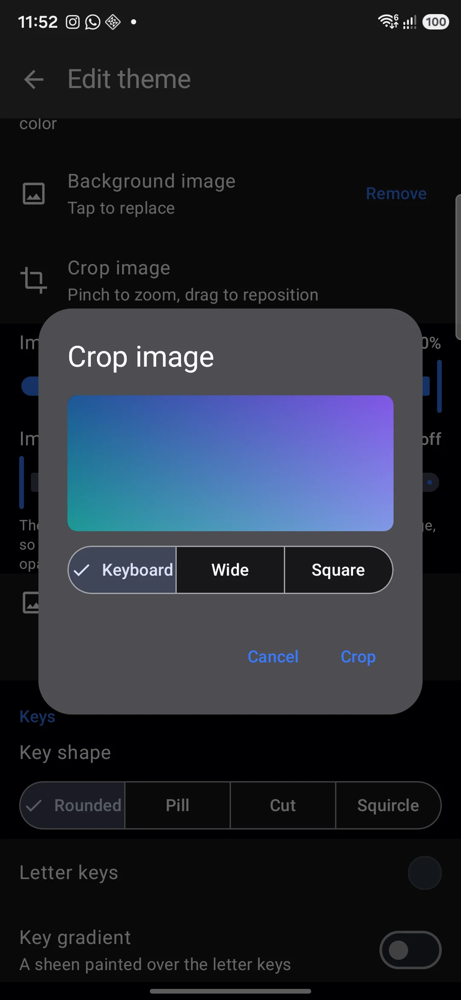</a></td>
</tr>
<tr>
<td align="center"><sub><code>settings/themes-delete-confirm</code></sub></td>
<td align="center"><sub><code>settings/themes-editor-overview</code></sub></td>
<td align="center"><sub><code>settings/themes-editor-crop</code></sub></td>
<td align="center"><sub><code>settings/themes-editor-crop-still</code></sub></td>
</tr>
<tr>
<td align="center" width="190"><a href="#shot-reference-settings-tools-list"></a></td>
<td align="center" width="190"><a href="#shot-reference-settings-tool-detail-top">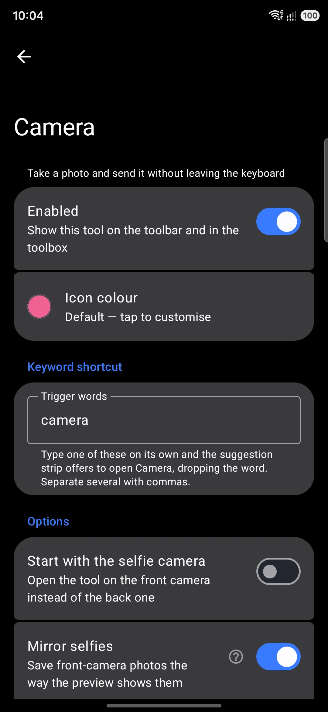</a></td>
<td align="center" width="190"><a href="#shot-reference-settings-typing-overview">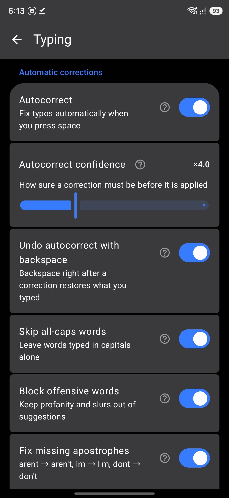</a></td>
<td align="center" width="190"><a href="#shot-reference-settings-typing-suggestions-group">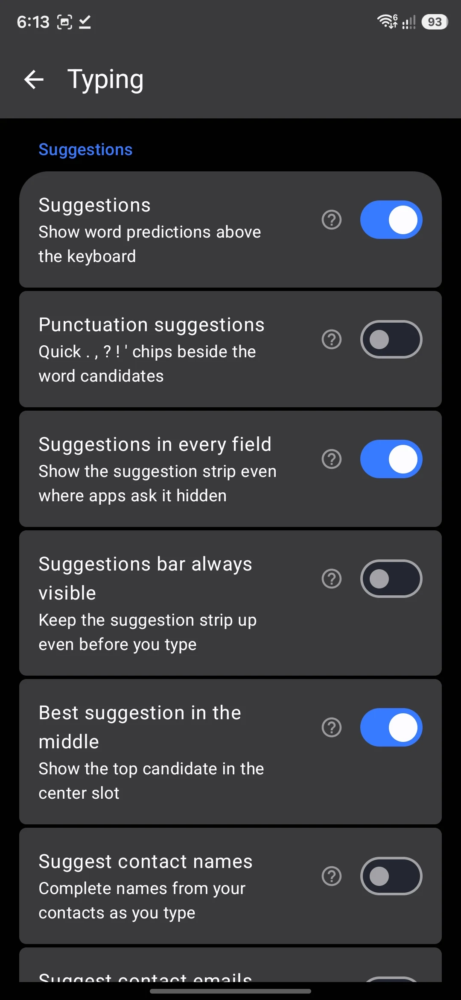</a></td>
</tr>
<tr>
<td align="center"><sub><code>settings/tools-list</code></sub></td>
<td align="center"><sub><code>settings/tool-detail-top</code></sub></td>
<td align="center"><sub><code>settings/typing-overview</code></sub></td>
<td align="center"><sub><code>settings/typing-suggestions-group</code></sub></td>
</tr>
<tr>
<td align="center" width="190"><a href="#shot-reference-settings-typing-smart-chips-group">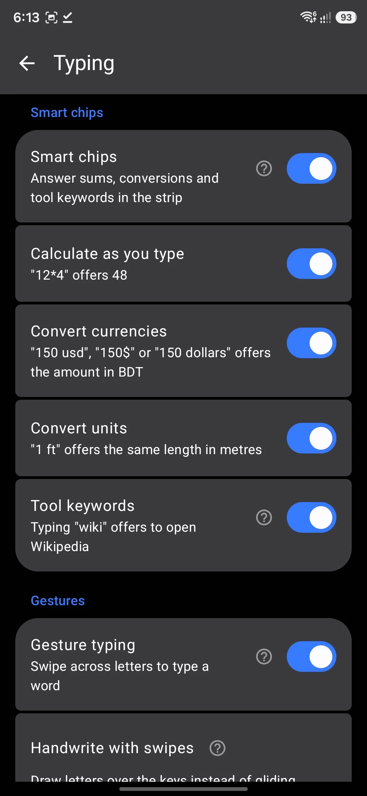</a></td>
<td align="center" width="190"><a href="#shot-reference-settings-typing-gestures-group">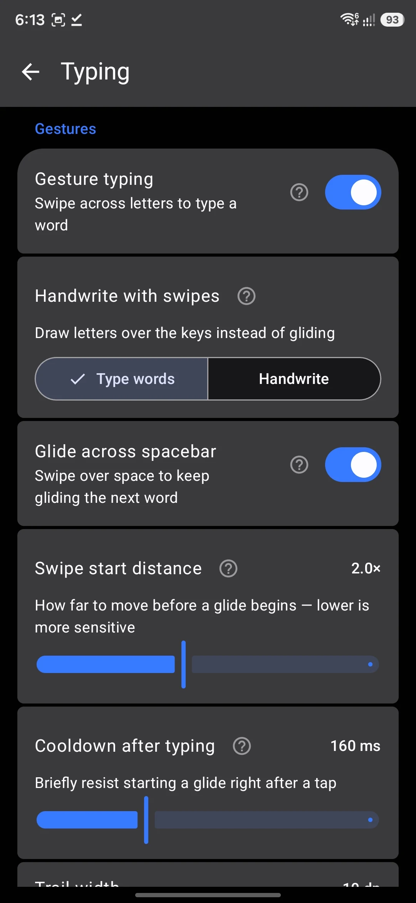</a></td>
<td align="center" width="190"><a href="#shot-reference-settings-typing-volume-keys-group">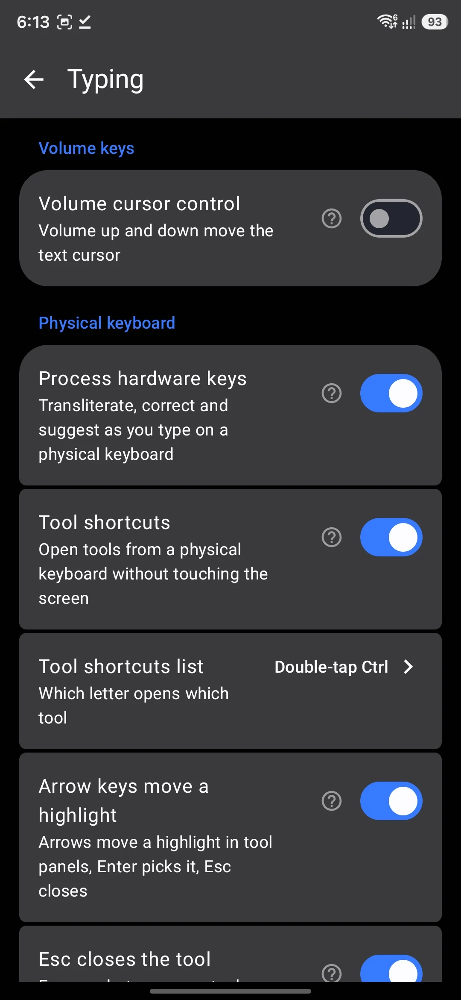</a></td>
<td align="center" width="190"><a href="#shot-reference-settings-typing-physical-keyboard-group">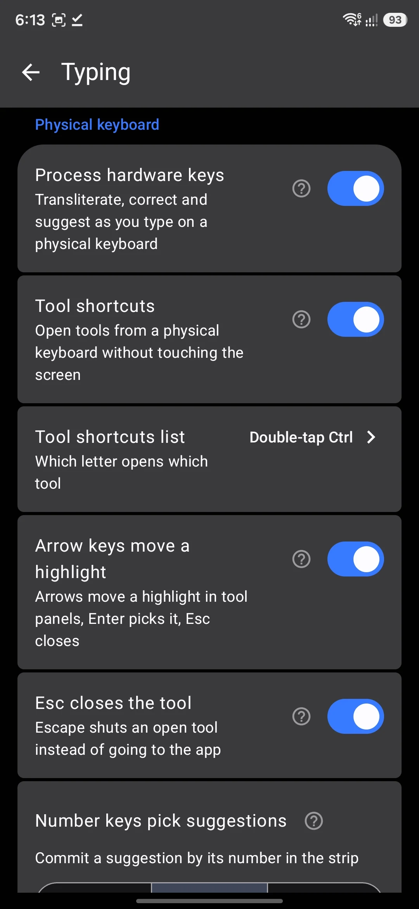</a></td>
</tr>
<tr>
<td align="center"><sub><code>settings/typing-smart-chips-group</code></sub></td>
<td align="center"><sub><code>settings/typing-gestures-group</code></sub></td>
<td align="center"><sub><code>settings/typing-volume-keys-group</code></sub></td>
<td align="center"><sub><code>settings/typing-physical-keyboard-group</code></sub></td>
</tr>
<tr>
<td align="center" width="190"><a href="#shot-reference-settings-typing-hwshortcuts-screen">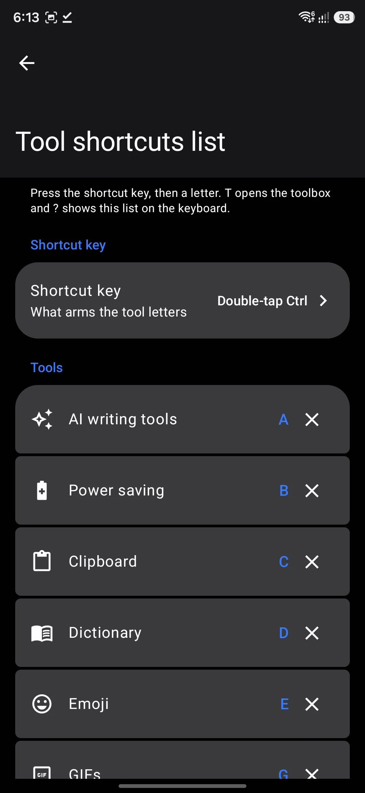</a></td>
</tr>
<tr>
<td align="center"><sub><code>settings/typing-hwshortcuts-screen</code></sub></td>
</tr>
</table>

### smart/  (9)

<table>
<tr>
<td align="center" width="190"><a href="#shot-smart-autocorrect-options">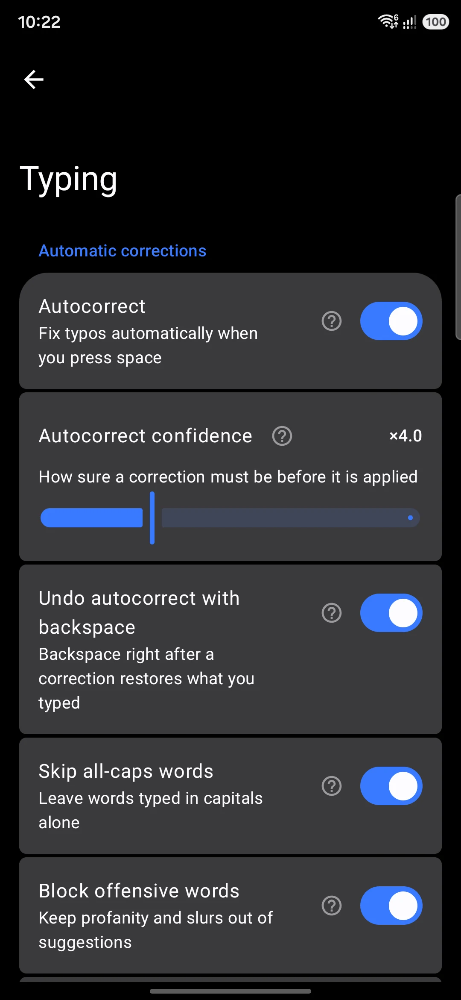</a></td>
<td align="center" width="190"><a href="#shot-smart-blacklist-editor">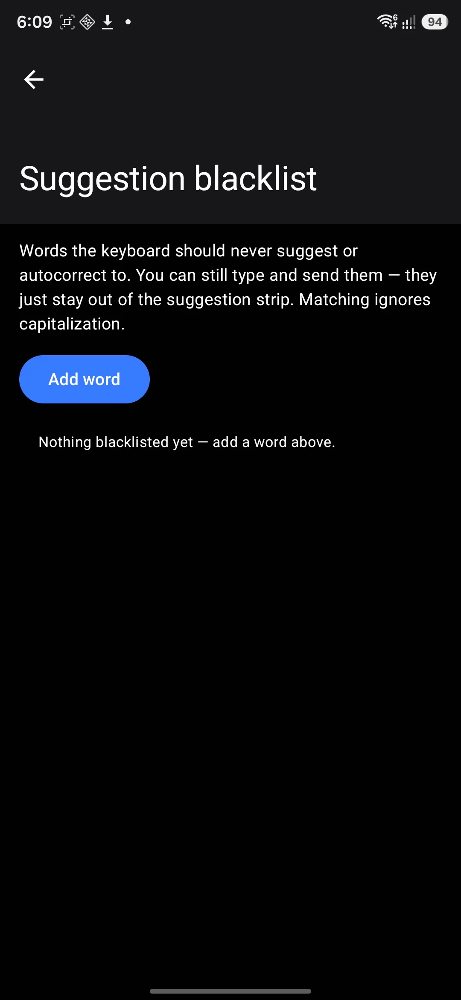</a></td>
<td align="center" width="190"><a href="#shot-smart-blacklist-add-dialog">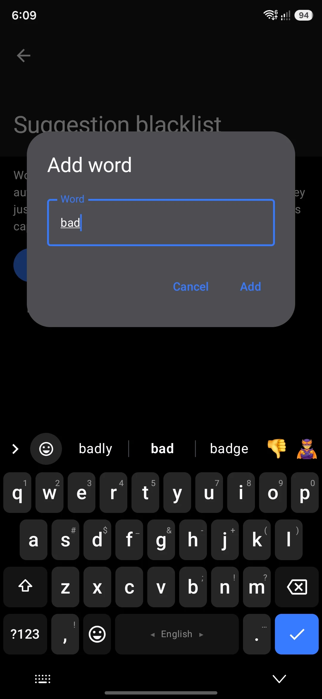</a></td>
<td align="center" width="190"><a href="#shot-smart-options">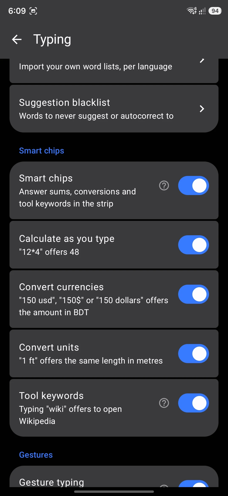</a></td>
</tr>
<tr>
<td align="center"><sub><code>autocorrect-options</code></sub></td>
<td align="center"><sub><code>blacklist-editor</code></sub></td>
<td align="center"><sub><code>blacklist-add-dialog</code></sub></td>
<td align="center"><sub><code>options</code></sub></td>
</tr>
<tr>
<td align="center" width="190"><a href="#shot-smart-grammar-settings">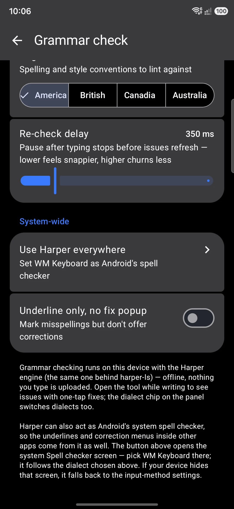</a></td>
<td align="center" width="190"><a href="#shot-smart-personal-dictionary-list">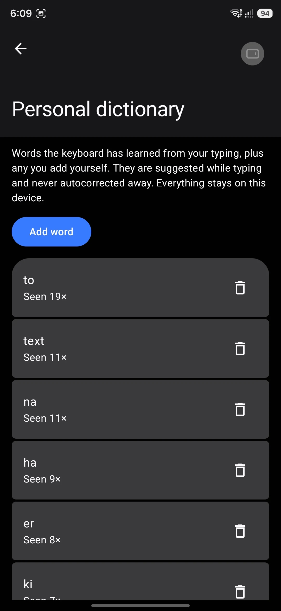</a></td>
<td align="center" width="190"><a href="#shot-smart-personal-dictionary-add">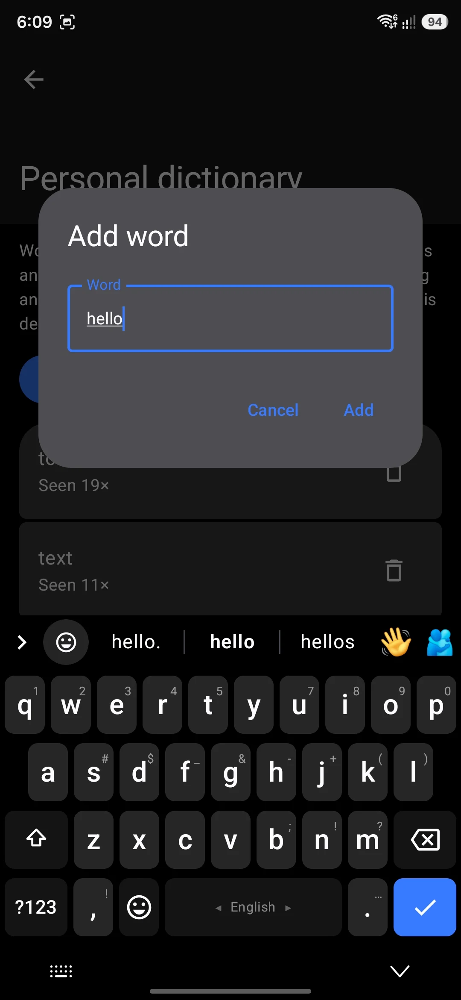</a></td>
<td align="center" width="190"><a href="#shot-smart-spell-checker-options">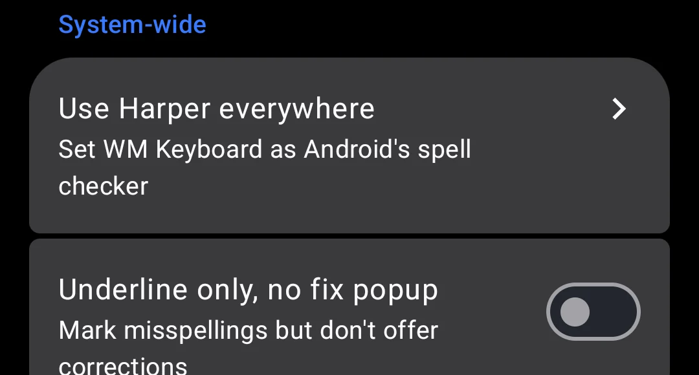</a></td>
</tr>
<tr>
<td align="center"><sub><code>grammar-settings</code></sub></td>
<td align="center"><sub><code>personal-dictionary-list</code></sub></td>
<td align="center"><sub><code>personal-dictionary-add</code></sub></td>
<td align="center"><sub><code>spell-checker-options</code></sub></td>
</tr>
<tr>
<td align="center" width="190"><a href="#shot-smart-suggestions-settings-group">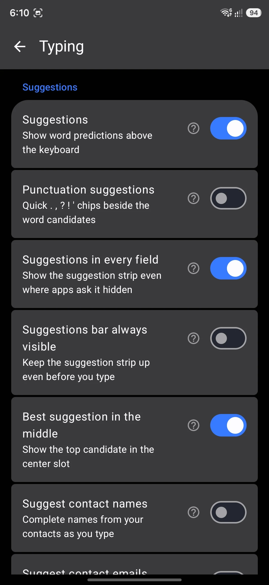</a></td>
</tr>
<tr>
<td align="center"><sub><code>suggestions-settings-group</code></sub></td>
</tr>
</table>

### start/  (2)

<table>
<tr>
<td align="center" width="190"><a href="#shot-start-faq-personal-dictionary">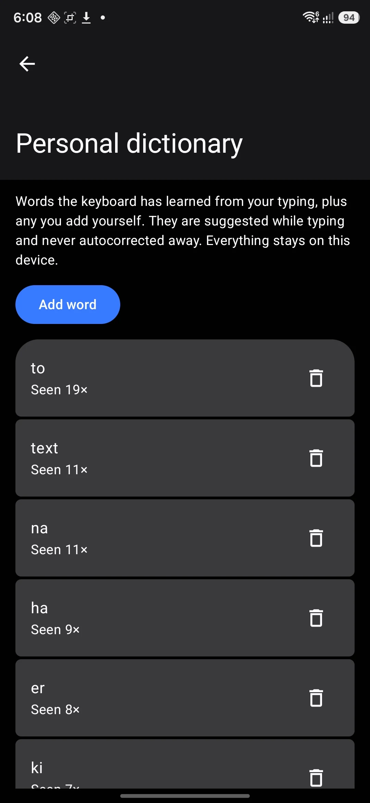</a></td>
<td align="center" width="190"><a href="#shot-start-migrating-tools-recommended">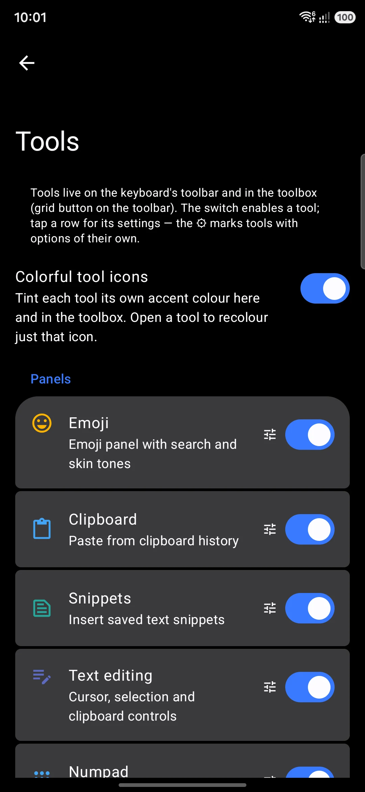</a></td>
</tr>
<tr>
<td align="center"><sub><code>faq-personal-dictionary</code></sub></td>
<td align="center"><sub><code>migrating-tools-recommended</code></sub></td>
</tr>
</table>

### themes/  (16)

<table>
<tr>
<td align="center" width="190"><a href="#shot-themes-background-image-live">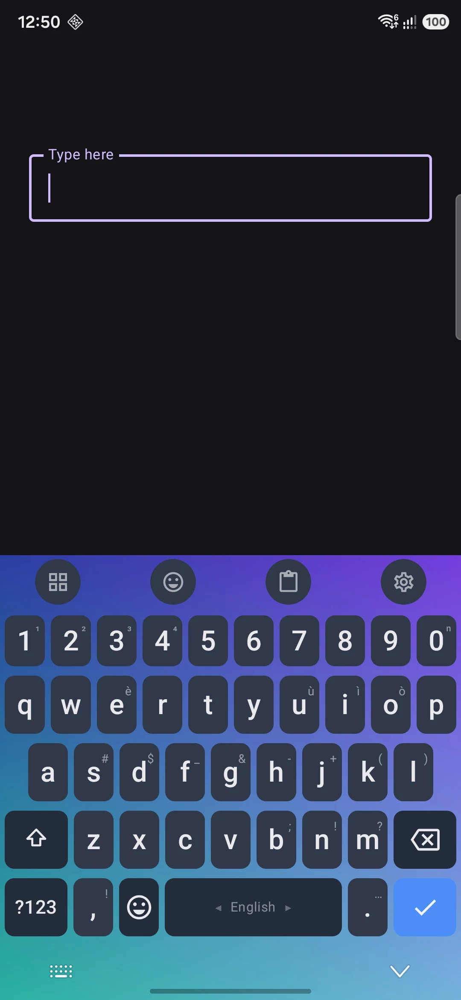</a></td>
<td align="center" width="190"><a href="#shot-themes-background-crop-dialog">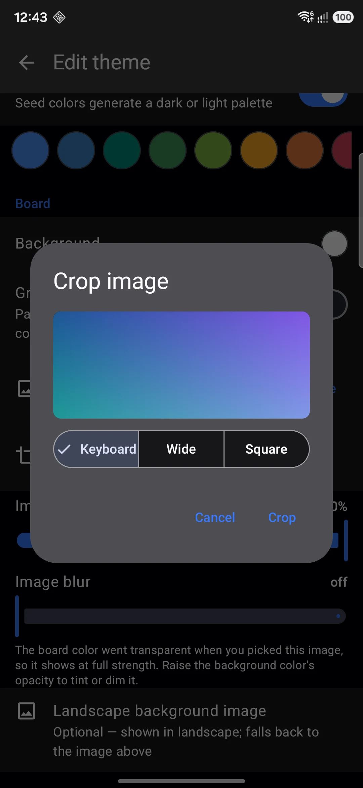</a></td>
<td align="center" width="190"><a href="#shot-themes-background-landscape">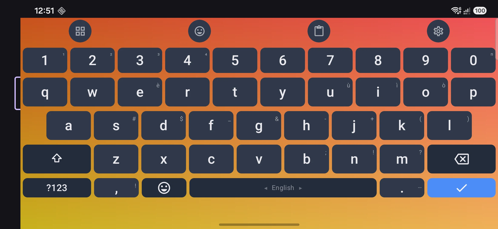</a></td>
<td align="center" width="190"><a href="#shot-themes-editor-live-preview">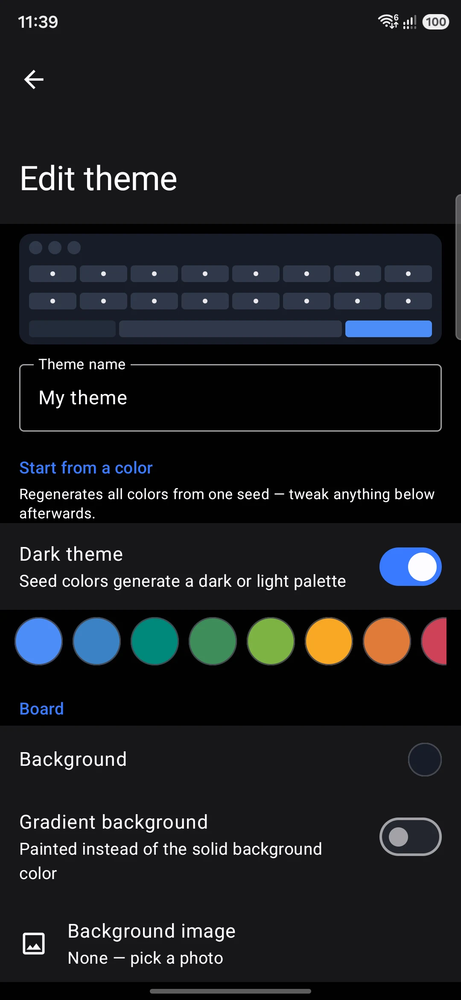</a></td>
</tr>
<tr>
<td align="center"><sub><code>background-image-live</code></sub></td>
<td align="center"><sub><code>background-crop-dialog</code></sub></td>
<td align="center"><sub><code>background-landscape</code></sub></td>
<td align="center"><sub><code>editor-live-preview</code></sub></td>
</tr>
<tr>
<td align="center" width="190"><a href="#shot-themes-editor-seed-swatches"></a></td>
<td align="center" width="190"><a href="#shot-themes-editor-gradient">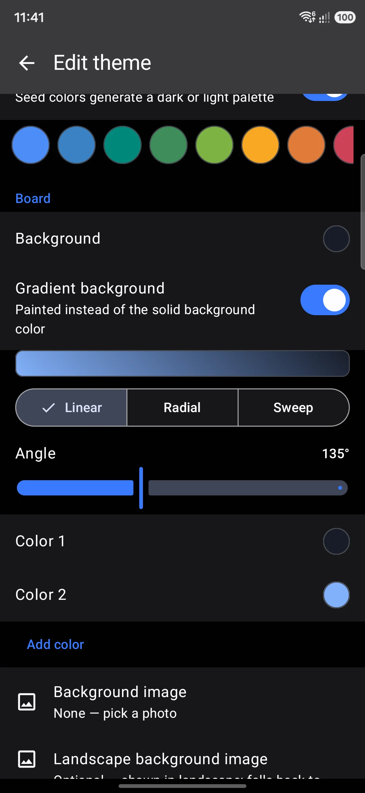</a></td>
<td align="center" width="190"><a href="#shot-themes-editor-corners-animation">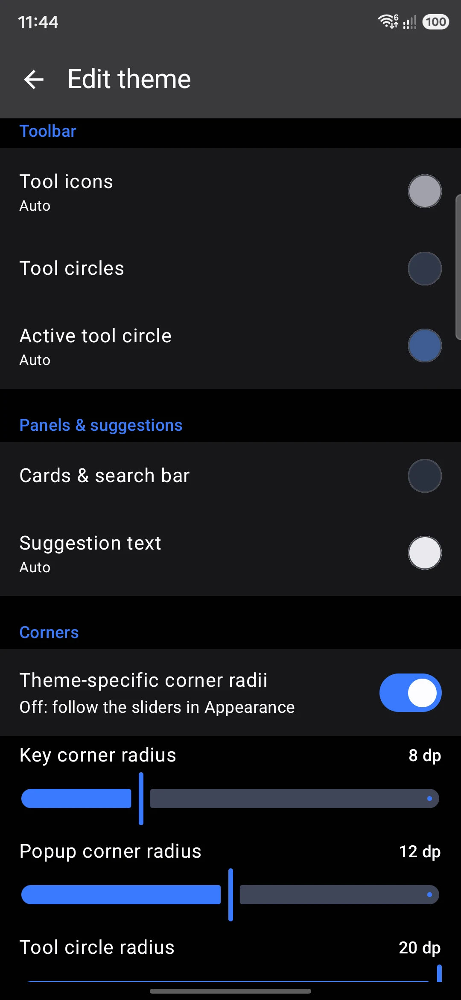</a></td>
<td align="center" width="190"><a href="#shot-themes-editor-delete-confirm">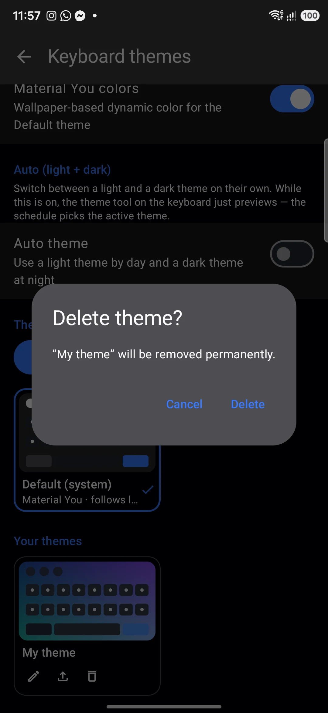</a></td>
</tr>
<tr>
<td align="center"><sub><code>editor-seed-swatches</code></sub></td>
<td align="center"><sub><code>editor-gradient</code></sub></td>
<td align="center"><sub><code>editor-corners-animation</code></sub></td>
<td align="center"><sub><code>editor-delete-confirm</code></sub></td>
</tr>
<tr>
<td align="center" width="190"><a href="#shot-themes-font-picker-english">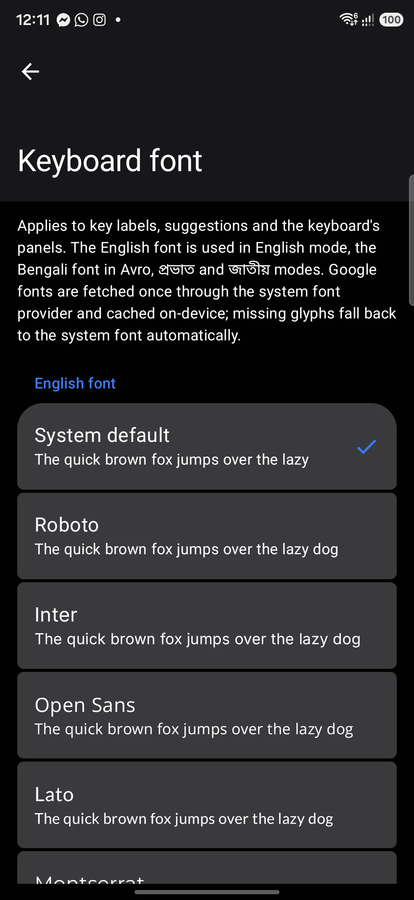</a></td>
<td align="center" width="190"><a href="#shot-themes-font-picker-script">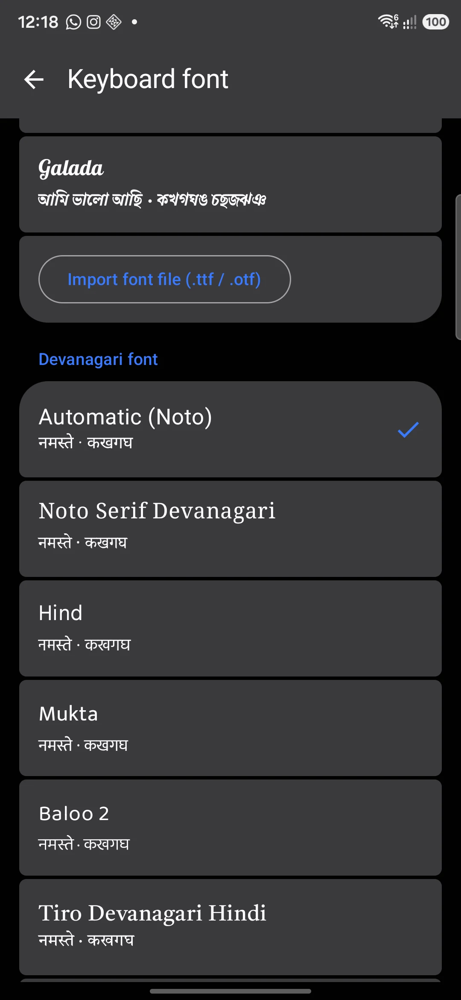</a></td>
<td align="center" width="190"><a href="#shot-themes-icons-screen-overview">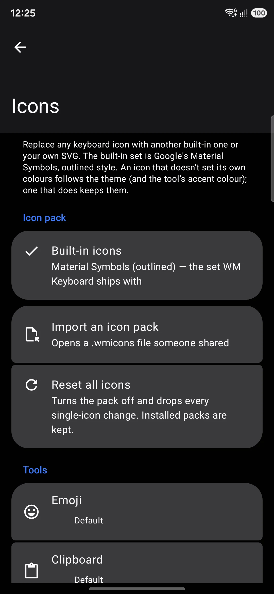</a></td>
<td align="center" width="190"><a href="#shot-themes-icons-slot-picker">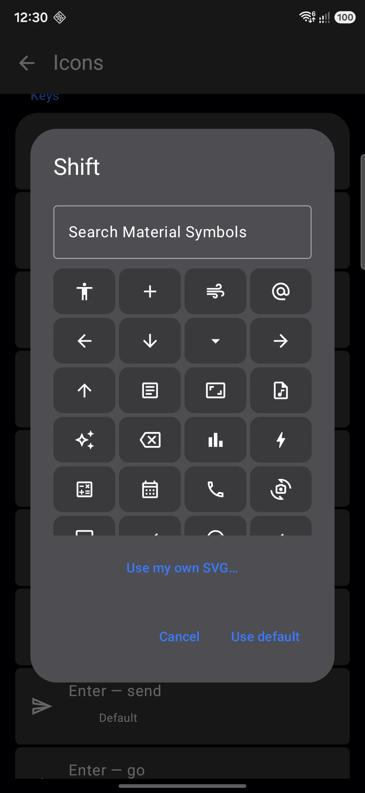</a></td>
</tr>
<tr>
<td align="center"><sub><code>font-picker-english</code></sub></td>
<td align="center"><sub><code>font-picker-script</code></sub></td>
<td align="center"><sub><code>icons-screen-overview</code></sub></td>
<td align="center"><sub><code>icons-slot-picker</code></sub></td>
</tr>
<tr>
<td align="center" width="190"><a href="#shot-themes-gallery-grid">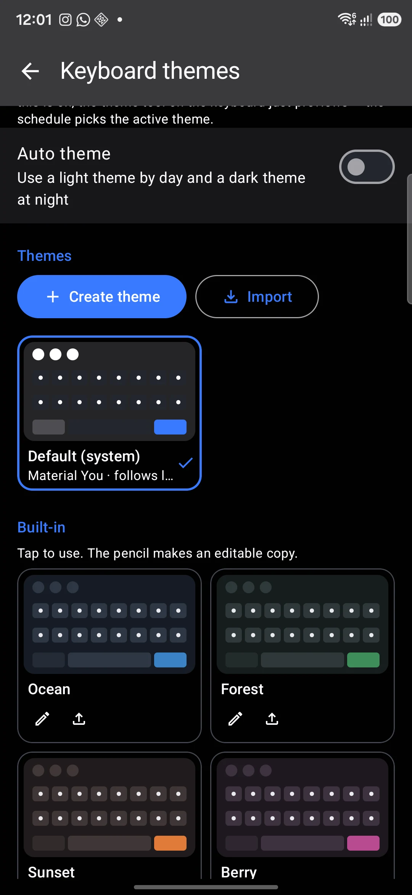</a></td>
<td align="center" width="190"><a href="#shot-themes-amoled-default-theme">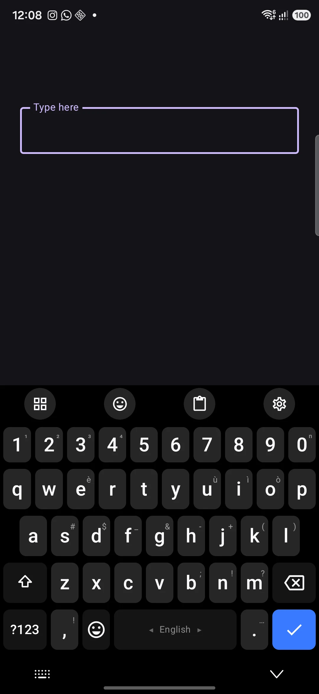</a></td>
<td align="center" width="190"><a href="#shot-themes-auto-theme-sun">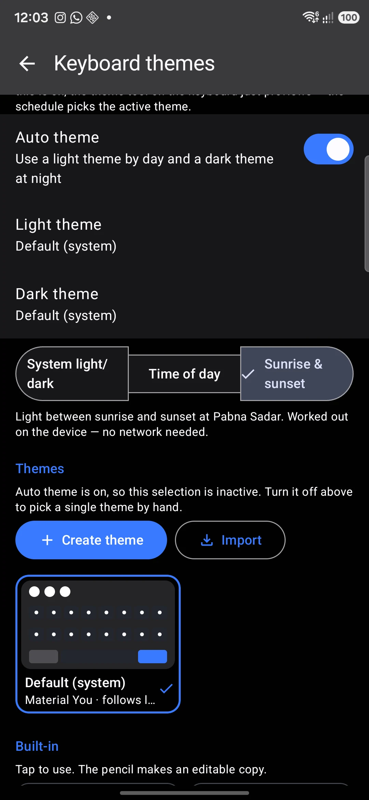</a></td>
<td align="center" width="190"><a href="#shot-themes-gallery-export-import">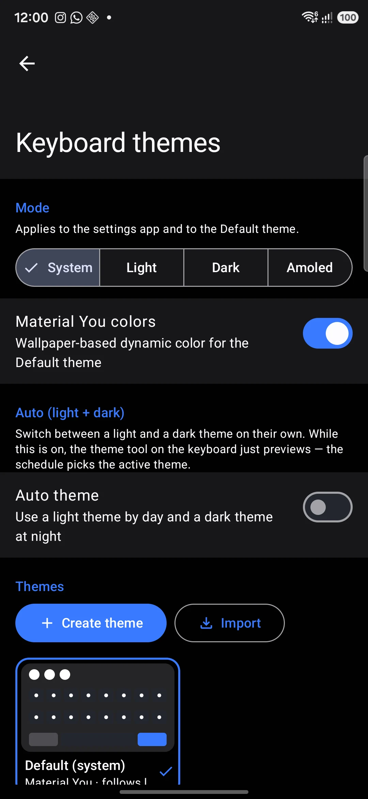</a></td>
</tr>
<tr>
<td align="center"><sub><code>gallery-grid</code></sub></td>
<td align="center"><sub><code>amoled-default-theme</code></sub></td>
<td align="center"><sub><code>auto-theme-sun</code></sub></td>
<td align="center"><sub><code>gallery-export-import</code></sub></td>
</tr>
</table>

### tools/  (13)

<table>
<tr>
<td align="center" width="190"><a href="#shot-tools-ai-need-setup">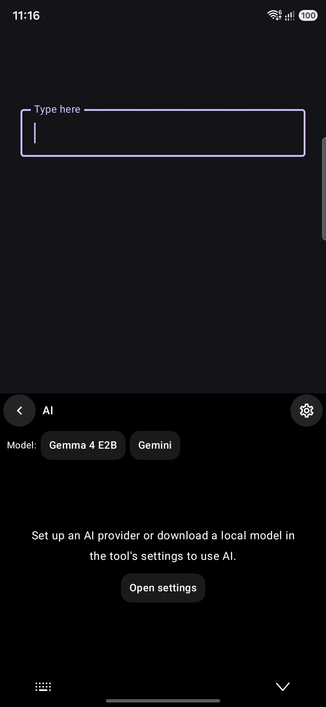</a></td>
<td align="center" width="190"><a href="#shot-tools-ai-settings-providers">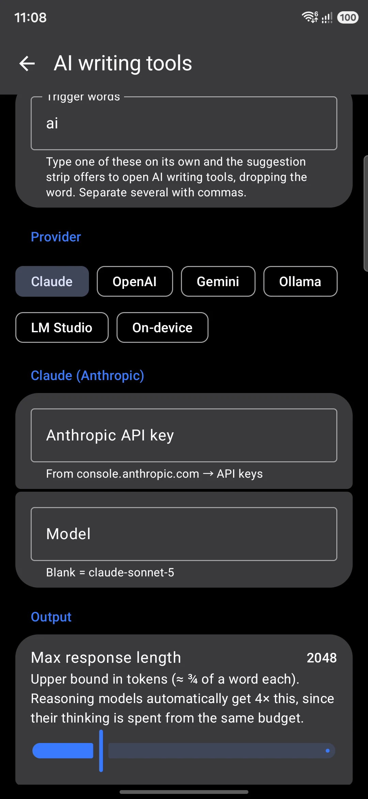</a></td>
<td align="center" width="190"><a href="#shot-tools-ai-settings-local-catalog">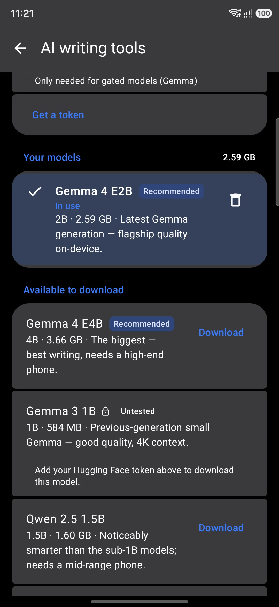</a></td>
<td align="center" width="190"><a href="#shot-tools-calendar-options">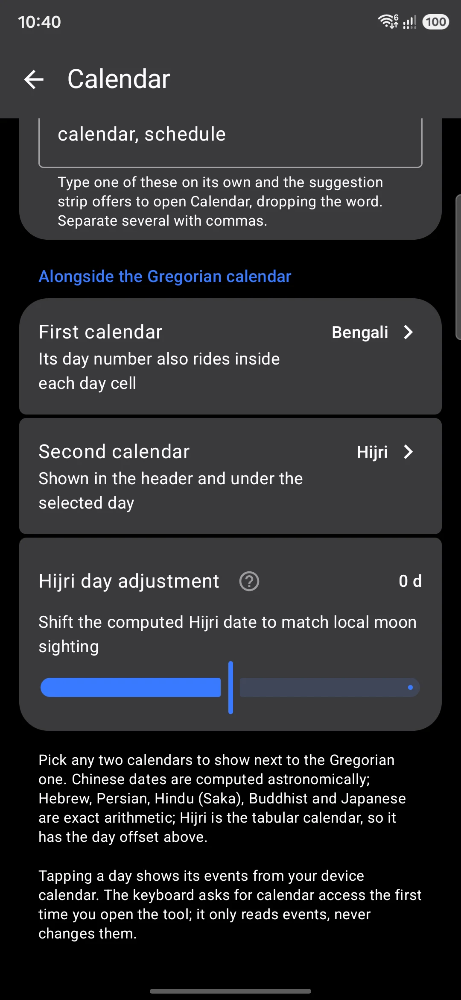</a></td>
</tr>
<tr>
<td align="center"><sub><code>ai-need-setup</code></sub></td>
<td align="center"><sub><code>ai-settings-providers</code></sub></td>
<td align="center"><sub><code>ai-settings-local-catalog</code></sub></td>
<td align="center"><sub><code>calendar-options</code></sub></td>
</tr>
<tr>
<td align="center" width="190"><a href="#shot-tools-camera-options">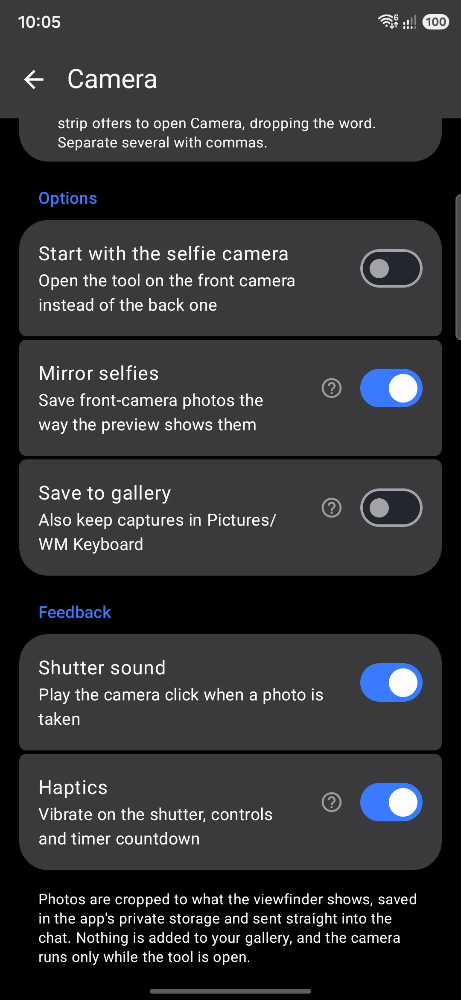</a></td>
<td align="center" width="190"><a href="#shot-tools-clipboard-settings"></a></td>
<td align="center" width="190"><a href="#shot-tools-whisper-engine-choice">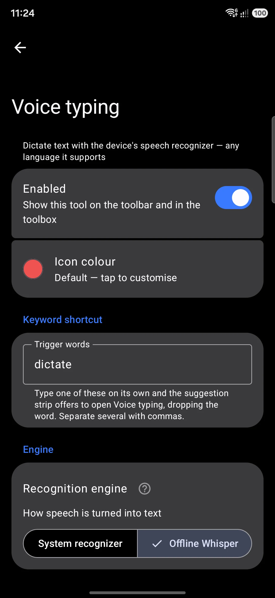</a></td>
<td align="center" width="190"><a href="#shot-tools-whisper-catalog"></a></td>
</tr>
<tr>
<td align="center"><sub><code>camera-options</code></sub></td>
<td align="center"><sub><code>clipboard-settings</code></sub></td>
<td align="center"><sub><code>whisper-engine-choice</code></sub></td>
<td align="center"><sub><code>whisper-catalog</code></sub></td>
</tr>
<tr>
<td align="center" width="190"><a href="#shot-tools-whisper-routing">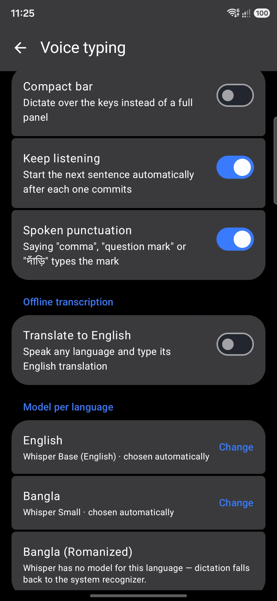</a></td>
<td align="center" width="190"><a href="#shot-tools-whisper-download-progress">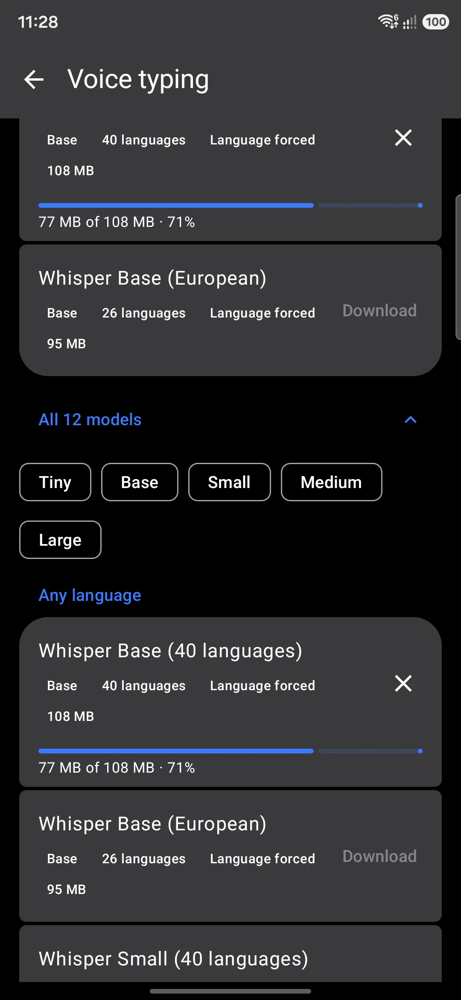</a></td>
<td align="center" width="190"><a href="#shot-tools-snippets-settings">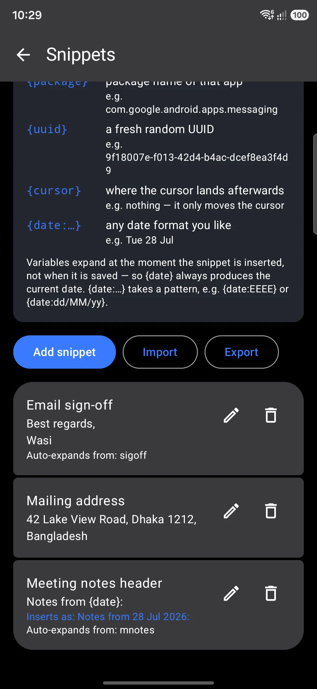</a></td>
<td align="center" width="190"><a href="#shot-tools-snippets-add-dialog">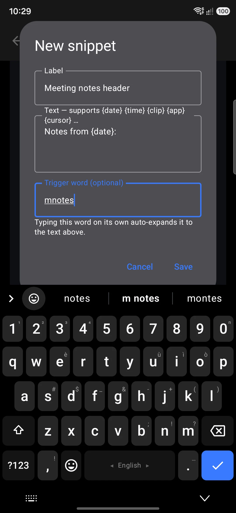</a></td>
</tr>
<tr>
<td align="center"><sub><code>whisper-routing</code></sub></td>
<td align="center"><sub><code>whisper-download-progress</code></sub></td>
<td align="center"><sub><code>snippets-settings</code></sub></td>
<td align="center"><sub><code>snippets-add-dialog</code></sub></td>
</tr>
<tr>
<td align="center" width="190"><a href="#shot-tools-instruments-settings-utilities-group">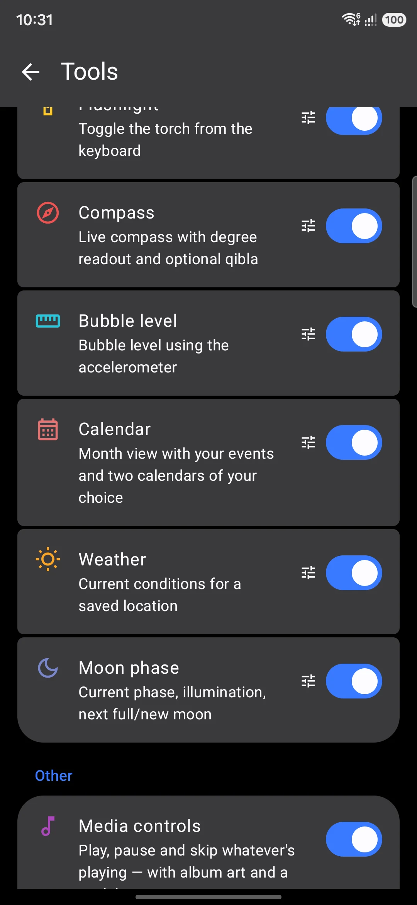</a></td>
</tr>
<tr>
<td align="center"><sub><code>instruments-settings-utilities-group</code></sub></td>
</tr>
</table>

### tour/  (1)

<table>
<tr>
<td align="center" width="190"><a href="#shot-tour-settings-entry">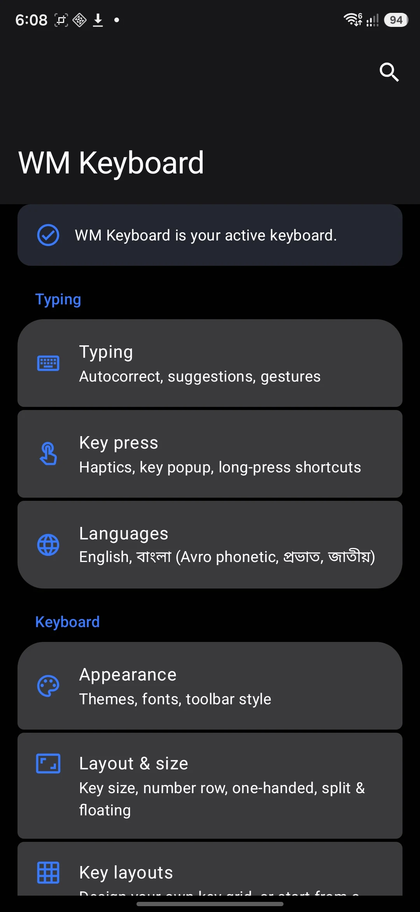</a></td>
</tr>
<tr>
<td align="center"><sub><code>settings-entry</code></sub></td>
</tr>
</table>

### typing/  (20)

<table>
<tr>
<td align="center" width="190"><a href="#shot-typing-long-press-popup">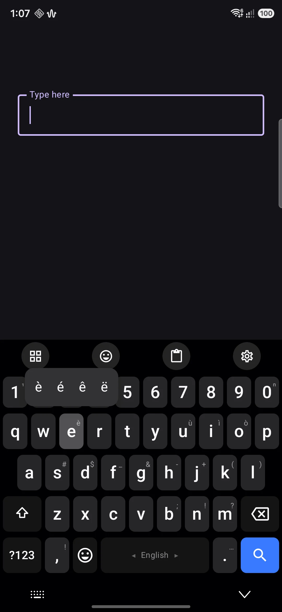</a></td>
<td align="center" width="190"><a href="#shot-typing-shift-states">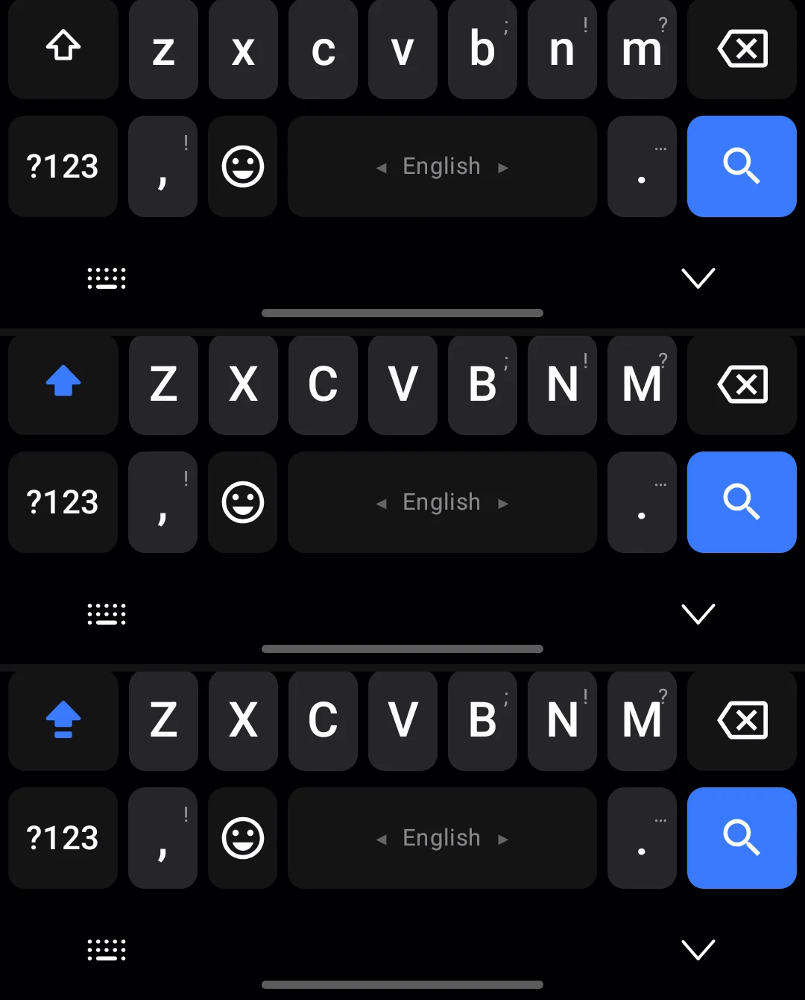</a></td>
<td align="center" width="190"><a href="#shot-typing-hold-letter-clipboard">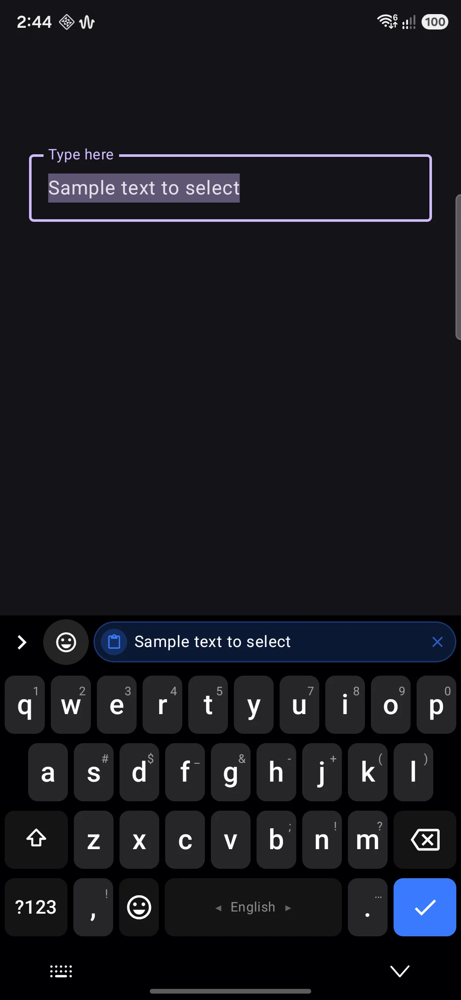</a></td>
<td align="center" width="190"><a href="#shot-typing-enter-action-icons"></a></td>
</tr>
<tr>
<td align="center"><sub><code>long-press-popup</code></sub></td>
<td align="center"><sub><code>shift-states</code></sub></td>
<td align="center"><sub><code>hold-letter-clipboard</code></sub></td>
<td align="center"><sub><code>enter-action-icons</code></sub></td>
</tr>
<tr>
<td align="center" width="190"><a href="#shot-typing-number-row">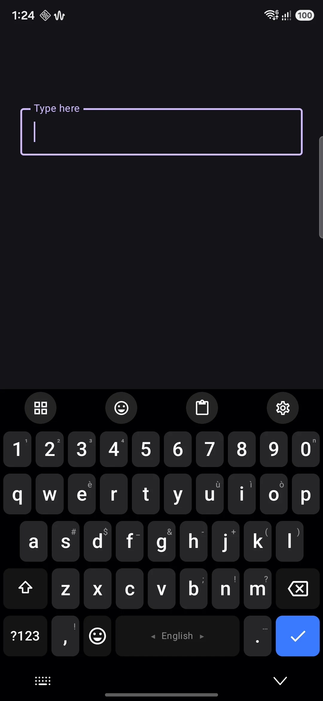</a></td>
<td align="center" width="190"><a href="#shot-typing-keypress-settings-overview">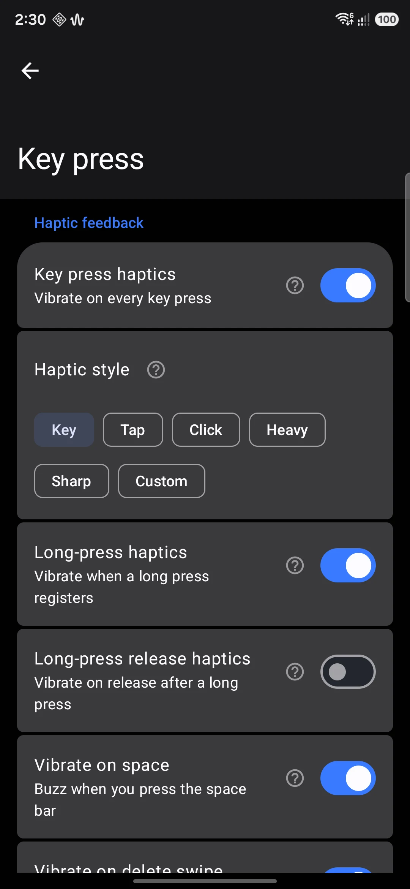</a></td>
<td align="center" width="190"><a href="#shot-typing-haptic-style-custom-sliders">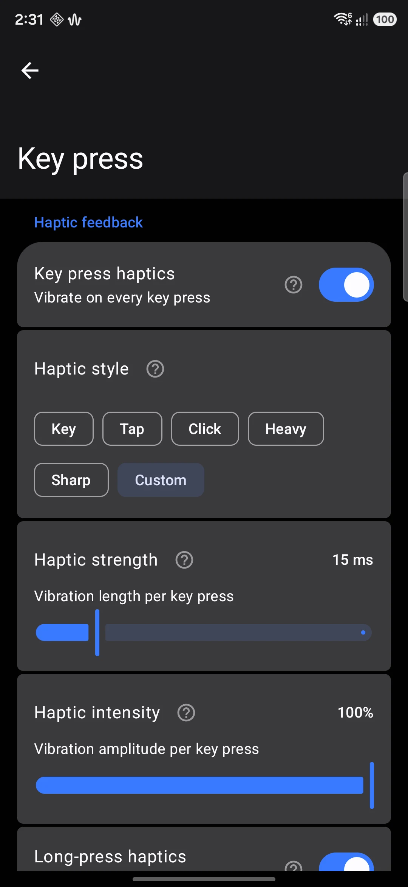</a></td>
<td align="center" width="190"><a href="#shot-typing-keysound-style-chips">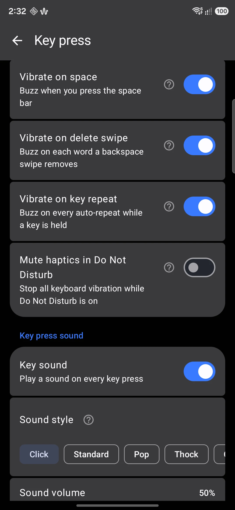</a></td>
</tr>
<tr>
<td align="center"><sub><code>number-row</code></sub></td>
<td align="center"><sub><code>keypress-settings-overview</code></sub></td>
<td align="center"><sub><code>haptic-style-custom-sliders</code></sub></td>
<td align="center"><sub><code>keysound-style-chips</code></sub></td>
</tr>
<tr>
<td align="center" width="190"><a href="#shot-typing-sound-haptics-toolbar-panel">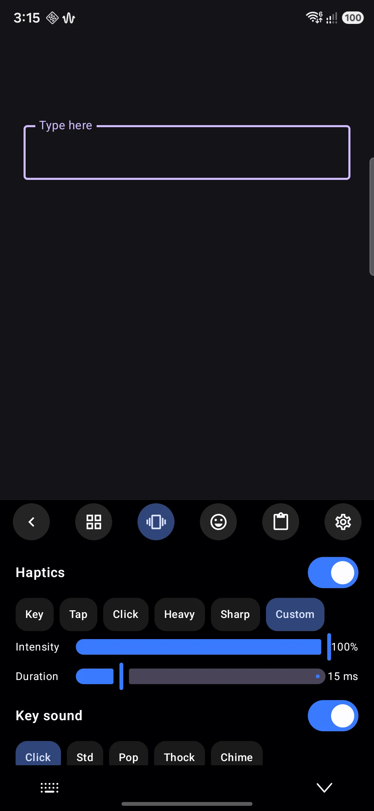</a></td>
<td align="center" width="190"><a href="#shot-typing-field-adaptation-email">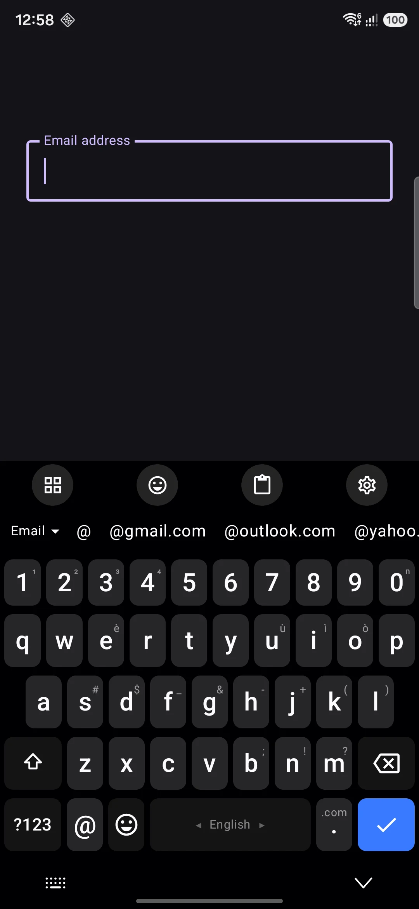</a></td>
<td align="center" width="190"><a href="#shot-typing-field-adaptation-uri">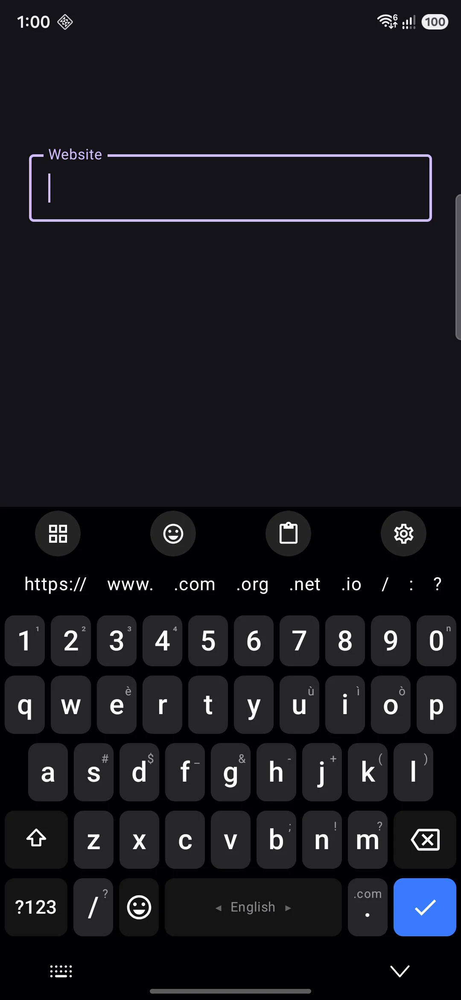</a></td>
<td align="center" width="190"><a href="#shot-typing-field-adaptation-numpad">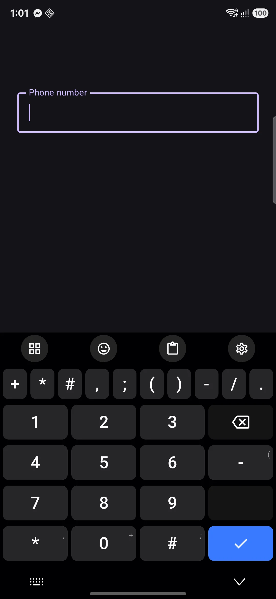</a></td>
</tr>
<tr>
<td align="center"><sub><code>sound-haptics-toolbar-panel</code></sub></td>
<td align="center"><sub><code>field-adaptation-email</code></sub></td>
<td align="center"><sub><code>field-adaptation-uri</code></sub></td>
<td align="center"><sub><code>field-adaptation-numpad</code></sub></td>
</tr>
<tr>
<td align="center" width="190"><a href="#shot-typing-field-adaptation-password">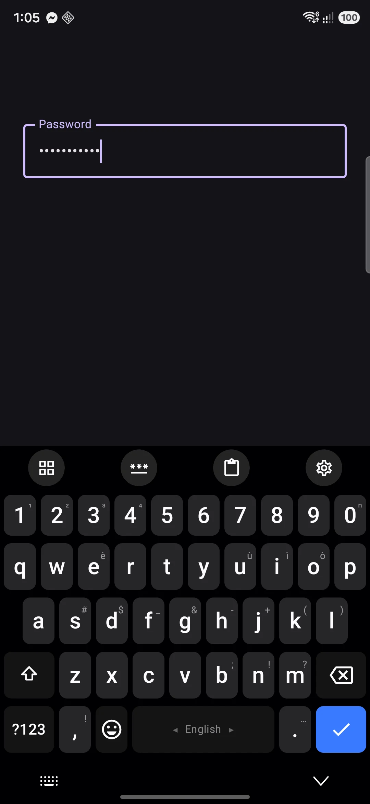</a></td>
<td align="center" width="190"><a href="#shot-typing-glide-settings-gestures">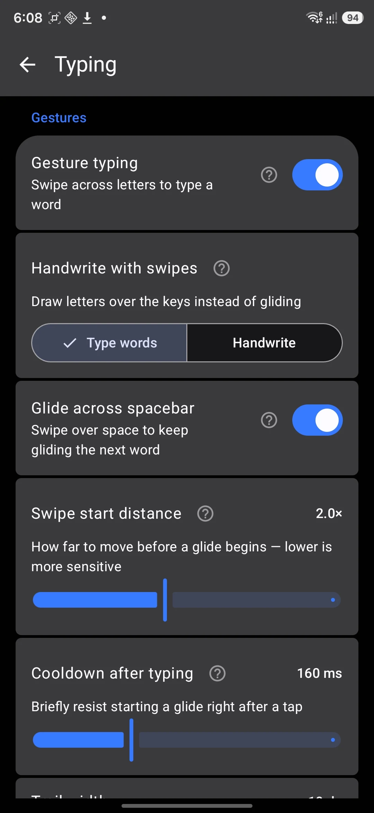</a></td>
<td align="center" width="190"><a href="#shot-typing-hardware-shortcuts-list">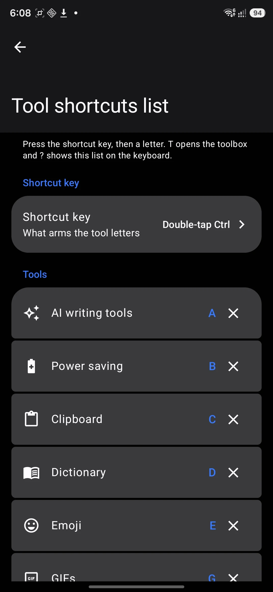</a></td>
<td align="center" width="190"><a href="#shot-typing-symbols-page-open">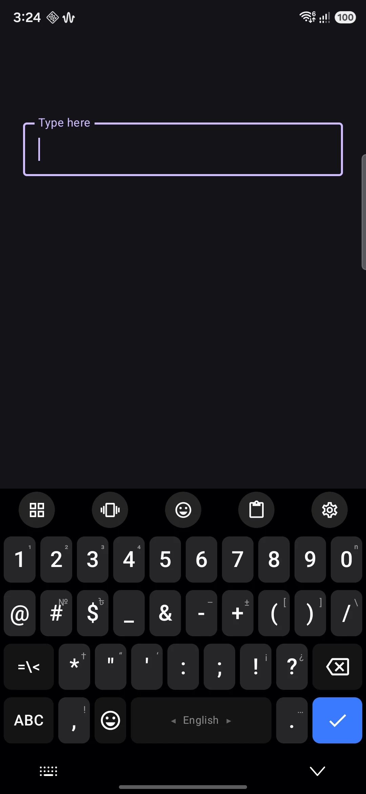</a></td>
</tr>
<tr>
<td align="center"><sub><code>field-adaptation-password</code></sub></td>
<td align="center"><sub><code>glide-settings-gestures</code></sub></td>
<td align="center"><sub><code>hardware-shortcuts-list</code></sub></td>
<td align="center"><sub><code>symbols-page-open</code></sub></td>
</tr>
<tr>
<td align="center" width="190"><a href="#shot-typing-size-position-settings-overview">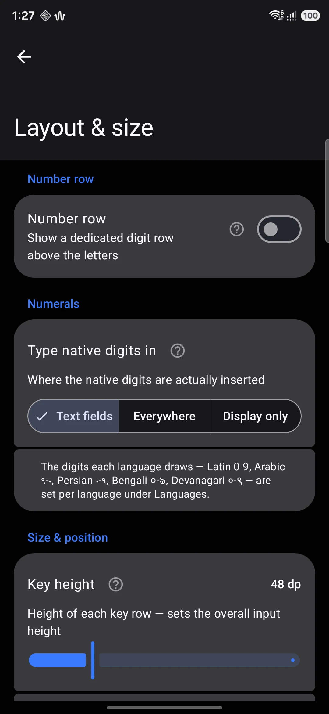</a></td>
<td align="center" width="190"><a href="#shot-typing-size-position-one-handed">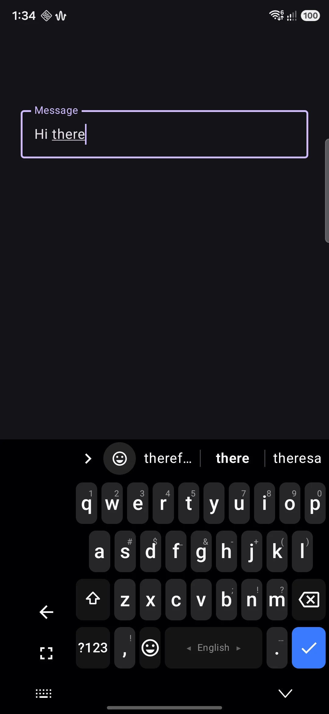</a></td>
<td align="center" width="190"><a href="#shot-typing-size-position-split">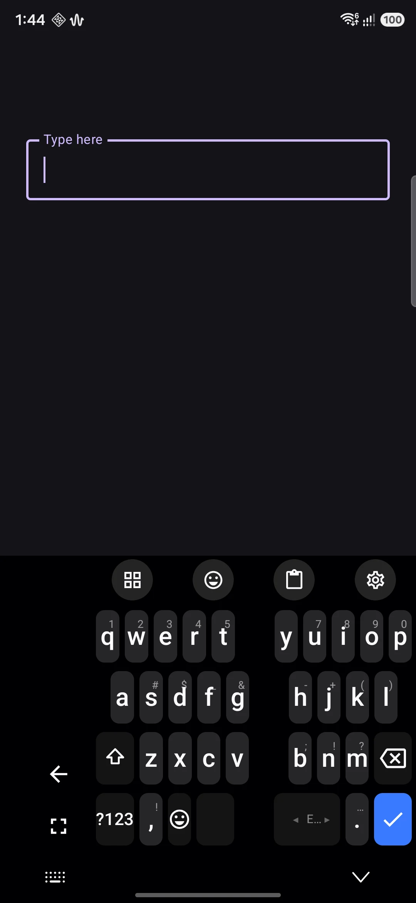</a></td>
<td align="center" width="190"><a href="#shot-typing-size-position-floating">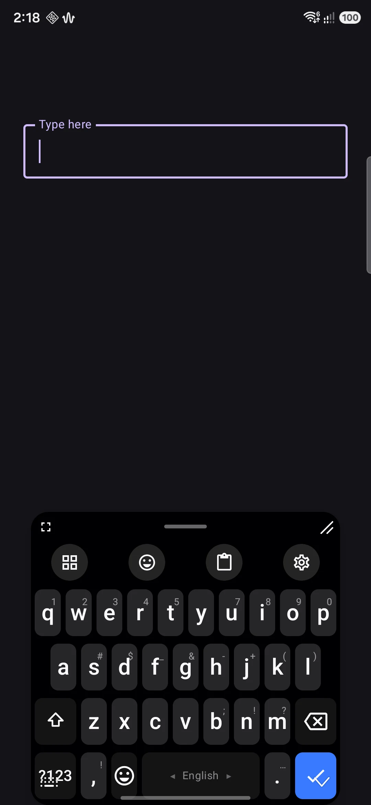</a></td>
</tr>
<tr>
<td align="center"><sub><code>size-position-settings-overview</code></sub></td>
<td align="center"><sub><code>size-position-one-handed</code></sub></td>
<td align="center"><sub><code>size-position-split</code></sub></td>
<td align="center"><sub><code>size-position-floating</code></sub></td>
</tr>
</table>

---

## Details

## accessibility/

<a id="shot-accessibility-vision-group"></a>

### `accessibility/vision-group`

- [ ] retake


**Caption (alt text):** The Vision group at the top of the Accessibility screen.

**Page:** `docs/src/content/docs/accessibility/overview.mdx`

**File:** `docs/src/assets/screens/accessibility/vision-group.webp`

**Shot under:**

- Not deep-link allowlisted (only typing/appearance/themes/languages/tools/search are). From the settings root, tap the "Accessibility" group.
- Screenshot the Vision group (colour vision, high contrast keys, key outlines, bold labels, readable font, text size, keyboard font row) at the top of the screen.

> Route is "accessibility", screen title "Accessibility" (MainActivity.kt:682-690). No wmkeyboard:// deep link exists for it.

---

<a id="shot-accessibility-screen-reader-modes"></a>

### `accessibility/screen-reader-modes`

- [ ] retake


**Caption (alt text):** TalkBack support set to Gestures, with the four modes shown in the picker.

**Page:** `docs/src/content/docs/accessibility/overview.mdx`

**File:** `docs/src/assets/screens/accessibility/screen-reader-modes.webp`

**Shot under:**

- Navigate to settings root → Accessibility.
- Tap the "TalkBack support" choice setting to open its picker, showing Off / Labels / Explore / Gestures.

> ChoiceSetting in AccessibilityScreens.kt:38-57, backed by settings.screenReaderMode (default LABELS).

---

<a id="shot-accessibility-high-contrast-live"></a>

### `accessibility/high-contrast-live`

- [ ] retake


**Caption (alt text):** High contrast keys turned on: a flat board with maximum-contrast labels.

**Page:** `docs/src/content/docs/accessibility/overview.mdx`

**File:** `docs/src/assets/screens/accessibility/high-contrast-live.webp`

**Shot under:**

- Turn on Accessibility → High contrast keys.
- adb shell am start -n com.wasimaster.wmkeyboard/.app.DocsShotActivity --es mode field --es kind text
- Focus the field so the keyboard shows, then capture.

> Verify visually that gradients/background image/animation are absent per KbTheme.kt:427-453 (forces pure black/white board+key, kills gradients/bg image/animation, keeps theme accent).

---

<a id="shot-accessibility-color-vision-live"></a>

### `accessibility/color-vision-live`

- [ ] retake


**Caption (alt text):** The Deutan colour vision filter applied to a keyboard theme.

**Page:** `docs/src/content/docs/accessibility/overview.mdx`

**File:** `docs/src/assets/screens/accessibility/color-vision-live.webp`

**Shot under:**

- Pick a theme with visibly distinct hues (not the flat default) so the correction is visible in the shot.
- Turn on Accessibility → Colour vision → Deutan.
- adb shell am start -n com.wasimaster.wmkeyboard/.app.DocsShotActivity --es mode field --es kind text
- Focus the field so the keyboard shows, then capture.

> Daltonization pipeline in core/theme ColorVision.kt; a before/after pair (this shot vs the theme's normal screenshot elsewhere) would illustrate the effect best if the docs later want a comparison.

---

<a id="shot-accessibility-touch-group"></a>

### `accessibility/touch-group`

- [ ] retake


**Caption (alt text):** The Touch group: ignore repeated presses and long-press delay.

**Page:** `docs/src/content/docs/accessibility/overview.mdx`

**File:** `docs/src/assets/screens/accessibility/touch-group.webp`

**Shot under:**

- Navigate to settings root → Accessibility.
- Scroll to the Touch group at the bottom of the screen (sliders + the Key size & spacing / Haptics & sound links).

> Group at AccessibilityScreens.kt:213-260.

---

## emoji/

<a id="shot-emoji-settings-overview"></a>

### `emoji/settings-overview`

- [ ] retake


**Caption (alt text):** The Emoji settings screen, with the live font preview row.

**Page:** `docs/src/content/docs/emoji/customization.mdx`

**File:** `docs/src/assets/screens/emoji/settings-overview.webp`

**Shot under:**

- Open WM Keyboard settings home screen
- Tap Emoji under Features
- Scroll to the Emoji style group so the emoji font preview row is visible

> "emoji" is not in the wmkeyboard://settings deep-link allowlist (only typing, appearance, themes, languages, tools, search are) — reach it by tapping through the settings home screen instead. Capture with default settings (Emoji font = System) so the preview row shows the device's own emoji pack.

---

<a id="shot-emoji-keyword-packs"></a>

### `emoji/keyword-packs`

- [ ] retake


**Caption (alt text):** The Emoji keywords screen, with per-language download and delete controls.

**Page:** `docs/src/content/docs/emoji/customization.mdx`

**File:** `docs/src/assets/screens/emoji/keyword-packs.webp`

**Shot under:**

- Open WM Keyboard settings home screen
- Tap Emoji under Features
- Tap "Emoji keywords"

> Ideally capture with one language already downloaded (shows a Delete button) and one not yet downloaded (shows a Download button) visible in the same frame to illustrate both states.

---

## privacy/

<a id="shot-privacy-backup-restore-screen"></a>

### `privacy/backup-restore-screen`

- [ ] retake


**Caption (alt text):** Backup & restore: pick what to include, then export or import a file.

**Page:** `docs/src/content/docs/privacy/backup.mdx`

**File:** `docs/src/assets/screens/privacy/backup-restore-screen.webp`

**Shot under:**

- Not deep-link allowlisted (only typing, appearance, themes, languages, tools, search are) — navigate by tap: open the app, tap 'Backup & restore' in the Data group on the home screen.
- Capture with the default export-toggle state (Settings/Themes/Snippets/Custom word lists/Addon repositories on; Dictionary/Clipboard/Sticker packs/Icon packs off) so the screenshot matches the documented defaults.

> Screen is BackupSettings composable, MainActivity.kt:4589. Show the 'Include in export' toggle group; scroll position should include at least the top few rows (Settings, Include API keys hidden since Settings default is on but API keys default off, Themes) so the visible defaults are checkable against the docs table.

---

<a id="shot-privacy-backup-import-confirm"></a>

### `privacy/backup-import-confirm`

- [ ] retake


**Caption (alt text):** The import confirmation, listing what a backup file contains before anything is applied.

**Page:** `docs/src/content/docs/privacy/backup.mdx`

**File:** `docs/src/assets/screens/privacy/backup-import-confirm.webp`

**Shot under:**

- From the Backup & restore screen, tap 'Import backup' and pick a previously-exported .wmconfig.json file (or one with a couple of sections, e.g. a small file with Themes + Snippets, so the dialog's bulleted section list is short enough to read in the screenshot).
- Capture the resulting 'Import backup?' AlertDialog (MainActivity.kt:4823-4841 / FileImport.kt:390-407) before tapping Import or Cancel.

> Use a test file that does NOT include secrets, so the screenshot shows the plain merge/replace sentence without the extra API-key warning paragraph — keeps the caption's claim clean. A separate capture with a secrets-containing file could be added later if the reviewer wants that state shown too, but it's not required by this page.

---

<a id="shot-privacy-on-device-learning-toggles"></a>

### `privacy/on-device-learning-toggles`

- [ ] retake


**Caption (alt text):** The Privacy screen: on-device learning toggles above, the Clear learned words button below.

**Page:** `docs/src/content/docs/privacy/data.mdx`

**File:** `docs/src/assets/screens/privacy/on-device-learning-toggles.webp`

**Shot under:**

- am start -n com.wasimaster.wmkeyboard/.app.MainActivity
- Tap Privacy from the settings home list (it's under the Data group, alongside Backup & restore)
- Capture at the top of the screen: On-device learning group (Learn from typing, Add words to the system dictionary, Expand dictionary shortcuts, Incognito mode, Follow private browsing)

> The privacy route is NOT in the deep-link allowlist (only typing/appearance/themes/languages/tools/search are) -- reach it by tapping through the settings home screen's Data group rather than a wmkeyboard://settings/privacy deep link.

---

<a id="shot-privacy-clear-learned-words-button"></a>

### `privacy/clear-learned-words-button`

- [ ] retake


**Caption (alt text):** Clear learned words, under Privacy → Your data.

**Page:** `docs/src/content/docs/privacy/data.mdx`

**File:** `docs/src/assets/screens/privacy/clear-learned-words-button.webp`

**Shot under:**

- am start -n com.wasimaster.wmkeyboard/.app.MainActivity
- Tap Privacy from the settings home list (Data group)
- Scroll to the bottom, past the Android backup group, to the Your data group

> Shows the Your data group's single Clear learned words button. There is no confirmation dialog on tap (verified in MainActivity.kt) -- do not tap it during capture unless intentionally showing the post-clear state.

---

<a id="shot-privacy-secure-field-no-suggestions"></a>

### `privacy/secure-field-no-suggestions`

- [ ] retake


**Caption (alt text):** A password field: no suggestion strip, no smart chips.

**Page:** `docs/src/content/docs/privacy/incognito.mdx`

**File:** `docs/src/assets/screens/privacy/secure-field-no-suggestions.webp`

**Shot under:**

- adb shell am start -n com.wasimaster.wmkeyboard/.app.DocsShotActivity --es mode field --es kind password
- Focus the field so the keyboard shows; the suggestion strip should be entirely absent

> isSecureField()/suppressesSuggestions() force this for password variations regardless of the 'Suggestions in every field' override — WMKeyboardService.kt:10494-10529.

---

<a id="shot-privacy-clipboard-settings-passwords"></a>

### `privacy/clipboard-settings-passwords`

- [ ] retake


**Caption (alt text):** Passwords & codes: sensitive-clip handling and the paste-time purge, both on by default.

**Page:** `docs/src/content/docs/privacy/incognito.mdx`

**File:** `docs/src/assets/screens/privacy/clipboard-settings-passwords.webp`

**Shot under:**

- am start -a android.intent.action.VIEW -d "wmkeyboard://settings/tools"
- Tap the Clipboard row to open its settings screen
- Scroll to the 'Passwords & codes' group near the bottom: Sensitive clips, Recognise them yourself, Forget sensitive clips after, and Forget after pasting a password (MainActivity.kt:6264-6312)

> 'tools' is on the wmkeyboard:// deep-link allowlist (SettingsShortcuts.kt:38); the Clipboard sub-screen itself is reached by tap from there, not by its own deep link.

---

<a id="shot-privacy-tools-enabled-switches"></a>

### `privacy/tools-enabled-switches`

- [ ] retake


**Caption (alt text):** The Tools screen: every tool has its own Enabled switch, on by default.

**Page:** `docs/src/content/docs/privacy/network.mdx`

**File:** `docs/src/assets/screens/privacy/tools-enabled-switches.webp`

**Shot under:**

- adb shell am start -a android.intent.action.VIEW -d wmkeyboard://settings/tools

> Top-level Tools settings screen (ToolsSettings composable, MainActivity.kt ~line 5873) listing every ToolbarTool with its Enabled switch; enabledTools defaults to every tool. 'tools' is in the SettingsShortcuts deep-link allowlist, so the single adb command lands directly on this screen.

---

<a id="shot-privacy-ai-ollama-plain-http"></a>

### `privacy/ai-ollama-plain-http`

- [ ] retake


**Caption (alt text):** AI tool settings: a self-hosted Ollama or LM Studio server address, with the plain-HTTP disclosure below it.

**Page:** `docs/src/content/docs/privacy/network.mdx`

**File:** `docs/src/assets/screens/privacy/ai-ollama-plain-http.webp`

**Shot under:**

- adb shell am start -a android.intent.action.VIEW -d wmkeyboard://settings/tools
- Tap the 'AI' row to open Tools / AI writing tools
- Tap the Ollama or LM Studio provider chip to reveal the server-address field and the 'Traffic to a self-hosted server is plain HTTP, and the app allows cleartext traffic app-wide to support it. Keep the server on a network you trust.' note

> The per-tool AI screen (route 'tool/AI') is not in the deep-link allowlist (only typing/appearance/themes/languages/tools/search are), so this needs a tap after landing on Tools — no direct wmkeyboard:// URI. This id is distinct from tools/ai.mdx's own registered shots (ai-panel-idle, ai-need-setup, ai-result-ready, ai-settings-providers, ai-settings-local-catalog) — none of those already cover the Ollama/LM Studio plain-HTTP note specifically, so this is not a duplicate, but double-check at capture time in case that page's manifest grew one since.

---

<a id="shot-privacy-privacy-screen-groups"></a>

### `privacy/privacy-screen-groups`

- [ ] retake


**Caption (alt text):** The Privacy screen: On-device learning, Android backup, and Your data groups.

**Page:** `docs/src/content/docs/privacy/overview.mdx`

**File:** `docs/src/assets/screens/privacy/privacy-screen-groups.webp`

**Shot under:**

- am start -a android.intent.action.VIEW -d wmkeyboard://settings/privacy

> Full-screen shot of the Privacy settings screen showing all three SettingsGroup headers (On-device learning, Android backup, Your data) — scroll to capture all three if they don't fit in one viewport, or take the top of the screen where On-device learning starts.

---

<a id="shot-privacy-smart-chips-currency-toggle"></a>

### `privacy/smart-chips-currency-toggle`

- [ ] retake


**Caption (alt text):** Convert currencies, on by default under Smart chips — the one smart chip that reaches the network.

**Page:** `docs/src/content/docs/privacy/overview.mdx`

**File:** `docs/src/assets/screens/privacy/smart-chips-currency-toggle.webp`

**Shot under:**

- am start -a android.intent.action.VIEW -d wmkeyboard://settings/typing
- Scroll to the Smart chips group and ensure Convert currencies is visible with its toggle in the on state.

> Not in the deep-link allowlist beyond 'typing' itself (which is allowlisted); the Smart chips group is partway down that screen so a scroll is needed after the deep link lands.

---

## reference/

<a id="shot-reference-settings-deep-link-destination"></a>

### `reference/settings-deep-link-destination`

- [ ] retake


**Caption (alt text):** A settings screen reached from a launcher shortcut — this one opened straight to Themes.

**Page:** `docs/src/content/docs/reference/deep-links.mdx`

**File:** `docs/src/assets/screens/reference/settings-deep-link-destination.webp`

**Shot under:**

- adb shell am start -n com.wasimaster.wmkeyboard/.app.MainActivity -a android.intent.action.VIEW -d "wmkeyboard://settings/themes"

> Settings deep links are not BROWSABLE, so this must be an explicit intent naming MainActivity directly (works even without an intent-filter match, since the component is named). Shows the Themes settings screen as the destination.

---

<a id="shot-reference-gestures-typing-screen"></a>

### `reference/gestures-typing-screen`

- [ ] retake


**Caption (alt text):** The Gestures group on the Typing settings screen — home to most of the spacebar and backspace gestures below.

**Page:** `docs/src/content/docs/reference/gestures.mdx`

**File:** `docs/src/assets/screens/reference/gestures-typing-screen.webp`

**Shot under:**

- am start -a android.intent.action.VIEW -d wmkeyboard://settings/typing
- Scroll to the Gestures group (Quick swipe on spacebar, Hold + swipe on spacebar, 2-D cursor touchpad, Swipe down to hide, Gesture typing)

> Reconstructed manually — the writer agent's structured-output call dropped due to a connection error after the file edit itself succeeded.

---

<a id="shot-reference-settings-home-screen"></a>

### `reference/settings/home-screen`

- [ ] retake


**Caption (alt text):** The Home screen: Typing, Keyboard, Features, Accessibility, Data and About, each its own card.

**Page:** `docs/src/content/docs/reference/settings/index.mdx`

**File:** `docs/src/assets/screens/reference/settings/home-screen.webp`

**Shot under:**

- am start -a android.intent.action.VIEW -d wmkeyboard://settings/typing
- Then press back once to land on Home (Home itself has no direct deep-link route; typing is the nearest allowlisted route and backing out is faster than the app icon's default launch, which may show onboarding on a fresh install).

> Scroll position should show at least the Typing and Keyboard groups; the setup card at top will read 'WM Keyboard is your active keyboard' if the harness device already has it enabled — that's the desired state for a clean shot.

---

<a id="shot-reference-settings-search-results"></a>

### `reference/settings/search-results`

- [ ] retake


**Caption (alt text):** Typing a query in Settings search — each result carries a breadcrumb to the screen it lives on.

**Page:** `docs/src/content/docs/reference/settings/index.mdx`

**File:** `docs/src/assets/screens/reference/settings/search-results.webp`

**Shot under:**

- am start -a android.intent.action.VIEW -d wmkeyboard://settings/search
- Type a query such as "haptic" into the focused search field so results populate before the shot.

> Pick a query that returns 3-6 results so the breadcrumb text is legible at phone-frame scale; avoid a query with only one hit.

---

<a id="shot-reference-settings-accessibility-vision-group"></a>

### `reference/settings/accessibility-vision-group`

- [ ] retake


**Caption (alt text):** The Vision group at the top of the Accessibility screen.

**Page:** `docs/src/content/docs/reference/settings/accessibility.mdx`

**File:** `docs/src/assets/screens/reference/settings/accessibility-vision-group.webp`

**Shot under:**

- am start -a android.intent.action.VIEW -d wmkeyboard://settings/typing
- accessibility is not in the deep-link allowlist (only typing, appearance, themes, languages, tools, search are) — from the settings home screen, tap the Accessibility row under the Accessibility group to reach this screen, then screenshot the Vision group at the top

> Same screenshot subject as accessibility/vision-group registered by the finished /accessibility/overview/ guide page, but a distinct asset id/path under reference/settings/ per the manifest namespace rule — capture agent may reuse a single capture for both ids if convenient, but register/file both separately.

---

<a id="shot-reference-settings-backup-screen"></a>

### `reference/settings/backup-screen`

- [ ] retake


**Caption (alt text):** The Backup & restore screen: what to include, plus the export and import buttons.

**Page:** `docs/src/content/docs/reference/settings/backup.mdx`

**File:** `docs/src/assets/screens/reference/settings/backup-screen.webp`

**Shot under:**

- adb shell am start -n com.wasimaster.wmkeyboard/.app.MainActivity
- Route 'backup' is NOT in the wmkeyboard://settings deep-link allowlist (SettingsShortcuts.kt only allows typing/appearance/themes/languages/tools/search) — no deep link works here.
- Tap-sequence: on the settings home screen, tap the 'Data' group, then tap 'Backup & restore'.
- Scroll so the full 'Include in export' toggle group and the Export/Import buttons are visible in frame (may need two shots or a tall capture).

> Shows the 10-toggle export list at its default state (Settings/Themes/Snippets/Custom word lists/Addon repositories on, the rest off) plus the Export backup and Import backup buttons below.

---

<a id="shot-reference-settings-dictionary-personal"></a>

### `reference/settings/dictionary-personal`

- [ ] retake


**Caption (alt text):** The Personal dictionary screen: learned and manually-added words, most-used first.

**Page:** `docs/src/content/docs/reference/settings/dictionaries.mdx`

**File:** `docs/src/assets/screens/reference/settings/dictionary-personal.webp`

**Shot under:**

- adb shell am start -a android.intent.action.VIEW -d 'wmkeyboard://settings/typing'
- Scroll to the Suggestions group and tap Personal dictionary.
- Have a mix of typed (low count) and manually-added (weight 200, reads 'Added by you') words so both row styles show.

> Route 'dictionary' is not deep-link allowlisted (only typing/appearance/themes/languages/tools/search are, per SettingsShortcuts.kt), so deep-link to typing and tap the Suggestions row.

---

<a id="shot-reference-settings-dictionary-custom"></a>

### `reference/settings/dictionary-custom`

- [ ] retake


**Caption (alt text):** Custom dictionaries, grouped by language, with Import and From URL actions.

**Page:** `docs/src/content/docs/reference/settings/dictionaries.mdx`

**File:** `docs/src/assets/screens/reference/settings/dictionary-custom.webp`

**Shot under:**

- adb shell am start -a android.intent.action.VIEW -d 'wmkeyboard://settings/typing'
- Scroll to the Suggestions group and tap Custom dictionaries.
- Import at least one word list for one enabled language beforehand so a populated group and an empty group both appear if possible.

> Route 'customdictionaries' is not deep-link allowlisted; reached via Typing screen only.

---

<a id="shot-reference-settings-dictionary-blacklist"></a>

### `reference/settings/dictionary-blacklist`

- [ ] retake


**Caption (alt text):** The Suggestion blacklist editor, empty until you add a word.

**Page:** `docs/src/content/docs/reference/settings/dictionaries.mdx`

**File:** `docs/src/assets/screens/reference/settings/dictionary-blacklist.webp`

**Shot under:**

- adb shell am start -a android.intent.action.VIEW -d 'wmkeyboard://settings/typing'
- Scroll to the Suggestions group and tap Suggestion blacklist.
- Add 2-3 words beforehand so the alphabetically-sorted list isn't empty.

> Route 'blacklist' is not deep-link allowlisted; reached via Typing screen only.

---

<a id="shot-reference-settings-dictionary-emoji-keywords"></a>

### `reference/settings/dictionary-emoji-keywords`

- [ ] retake


**Caption (alt text):** Emoji keywords: the Downloads toggle, a bundled-catalog row, and an imported pack for one language.

**Page:** `docs/src/content/docs/reference/settings/dictionaries.mdx`

**File:** `docs/src/assets/screens/reference/settings/dictionary-emoji-keywords.webp`

**Shot under:**

- adb shell am start -a android.intent.action.VIEW -d 'wmkeyboard://settings/search'
- Search 'Emoji keywords' and tap the result (the Emoji screen itself is not deep-link allowlisted, so search is the reliable path).
- Have one language with a downloaded bundled catalog and a second with an imported pack so both row kinds are visible under the Downloads toggle.

> Route 'emoji' and 'emojikeywords' are both outside SettingsShortcuts.Routes (only typing/appearance/themes/languages/tools/search). Falling back to settings search is the cleanest path.

---

<a id="shot-reference-settings-themes-gallery-overview"></a>

### `reference/settings/themes-gallery-overview`

- [ ] retake


**Caption (alt text):** The theme gallery: Mode, Auto (light + dark), and the Themes grid.

**Page:** `docs/src/content/docs/reference/settings/themes.mdx`

**File:** `docs/src/assets/screens/reference/settings/themes-gallery-overview.webp`

**Shot under:**

- am start -a android.intent.action.VIEW -d "wmkeyboard://settings/themes"
- Scroll so Mode, Material You colors, the Auto (light + dark) group (collapsed, Auto theme off), and the top of the Themes grid (Default card + a couple of built-in cards) are all visible in one frame

> ThemesScreen (ThemeScreens.kt:294-589). Keep Auto theme off for this shot so the collapsed state is what's shown; the expanded/Auto-on state is its own shot below.

---

<a id="shot-reference-settings-themes-auto-schedule"></a>

### `reference/settings/themes-auto-schedule`

- [ ] retake


**Caption (alt text):** Auto theme on, with Time of day chosen and both clock rows visible.

**Page:** `docs/src/content/docs/reference/settings/themes.mdx`

**File:** `docs/src/assets/screens/reference/settings/themes-auto-schedule.webp`

**Shot under:**

- am start -a android.intent.action.VIEW -d "wmkeyboard://settings/themes"
- Tap the Auto theme switch on
- Tap the Trigger segmented row's "Time of day" segment
- Frame the Light theme / Dark theme picker rows, the Trigger row, and the Light theme from / Dark theme from time rows together

> Auto theme defaults off (AutoThemeSettings.enabled = false); Trigger defaults to System light/dark. This shot needs SCHEDULE selected to show the two time rows (7:00 AM / 7:00 PM defaults).

---

<a id="shot-reference-settings-themes-delete-confirm"></a>

### `reference/settings/themes-delete-confirm`

- [ ] retake


**Caption (alt text):** Deleting a custom theme asks for confirmation before removing it.

**Page:** `docs/src/content/docs/reference/settings/themes.mdx`

**File:** `docs/src/assets/screens/reference/settings/themes-delete-confirm.webp`

**Shot under:**

- am start -a android.intent.action.VIEW -d "wmkeyboard://settings/themes"
- Tap Create theme to seed a disposable custom theme (named "My theme")
- Back out to the gallery, find the new card under Your themes, tap its trash icon
- Capture the resulting “Delete theme?” AlertDialog

> Dialog text is exact: title "Delete theme?", body ““${theme.name}” will be removed permanently.” (ThemeScreens.kt:715-716). Do not actually confirm delete if the capture harness needs the theme to stay for other shots — or delete last.

---

<a id="shot-reference-settings-themes-editor-overview"></a>

### `reference/settings/themes-editor-overview`

- [ ] retake


**Caption (alt text):** The theme editor, live preview pinned above the color and shape controls.

**Page:** `docs/src/content/docs/reference/settings/themes.mdx`

**File:** `docs/src/assets/screens/reference/settings/themes-editor-overview.webp`

**Shot under:**

- am start -a android.intent.action.VIEW -d "wmkeyboard://settings/themes"
- Tap Create theme (theme_edit/{id} is not in the wmkeyboard://settings deep-link allowlist — SettingsShortcuts.Routes only has typing/appearance/themes/languages/tools/search — so reach the editor by tapping through)
- Scroll so the live preview, Theme name field, and the top of "Start from a color" (Dark theme switch + seed swatch row) are all visible

> ThemeEditorScreen (ThemeScreens.kt:727-1196). A freshly created theme is blue/dark by default (seeded from SeedSwatches.first(), dark = true).

---

<a id="shot-reference-settings-themes-editor-crop"></a>

### `reference/settings/themes-editor-crop`

- [ ] retake


**Caption (alt text):** Cropping a background image: pinch to zoom, drag to reposition, three aspect presets.

**Page:** `docs/src/content/docs/reference/settings/themes.mdx`

**File:** `docs/src/assets/screens/reference/settings/themes-editor-crop.webp`

**Shot under:**

- In the theme editor (see themes-editor-overview setup), scroll to Board, tap Background image, pick a sample photo
- Tap Crop image to open CropImageDialog
- adb shell screenrecord --time-limit 6 --bit-rate 8M /sdcard/rec.mp4 &
- Perform a slow pinch-zoom then a drag-to-pan gesture inside the crop frame
- wait; adb pull /sdcard/rec.mp4
- ffmpeg -i rec.mp4 -vf "fps=15,scale=540:-1" -c:v libwebp_anim -loop 0 -q:v 70 -an themes-editor-crop.webp

> Motion-only behavior (pinch/pan feel doesn't read in a still). Requires the still sibling reference/settings/themes-editor-crop-still below for reduced-motion readers; both entries share this page's single placeholder id/comment.

---

<a id="shot-reference-settings-themes-editor-crop-still"></a>

### `reference/settings/themes-editor-crop-still`

- [ ] retake


**Caption (alt text):** Cropping a background image: pinch to zoom, drag to reposition, three aspect presets.

**Page:** `docs/src/content/docs/reference/settings/themes.mdx`

**File:** `docs/src/assets/screens/reference/settings/themes-editor-crop-still.webp`

**Shot under:**

- Same setup as reference/settings/themes-editor-crop, but take a single screenshot mid-gesture (image panned/zoomed off-center) with the Keyboard/Wide/Square aspect segmented row visible instead of recording video

> Reduced-motion fallback for reference/settings/themes-editor-crop — not referenced by its own placeholder comment in the page; swapped in by the capture pipeline when reduced motion is preferred.

---

<a id="shot-reference-settings-tools-list"></a>

### `reference/settings/tools-list`

- [ ] retake


**Caption (alt text):** The Tools screen: Colorful tool icons, then every tool grouped by what it does.

**Page:** `docs/src/content/docs/reference/settings/tools.mdx`

**File:** `docs/src/assets/screens/reference/settings/tools-list.webp`

**Shot under:**

- am start -a android.intent.action.VIEW -d wmkeyboard://settings/tools
- scroll to show the Colorful tool icons toggle plus the start of the Panels group

> Top of the Tools list screen (ToolsSettings composable). Capture with default settings (all 60 tools enabled, colorful icons on) so the tune-icon and switch pattern is visible on a few rows.

---

<a id="shot-reference-settings-tool-detail-top"></a>

### `reference/settings/tool-detail-top`

- [ ] retake


**Caption (alt text):** A tool's own detail screen: Enabled, Icon colour, and its keyword shortcut field above the tool's own settings.

**Page:** `docs/src/content/docs/reference/settings/tools.mdx`

**File:** `docs/src/assets/screens/reference/settings/tool-detail-top.webp`

**Shot under:**

- am start -a android.intent.action.VIEW -d wmkeyboard://settings/tools
- tap a tool row that has a keyword shortcut and options past the shared rows — e.g. Calculator or Wikipedia — to land on tool/{toolName}
- capture the top of that screen: Enabled switch, Icon colour row, Keyword shortcut field

> No deep-link route exists for an individual tool/{toolName} screen (not in the allowlist) — requires a tap sequence from the Tools list. Pick a tool with both a keyword (present in SmartSuggest.defaultKeywords) and a tune icon so all three shared rows plus a hint of tool-specific settings are visible.

---

<a id="shot-reference-settings-typing-overview"></a>

### `reference/settings/typing-overview`

- [ ] retake


**Caption (alt text):** The Typing settings screen, scrolled to the Automatic corrections group.

**Page:** `docs/src/content/docs/reference/settings/typing.mdx`

**File:** `docs/src/assets/screens/reference/settings/typing-overview.webp`

**Shot under:**

- adb shell am start -n com.wasimaster.wmkeyboard/.app.MainActivity -a android.intent.action.VIEW -d wmkeyboard://settings/typing
- screen opens already scrolled to the top (Automatic corrections group) — no further scroll needed

> Route is deep-link allowlisted (SettingsShortcuts.kt Routes set). Capture with Autocorrect on so the confidence slider and the three gated toggles are visible.

---

<a id="shot-reference-settings-typing-suggestions-group"></a>

### `reference/settings/typing-suggestions-group`

- [ ] retake


**Caption (alt text):** The Suggestions group, including the three dictionary and blacklist navigation rows.

**Page:** `docs/src/content/docs/reference/settings/typing.mdx`

**File:** `docs/src/assets/screens/reference/settings/typing-suggestions-group.webp`

**Shot under:**

- adb shell am start -n com.wasimaster.wmkeyboard/.app.MainActivity -a android.intent.action.VIEW -d wmkeyboard://settings/typing
- scroll down to the 'Suggestions' group heading

> Consider adding 1-2 blacklist words beforehand so the Suggestion blacklist row shows a count subtitle instead of the empty-state text.

---

<a id="shot-reference-settings-typing-smart-chips-group"></a>

### `reference/settings/typing-smart-chips-group`

- [ ] retake


**Caption (alt text):** The Smart chips group: the master switch and its four per-family toggles.

**Page:** `docs/src/content/docs/reference/settings/typing.mdx`

**File:** `docs/src/assets/screens/reference/settings/typing-smart-chips-group.webp`

**Shot under:**

- adb shell am start -n com.wasimaster.wmkeyboard/.app.MainActivity -a android.intent.action.VIEW -d wmkeyboard://settings/typing
- scroll down to the 'Smart chips' group heading

> Default currency is BDT (Taka) — the Convert currencies subtitle will read 'offers the amount in BDT' unless the device's currencyTo has been changed first.

---

<a id="shot-reference-settings-typing-gestures-group"></a>

### `reference/settings/typing-gestures-group`

- [ ] retake


**Caption (alt text):** The Gestures group: the spacebar's Quick swipe and Hold + swipe pickers.

**Page:** `docs/src/content/docs/reference/settings/typing.mdx`

**File:** `docs/src/assets/screens/reference/settings/typing-gestures-group.webp`

**Shot under:**

- adb shell am start -n com.wasimaster.wmkeyboard/.app.MainActivity -a android.intent.action.VIEW -d wmkeyboard://settings/typing
- scroll down to the 'Gestures' group, framing the 'Quick swipe on spacebar' and 'Hold + swipe on spacebar' rows

> Full-flavor build will additionally show 'Handwrite with swipes' above Glide across spacebar; lite build skips straight to it. Pick one flavor consistently with other Gestures-related screenshots on typing/gestures.mdx and typing/glide-typing.mdx.

---

<a id="shot-reference-settings-typing-volume-keys-group"></a>

### `reference/settings/typing-volume-keys-group`

- [ ] retake


**Caption (alt text):** Volume cursor control and its media-aware release toggle.

**Page:** `docs/src/content/docs/reference/settings/typing.mdx`

**File:** `docs/src/assets/screens/reference/settings/typing-volume-keys-group.webp`

**Shot under:**

- adb shell am start -n com.wasimaster.wmkeyboard/.app.MainActivity -a android.intent.action.VIEW -d wmkeyboard://settings/typing
- scroll down to the 'Volume keys' group
- tap 'Volume cursor control' to turn it on, which reveals 'Release while audio plays' below it

> Both rows only appear together once Volume cursor control is on (default off) — must toggle it on before capturing.

---

<a id="shot-reference-settings-typing-physical-keyboard-group"></a>

### `reference/settings/typing-physical-keyboard-group`

- [ ] retake


**Caption (alt text):** The Physical keyboard group, with Tool shortcuts list showing the current shortcut key.

**Page:** `docs/src/content/docs/reference/settings/typing.mdx`

**File:** `docs/src/assets/screens/reference/settings/typing-physical-keyboard-group.webp`

**Shot under:**

- adb shell am start -n com.wasimaster.wmkeyboard/.app.MainActivity -a android.intent.action.VIEW -d wmkeyboard://settings/typing
- scroll to the bottom, to the 'Physical keyboard' group

> Tool shortcuts list row only appears while the 'Tool shortcuts' toggle above it is on (default on) — no action needed at defaults.

---

<a id="shot-reference-settings-typing-hwshortcuts-screen"></a>

### `reference/settings/typing-hwshortcuts-screen`

- [ ] retake


**Caption (alt text):** The Tool shortcuts list screen: every tool with its assigned letter.

**Page:** `docs/src/content/docs/reference/settings/typing.mdx`

**File:** `docs/src/assets/screens/reference/settings/typing-hwshortcuts-screen.webp`

**Shot under:**

- adb shell am start -n com.wasimaster.wmkeyboard/.app.MainActivity -a android.intent.action.VIEW -d wmkeyboard://settings/typing
- scroll to 'Physical keyboard' and tap the 'Tool shortcuts list' row (route 'hwshortcuts' is NOT deep-link allowlisted — SettingsShortcuts.kt Routes only contains typing/appearance/themes/languages/tools/search — so this screen must be reached by the tap, not a second am start)

> Capture at default bindings (23 letters bound, Reset to defaults not pressed) so it matches the default table on typing/hardware-keyboard.mdx.

---

## smart/

<a id="shot-smart-autocorrect-options"></a>

### `smart/autocorrect-options`

- [ ] retake


**Caption (alt text):** The Automatic corrections group in Typing settings, including the confidence slider.

**Page:** `docs/src/content/docs/smart/autocorrect.mdx`

**File:** `docs/src/assets/screens/smart/autocorrect-options.webp`

**Shot under:**

- am start -a android.intent.action.VIEW -d wmkeyboard://settings/typing
- Scroll to the 'Automatic corrections' group so the Autocorrect toggle and the Autocorrect confidence slider (with its current ×4.0 label) are both visible, along with Undo autocorrect with backspace / Skip all-caps words / Block offensive words below it

> Only shows the slider and dependent toggles while the master Autocorrect toggle is on (default state), which is the state to capture.

---

<a id="shot-smart-blacklist-editor"></a>

### `smart/blacklist-editor`

- [ ] retake


**Caption (alt text):** The suggestion blacklist editor, reached from Typing settings.

**Page:** `docs/src/content/docs/smart/blacklist.mdx`

**File:** `docs/src/assets/screens/smart/blacklist-editor.webp`

**Shot under:**

- am start -a android.intent.action.VIEW -d wmkeyboard://settings/typing
- Tap 'Suggestion blacklist' under the Suggestions group to open the editor screen
- Add a couple of sample words first (e.g. via the Add word dialog) so the list isn't empty in the shot

> Shows the sorted word list with trailing delete icons per row. Route 'blacklist' is not itself deep-link allowlisted, only 'typing' is, so navigate via the Typing screen and tap through.

---

<a id="shot-smart-blacklist-add-dialog"></a>

### `smart/blacklist-add-dialog`

- [ ] retake


**Caption (alt text):** Adding a word to the blacklist from the Add word dialog.

**Page:** `docs/src/content/docs/smart/blacklist.mdx`

**File:** `docs/src/assets/screens/smart/blacklist-add-dialog.webp`

**Shot under:**

- am start -a android.intent.action.VIEW -d wmkeyboard://settings/typing
- Tap 'Suggestion blacklist' to open the editor, then tap 'Add word'
- Type a sample word into the 'Word' field before capturing so the Add button is enabled

> AlertDialog with single OutlinedTextField labeled 'Word', Add/Cancel buttons; Add is disabled while blank so type something first.

---

<a id="shot-smart-options"></a>

### `smart/options`

- [ ] retake


**Caption (alt text):** Smart chips settings under Typing: master switch and the four per-family toggles.

**Page:** `docs/src/content/docs/smart/chips.mdx`

**File:** `docs/src/assets/screens/smart/options.webp`

**Shot under:**

- am start -a android.intent.action.VIEW -d wmkeyboard://settings/typing
- Scroll to the Smart chips group and screenshot the master switch plus the four per-family toggles.

> Typing is deep-link allowlisted per MainActivity.kt/SettingsSearch.kt. All five toggles default true.

---

<a id="shot-smart-grammar-settings"></a>

### `smart/grammar-settings`

- [ ] retake


**Caption (alt text):** The Grammar check settings screen: dialect, re-check delay, and the system-wide group.

**Page:** `docs/src/content/docs/smart/grammar.mdx`

**File:** `docs/src/assets/screens/smart/grammar-settings.webp`

**Shot under:**

- am start -a android.intent.action.VIEW -d wmkeyboard://settings/tools
- Navigate to the Grammar check tool's settings screen (Tools list -> Grammar check) since tool subpages aren't individually deep-link allowlisted
- Capture with English dialect, Re-check delay, and the System-wide group (Use Harper everywhere, Underline only) all visible — full flavor build required for the System-wide group to render

> Same screen is also referenced by smart/spell-checker.mdx's own settings shot (smart/spell-checker-options) which crops to just the System-wide group — this one should show the whole screen including the Options group above it.

---

<a id="shot-smart-personal-dictionary-list"></a>

### `smart/personal-dictionary-list`

- [ ] retake


**Caption (alt text):** The Personal dictionary screen: learned and manually-added words, most-used first.

**Page:** `docs/src/content/docs/smart/personal-dictionary.mdx`

**File:** `docs/src/assets/screens/smart/personal-dictionary-list.webp`

**Shot under:**

- am start -a android.intent.action.VIEW -d wmkeyboard://settings/typing
- Scroll to the Suggestions group and tap 'Personal dictionary'

> Route 'dictionary' is not in the deep-link allowlist (only typing/appearance/themes/languages/tools/search are), so the deep link lands on Typing and needs one tap into Personal dictionary. Pre-seed a few words before shooting so both an 'Added by you' row (weight >= 200) and a 'Seen N×' row are visible in the same frame -- either type a word 200+ times via automation, or manually add one (Add word) and let a couple others accumulate a lower count from normal typing.

---

<a id="shot-smart-personal-dictionary-add"></a>

### `smart/personal-dictionary-add`

- [ ] retake


**Caption (alt text):** Adding a word by hand from the Add word dialog.

**Page:** `docs/src/content/docs/smart/personal-dictionary.mdx`

**File:** `docs/src/assets/screens/smart/personal-dictionary-add.webp`

**Shot under:**

- am start -a android.intent.action.VIEW -d wmkeyboard://settings/typing
- Scroll to the Suggestions group, tap 'Personal dictionary', tap 'Add word'
- Type a sample word (e.g. a made-up nickname) into the dialog field before capturing

> Capture with the dialog open and the text field non-empty so the enabled 'Add' button is visible.

---

<a id="shot-smart-spell-checker-options"></a>

### `smart/spell-checker-options`

- [ ] retake


**Caption (alt text):** The System-wide group on the Grammar check screen: Use Harper everywhere, and Underline only for Android 12 and up.

**Page:** `docs/src/content/docs/smart/spell-checker.mdx`

**File:** `docs/src/assets/screens/smart/spell-checker-options.webp`

**Shot under:**

- am start -a android.intent.action.VIEW -d wmkeyboard://settings/tools
- Tap Grammar check in the Tools list to open its detail screen
- Scroll to the System-wide group near the bottom

> System-wide group only renders when BuildConfig.ENABLE_GRAMMAR is true (full flavor) -- capture on a full build. The 'Underline only, no fix popup' row only renders on API 31+, so capture on an Android 12+ image to show both rows together.

---

<a id="shot-smart-suggestions-settings-group"></a>

### `smart/suggestions-settings-group`

- [ ] retake


**Caption (alt text):** The Suggestions group on the Typing settings screen.

**Page:** `docs/src/content/docs/smart/suggestions.mdx`

**File:** `docs/src/assets/screens/smart/suggestions-settings-group.webp`

**Shot under:**

- am start -a android.intent.action.VIEW -d wmkeyboard://settings/typing
- Scroll to the "Suggestions" settings group (Suggestions, Punctuation suggestions, Suggestions in every field, Suggestions bar always visible, Best suggestion in the middle, Suggest contact names, ...).

> Crop/scroll to the Suggestions group specifically, not the whole Typing screen.

---

## start/

<a id="shot-start-faq-personal-dictionary"></a>

### `start/faq-personal-dictionary`

- [ ] retake


**Caption (alt text):** Personal dictionary: every learned word, with per-word delete and an Add word button.

**Page:** `docs/src/content/docs/start/faq.mdx`

**File:** `docs/src/assets/screens/start/faq-personal-dictionary.webp`

**Shot under:**

- am start -a android.intent.action.VIEW -d wmkeyboard://settings/typing  (deep-links into the Typing screen; "typing" is in the allowlist)
- Tap 'Personal dictionary' to open the dictionary list (route "dictionary", not itself deep-linkable).
- Before capturing, type a few sentences in the field harness (mode=field) or use the 'Add word' button a couple of times so the list isn't empty.

> Words seen fewer than 200 times show as 'Seen N×'; words added via the dialog show as 'Added by you' (boost 200). Capture with at least one of each for a representative shot.

---

<a id="shot-start-migrating-tools-recommended"></a>

### `start/migrating-tools-recommended`

- [ ] retake


**Caption (alt text):** Settings → Tools: every tool starts on. Recommended switches to the curated 17-tool set the setup wizard offers.

**Page:** `docs/src/content/docs/start/migrating.mdx`

**File:** `docs/src/assets/screens/start/migrating-tools-recommended.webp`

**Shot under:**

- am start -a android.intent.action.VIEW -d wmkeyboard://settings/tools
- Capture with the Recommended / Everything action row visible above the tool list

> Route 'tools' is in SettingsShortcuts.Routes allowlist. Shows enabledTools default = ToolbarTool.entries (~60 tools) and the RecommendedTools 17-tool curated set (ToolbarTool.kt:140-146).

---

## themes/

<a id="shot-themes-background-image-live"></a>

### `themes/background-image-live`

- [ ] retake


**Caption (alt text):** A theme with a background image showing through the keys.

**Page:** `docs/src/content/docs/themes/backgrounds.mdx`

**File:** `docs/src/assets/screens/themes/background-image-live.webp`

**Shot under:**

- adb shell am start -n com.wasimaster.wmkeyboard/.app.DocsShotActivity --es mode field --es kind text
- Switch active keyboard theme to one with a background image set (create/edit one first under Appearance > Keyboard themes if none exists) before focusing the field
- theme=dark (default) recommended so the photo reads clearly against the board scrim

> Needs a theme pre-configured with backgroundImage set, board color alpha raised partway as a scrim, and a moderate blur so the shot demonstrates the opacity/blur/tint combination rather than a raw unedited photo.

---

<a id="shot-themes-background-crop-dialog"></a>

### `themes/background-crop-dialog`

- [ ] retake


**Caption (alt text):** Cropping a background image to the keyboard's 2.4:1 aspect ratio.

**Page:** `docs/src/content/docs/themes/backgrounds.mdx`

**File:** `docs/src/assets/screens/themes/background-crop-dialog.webp`

**Shot under:**

- am start -a android.intent.action.VIEW -d wmkeyboard://settings/themes
- Tap edit (pencil) on any theme to open the editor, scroll to Board, pick or use an existing Background image, then tap 'Crop image' to open the CropImageDialog with the Keyboard (2.4:1) preset selected

> This is a dialog overlay, not the field harness — capture it directly from the app's own theme editor screen rather than DocsShotActivity.

---

<a id="shot-themes-background-landscape"></a>

### `themes/background-landscape`

- [ ] retake


**Caption (alt text):** A theme with distinct portrait and landscape background images.

**Page:** `docs/src/content/docs/themes/backgrounds.mdx`

**File:** `docs/src/assets/screens/themes/background-landscape.webp`

**Shot under:**

- adb shell am start -n com.wasimaster.wmkeyboard/.app.DocsShotActivity --es mode field --es kind text
- Configure a theme with both Background image and Landscape background image set to visibly different photos, activate it, then rotate the device/emulator to landscape before capturing
- Capture a matching portrait shot of the same theme too if space allows, to show the contrast

> Requires rotating the harness activity to landscape; confirm DocsShotActivity doesn't lock orientation before relying on this.

---

<a id="shot-themes-editor-live-preview"></a>

### `themes/editor-live-preview`

- [ ] retake


**Caption (alt text):** The theme editor, with the live preview pinned above the color and shape controls.

**Page:** `docs/src/content/docs/themes/editor.mdx`

**File:** `docs/src/assets/screens/themes/editor-live-preview.webp`

**Shot under:**

- am start -a android.intent.action.VIEW -d wmkeyboard://settings/themes
- Tap 'Create theme' to open a fresh custom theme in the editor (or tap the pencil on any existing custom theme)

> Capture the top of ThemeEditorScreen: ThemePreview widget, theme name field, and the start of the 'Start from a color' section.

---

<a id="shot-themes-editor-seed-swatches"></a>

### `themes/editor-seed-swatches`

- [ ] retake


**Caption (alt text):** Start from a color: the Dark theme switch and seed swatch row.

**Page:** `docs/src/content/docs/themes/editor.mdx`

**File:** `docs/src/assets/screens/themes/editor-seed-swatches.webp`

**Shot under:**

- am start -a android.intent.action.VIEW -d wmkeyboard://settings/themes
- Tap 'Create theme' (or the pencil on a custom theme) to open the editor
- The 'Start from a color' section with the Dark theme switch and the 15-swatch row is at the top, just below the theme name field

> SeedSwatches has 15 colors in a LazyRow; frame the row wide enough to show several swatches plus the Dark theme switch above it.

---

<a id="shot-themes-editor-gradient"></a>

### `themes/editor-gradient`

- [ ] retake


**Caption (alt text):** A board gradient turned on: type, angle, and color-stop controls.

**Page:** `docs/src/content/docs/themes/editor.mdx`

**File:** `docs/src/assets/screens/themes/editor-gradient.webp`

**Shot under:**

- am start -a android.intent.action.VIEW -d wmkeyboard://settings/themes
- Tap the pencil on any custom theme to open the editor
- Scroll to the 'Board' section and turn on the 'Gradient background' switch
- Capture the expanded gradient editor: preview strip, Linear/Radial/Sweep picker, angle slider, and color stop rows

> Angle slider is hidden when Radial is selected, so leave the default Linear type selected for this shot.

---

<a id="shot-themes-editor-corners-animation"></a>

### `themes/editor-corners-animation`

- [ ] retake


**Caption (alt text):** Theme-specific corner radii, with the Key, Popup, and Tool circle sliders.

**Page:** `docs/src/content/docs/themes/editor.mdx`

**File:** `docs/src/assets/screens/themes/editor-corners-animation.webp`

**Shot under:**

- am start -a android.intent.action.VIEW -d wmkeyboard://settings/themes
- Tap the pencil on any custom theme to open the editor
- Scroll to the 'Corners' section and turn on 'Theme-specific corner radii' so the three sliders appear
- Capture the Corners section (and ideally scroll to include the start of the Animation section below it)

> If Corners and Animation don't fit in one frame at readable size, split into two separate stills instead and adjust the page's single PhoneFrame to two, or crop tightly on Corners only.

---

<a id="shot-themes-editor-delete-confirm"></a>

### `themes/editor-delete-confirm`

- [ ] retake


**Caption (alt text):** Deleting a custom theme asks for confirmation before removing it.

**Page:** `docs/src/content/docs/themes/editor.mdx`

**File:** `docs/src/assets/screens/themes/editor-delete-confirm.webp`

**Shot under:**

- am start -a android.intent.action.VIEW -d wmkeyboard://settings/themes
- Tap the trash icon on any custom theme's card in the 'Your themes' section
- Capture the resulting 'Delete theme?' confirmation dialog

> Needs at least one existing custom theme on the device first (create one via 'Create theme' if none exist).

---

<a id="shot-themes-font-picker-english"></a>

### `themes/font-picker-english`

- [ ] retake


**Caption (alt text):** The Keyboard font screen: curated Google Fonts, each row previewed in its own face.

**Page:** `docs/src/content/docs/themes/fonts.mdx`

**File:** `docs/src/assets/screens/themes/font-picker-english.webp`

**Shot under:**

- adb shell am start -a android.intent.action.VIEW -d wmkeyboard://settings/appearance
- Tap 'Keyboard font' to open the fonts screen (route is not itself deep-link allowlisted)
- Scroll to the English font section so several curated Google Fonts rows are visible with their live previews

> English section is always present regardless of enabled languages. Let a couple of Google Font rows finish downloading/rendering (system font provider caches after first fetch) before capturing so previews aren't showing placeholder glyphs.

---

<a id="shot-themes-font-picker-script"></a>

### `themes/font-picker-script`

- [ ] retake


**Caption (alt text):** A script-specific picker (Devanagari): the automatic Noto face, a short curated list, and any installed fonts that declare coverage for the script.

**Page:** `docs/src/content/docs/themes/fonts.mdx`

**File:** `docs/src/assets/screens/themes/font-picker-script.webp`

**Shot under:**

- Enable a Devanagari-script language (e.g. Hindi) under Languages first, so the Devanagari font section appears
- adb shell am start -a android.intent.action.VIEW -d wmkeyboard://settings/appearance
- Tap 'Keyboard font', scroll to the 'Devanagari font' section
- Capture with the 'Automatic (Noto)' default row visible plus a few curated alternatives below it

> Devanagari has 7 curated alternatives (Noto Serif Devanagari, Hind, Mukta, Baloo 2, Tiro Devanagari Hindi, Rozha One, Kalam) so the list has enough visual variety. No import button appears in this section by design (import is English/Bengali only) — don't crop it out expecting one.

---

<a id="shot-themes-icons-screen-overview"></a>

### `themes/icons-screen-overview`

- [ ] retake


**Caption (alt text):** The Icons screen: the active pack, and every replaceable slot grouped by where it appears.

**Page:** `docs/src/content/docs/themes/icon-packs.mdx`

**File:** `docs/src/assets/screens/themes/icons-screen-overview.webp`

**Shot under:**

- am start -a android.intent.action.VIEW -d wmkeyboard://settings/appearance (icons is not itself deep-link allowlisted)
- Tap the 'Icons' row

> Show the Icon pack section (Built-in icons selected) plus the top of the grouped slot list (Tools/Keys/Toolbar/Emoji tabs headers visible).

---

<a id="shot-themes-icons-slot-picker"></a>

### `themes/icons-slot-picker`

- [ ] retake


**Caption (alt text):** Picking a replacement for the Shift icon: built-in alternatives, or an SVG of your own.

**Page:** `docs/src/content/docs/themes/icon-packs.mdx`

**File:** `docs/src/assets/screens/themes/icons-slot-picker.webp`

**Shot under:**

- am start -a android.intent.action.VIEW -d wmkeyboard://settings/appearance
- Tap 'Icons'
- Tap the Shift row in the Keys group to open its picker dialog

> Dialog should show the built-in Material Symbols grid plus the 'Use my own SVG…' row at the bottom.

---

<a id="shot-themes-gallery-grid"></a>

### `themes/gallery-grid`

- [ ] retake


**Caption (alt text):** The theme gallery: custom themes on top, built-in themes below.

**Page:** `docs/src/content/docs/themes/overview.mdx`

**File:** `docs/src/assets/screens/themes/gallery-grid.webp`

**Shot under:**

- am start -a android.intent.action.VIEW -d wmkeyboard://settings/themes

> Capture with at least one custom theme saved so the 'Your themes' section is visible above 'Built-in'; 2-column grid, ThemeScreens.kt.

---

<a id="shot-themes-amoled-default-theme"></a>

### `themes/amoled-default-theme`

- [ ] retake


**Caption (alt text):** Mode set to Amoled: a true-black board under the Default theme.

**Page:** `docs/src/content/docs/themes/overview.mdx`

**File:** `docs/src/assets/screens/themes/amoled-default-theme.webp`

**Shot under:**

- am start -n com.wasimaster.wmkeyboard/.app.DocsShotActivity --es mode field --es kind text
- In settings, set Appearance > Keyboard themes > Mode to Amoled and theme to Default (system), ensure device is in dark mode, then focus the field to show the keyboard

> Only visible when effective mode is dark (Mode=Amoled alone does nothing in light mode) and the active theme is Default (system) — built-in/custom themes ignore Mode.

---

<a id="shot-themes-auto-theme-sun"></a>

### `themes/auto-theme-sun`

- [ ] retake


**Caption (alt text):** Auto theme on, with Sunrise & sunset chosen as the trigger.

**Page:** `docs/src/content/docs/themes/overview.mdx`

**File:** `docs/src/assets/screens/themes/auto-theme-sun.webp`

**Shot under:**

- am start -a android.intent.action.VIEW -d wmkeyboard://settings/themes
- Toggle Auto theme on and select Sunrise & sunset as the trigger; needs a saved location in the weather tool for the informative copy to show, otherwise it shows the 'No location saved yet' fallback text

> ThemeScreens.kt Auto (light + dark) section; capture with a location already saved so the sunrise/sunset copy shows rather than the fallback message.

---

<a id="shot-themes-gallery-export-import"></a>

### `themes/gallery-export-import`

- [ ] retake


**Caption (alt text):** The theme gallery, with export and import actions above the cards.

**Page:** `docs/src/content/docs/themes/sharing.mdx`

**File:** `docs/src/assets/screens/themes/gallery-export-import.webp`

**Shot under:**

- am start -a android.intent.action.VIEW -d wmkeyboard://settings/themes
- Screenshot the top of the Keyboard themes screen showing the Create theme / Import row above the gallery.

> ThemeScreens.kt:510-530 — the Import button sits next to Create theme, right above the Default card and gallery.

---

## tools/

<a id="shot-tools-ai-need-setup"></a>

### `tools/ai-need-setup`

- [ ] retake


**Caption (alt text):** The empty state shown before any provider or local model is set up.

**Page:** `docs/src/content/docs/tools/ai.mdx`

**File:** `docs/src/assets/screens/tools/ai-need-setup.webp`

**Shot under:**

- adb shell am start -n com.wasimaster.wmkeyboard/.app.DocsShotActivity --es mode field --es kind text
- Fresh install / default settings (aiProvider defaults to Claude but aiAnthropicKey defaults to blank, so AiClient.isConfigured() is false). Open AI from the toolbar or toolbox.

> This is the true out-of-the-box default state — no provider configured yet.

---

<a id="shot-tools-ai-settings-providers"></a>

### `tools/ai-settings-providers`

- [ ] retake


**Caption (alt text):** The provider row and a cloud provider's API key and model fields.

**Page:** `docs/src/content/docs/tools/ai.mdx`

**File:** `docs/src/assets/screens/tools/ai-settings-providers.webp`

**Shot under:**

- adb shell am start -a android.intent.action.VIEW -d wmkeyboard://settings/tools
- Tap 'AI writing tools'. Leave Claude selected (or pick another cloud/self-hosted chip) so the provider chip row and its key/model fields are visible.

> AI's own screen isn't in the deep-link allowlist beyond the Tools list root, so this needs one tap into 'AI writing tools' after the deep link.

---

<a id="shot-tools-ai-settings-local-catalog"></a>

### `tools/ai-settings-local-catalog`

- [ ] retake


**Caption (alt text):** The on-device model catalog, with tier badges and a size/RAM subtitle per model.

**Page:** `docs/src/content/docs/tools/ai.mdx`

**File:** `docs/src/assets/screens/tools/ai-settings-local-catalog.webp`

**Shot under:**

- adb shell am start -a android.intent.action.VIEW -d wmkeyboard://settings/tools
- Tap 'AI writing tools', then tap the 'On-device' provider chip to show the model catalog, Hugging Face token field, and CPU/GPU compute chips.

> Full edition only — the On-device chip doesn't render at all in a Lite build (BuildConfig.ENABLE_LOCAL_LLM gates it out of the provider row), so this must be captured on a Full build.

---

<a id="shot-tools-calendar-options"></a>

### `tools/calendar-options`

- [ ] retake


**Caption (alt text):** Calendar options: First and second calendar pickers, and the Hijri day adjustment slider.

**Page:** `docs/src/content/docs/tools/calendar.mdx`

**File:** `docs/src/assets/screens/tools/calendar-options.webp`

**Shot under:**

- am start -a android.intent.action.VIEW -d wmkeyboard://settings/tools
- Tap the Calendar row in the tool list (tool/{toolName} sub-screens are not in the deep-link allowlist, so this last hop is a manual tap)

> Default settings (First=Bengali, Second=Hijri) already satisfy showsHijri, so the Hijri day adjustment slider is visible with no changes needed.

---

<a id="shot-tools-camera-options"></a>

### `tools/camera-options`

- [ ] retake


**Caption (alt text):** Camera's Options screen: selfie camera, mirroring, gallery saving, shutter sound and haptics.

**Page:** `docs/src/content/docs/tools/camera.mdx`

**File:** `docs/src/assets/screens/tools/camera-options.webp`

**Shot under:**

- adb shell am start -a android.intent.action.VIEW -d wmkeyboard://settings/tools
- Tap Camera in the Tools list to open its Options screen
- Scroll so both the Options and Feedback groups are visible in frame

> tool/CAMERA itself is not in the deep-link allowlist (only typing, appearance, themes, languages, tools, search are) — deep-link to tools then tap Camera manually.

---

<a id="shot-tools-clipboard-settings"></a>

### `tools/clipboard-settings`

- [ ] retake


**Caption (alt text):** Clipboard settings: the History group and, below it, Passwords & codes.

**Page:** `docs/src/content/docs/tools/clipboard.mdx`

**File:** `docs/src/assets/screens/tools/clipboard-settings.webp`

**Shot under:**

- adb shell am start -a android.intent.action.VIEW -d wmkeyboard://settings/tools
- Tap the Clipboard row in the tool list to open its settings screen (tool/CLIPBOARD isn't itself deep-link allowlisted, only the tools list is).
- Scroll to frame the History group's toggles/sliders and the start of the Passwords & codes group in one shot.

> Screen is long (roughly a dozen rows across two groups); may need two stacked shots or a scroll-captured composite if a single viewport crop can't fit both group headers legibly.

---

<a id="shot-tools-whisper-engine-choice"></a>

### `tools/whisper-engine-choice`

- [ ] retake


**Caption (alt text):** Recognition engine choice on the Voice typing screen.

**Page:** `docs/src/content/docs/tools/whisper.mdx`

**File:** `docs/src/assets/screens/tools/whisper-engine-choice.webp`

**Shot under:**

- am start -a android.intent.action.VIEW -d wmkeyboard://settings/tools
- Tap Voice typing to open the tool screen (Engine group with the Recognition engine chooser is at the top, full edition only)

> Full edition build required — the Engine section does not render on lite. Capture with System recognizer selected so both options are visible in the chooser.

---

<a id="shot-tools-whisper-catalog"></a>

### `tools/whisper-catalog`

- [ ] retake


**Caption (alt text):** Model catalog with size and language filters, grouped by tier.

**Page:** `docs/src/content/docs/tools/whisper.mdx`

**File:** `docs/src/assets/screens/tools/whisper-catalog.webp`

**Shot under:**

- am start -a android.intent.action.VIEW -d wmkeyboard://settings/tools
- Tap Voice typing, set Recognition engine to Offline Whisper, then open the model browse/catalog section (WhisperBrowseSection)

> Enable at least one non-English language first so a single-language model or two shows up in the visible catalog, not just the 8 multilingual entries.

---

<a id="shot-tools-whisper-routing"></a>

### `tools/whisper-routing`

- [ ] retake


**Caption (alt text):** Model-per-language routing list, with a coverage warning on one row.

**Page:** `docs/src/content/docs/tools/whisper.mdx`

**File:** `docs/src/assets/screens/tools/whisper-routing.webp`

**Shot under:**

- am start -a android.intent.action.VIEW -d wmkeyboard://settings/tools
- Tap Voice typing, set Recognition engine to Offline Whisper, download one model that only covers one enabled language, and enable a second language with no covering model downloaded
- Scroll to the 'Model per language' group (WhisperRoutingCard) so the uncovered-language row shows in error color

> Needs at least two enabled languages, only one covered by a downloaded model, to show both a normal 'chosen automatically' row and the error-colored 'cannot transcribe this language' row in the same shot.

---

<a id="shot-tools-whisper-download-progress"></a>

### `tools/whisper-download-progress`

- [ ] retake


**Caption (alt text):** A model mid-download, with progress and the storage summary below the list.

**Page:** `docs/src/content/docs/tools/whisper.mdx`

**File:** `docs/src/assets/screens/tools/whisper-download-progress.webp`

**Shot under:**

- am start -a android.intent.action.VIEW -d wmkeyboard://settings/tools
- Tap Voice typing, set Recognition engine to Offline Whisper, open the catalog, and tap download on a model (e.g. Small multilingual)
- Capture while the progress bar is mid-fill (progress updates throttle to every 250ms, so a mid-size model gives a comfortable capture window)

> Motion is just a progress bar filling, not core to the behavior being shown, so a single still mid-download is sufficient — no anim needed.

---

<a id="shot-tools-snippets-settings"></a>

### `tools/snippets-settings`

- [ ] retake


**Caption (alt text):** Snippets settings: the variable reference card, saved snippets with live insert previews, and Add / Import / Export.

**Page:** `docs/src/content/docs/tools/snippets.mdx`

**File:** `docs/src/assets/screens/tools/snippets-settings.webp`

**Shot under:**

- am start -a android.intent.action.VIEW -d wmkeyboard://settings/tools
- tool/SNIPPETS is not itself deep-link allowlisted -- from the Tools list, tap the 'Snippets' row (subtitle 'Insert saved text snippets').
- Have at least 2-3 snippets pre-created, including one with a trigger word set, so the list below the variable reference card isn't empty and shows both the 'Inserts as: ...' and 'Auto-expands from: ...' preview lines.

> Screen order top to bottom: CaptionText subtitle, Enabled toggle, (icon colour row if colourful tool icons on), Keyword shortcut text field, then SnippetSettings() content: intro paragraph, template-variable reference Card (18 rows + {date:...} row), Add/Import/Export button row, then the snippet list with pencil/trash icons per row. Consider cropping/scrolling to frame the variable card + list; full screen may be tall.

---

<a id="shot-tools-snippets-add-dialog"></a>

### `tools/snippets-add-dialog`

- [ ] retake


**Caption (alt text):** Adding a snippet: label, text with variables, and an optional trigger word.

**Page:** `docs/src/content/docs/tools/snippets.mdx`

**File:** `docs/src/assets/screens/tools/snippets-add-dialog.webp`

**Shot under:**

- From the Snippets settings screen (see tools/snippets-settings setup), tap the 'Add snippet' button.
- Optionally fill in sample values (e.g. label 'On my way', text 'On my way, be there by {time}!', trigger 'omw') before capturing so the dialog isn't empty.

> AlertDialog with Label (single-line), Text (multiline, hint 'Text -- supports {date} {time} {clip} {app} {cursor} ...'), Trigger word (single-line, optional) plus helper text below it. Save button is disabled unless label and text are both non-blank.

---

<a id="shot-tools-instruments-settings-utilities-group"></a>

### `tools/instruments-settings-utilities-group`

- [ ] retake


**Caption (alt text):** The Utilities group under Settings → Tools: Flashlight, Compass, Bubble level, Calendar, Weather and Moon phase.

**Page:** `docs/src/content/docs/tools/instruments.mdx`

**File:** `docs/src/assets/screens/tools/instruments-settings-utilities-group.webp`

**Shot under:**

- am start -a android.intent.action.VIEW -d wmkeyboard://settings/tools
- Scroll down to the 'Utilities' group (near the bottom of the Tools list).

> This is a Settings-app screenshot, not the live keyboard toolbox — the toolbox grid itself has no 'Utilities' label (verified: the string only appears in app/.../MainActivity.kt, never in feature/ime/).

---

## tour/

<a id="shot-tour-settings-entry"></a>

### `tour/settings-entry`

- [ ] retake


**Caption (alt text):** The Settings tool opens the full settings app to its home screen.

**Page:** `docs/src/content/docs/start/tour.mdx`

**File:** `docs/src/assets/screens/start/settings-entry.webp`

**Shot under:**

- am start -a android.intent.action.VIEW -d wmkeyboard://settings/typing
- or navigate to the Settings app home screen directly and screenshot HomeScreen (the six clusters: Typing, Keyboard, Features, Accessibility, Data, About)

> wmkeyboard://settings/ allowlist only covers typing, appearance, themes, languages, tools, search — not a bare home route, so for the literal home screen a plain app-open + navigate is more reliable than a deep link. Emphasize the six SettingsGroup clusters from MainActivity.kt HomeScreen.

---

## typing/

<a id="shot-typing-long-press-popup"></a>

### `typing/long-press-popup`

- [ ] retake


**Caption (alt text):** Holding a letter opens its accent and symbol alternates.

**Page:** `docs/src/content/docs/typing/basics.mdx`

**File:** `docs/src/assets/screens/typing/long-press-popup.webp`

**Shot under:**

- adb shell am start -n com.wasimaster.wmkeyboard/.app.DocsShotActivity --es mode field --es kind text
- Focus the field, then press and hold a letter key (e.g. 'e', whose alternates are 3 è é ê ë) until the popup opens — default long-press delay is 300ms — and capture while still holding.

> Pick a letter whose popup shows both a digit and accents (e/u/i/o) so the shot demonstrates both alternate kinds at once.

---

<a id="shot-typing-shift-states"></a>

### `typing/shift-states`

- [ ] retake


**Caption (alt text):** Shift off, one-shot Shift, and Caps Lock — the three states the key cycles through.

**Page:** `docs/src/content/docs/typing/basics.mdx`

**File:** `docs/src/assets/screens/typing/shift-states.webp`

**Shot under:**

- adb shell am start -n com.wasimaster.wmkeyboard/.app.DocsShotActivity --es mode field --es kind text
- Capture the Shift key in three states — untouched (off), after one tap (one-shot Shift), after a second tap within 350ms of the first (Caps Lock) — and composite into one frame or a 3-up.

> Caps-lock double-tap window is shiftCapsLockMs, default 350ms; a second tap slower than that just toggles back to off instead of locking.

---

<a id="shot-typing-hold-letter-clipboard"></a>

### `typing/hold-letter-clipboard`

- [ ] retake


**Caption (alt text):** With Hold C to copy turned on, holding C copies the selection instead of opening its accent popup.

**Page:** `docs/src/content/docs/typing/basics.mdx`

**File:** `docs/src/assets/screens/typing/hold-letter-clipboard.webp`

**Shot under:**

- First enable the shortcut manually: open Settings, tap the Key press tile from the home grid (route 'keypress' is not in the wmkeyboard:// deep-link allowlist), scroll to Long-press shortcuts, turn on 'Hold C to copy' (off by default).
- adb shell am start -n com.wasimaster.wmkeyboard/.app.DocsShotActivity --es mode field --es kind text --es text "Sample text to select"
- Select some text in the field, then press and hold the C key until the copy fires.

> All six hold-letter shortcuts (A/C/X/V/Z/Y) are off by default and independent — this shot needs at least Hold C to copy turned on first.

---

<a id="shot-typing-enter-action-icons"></a>

### `typing/enter-action-icons`

- [ ] retake


**Caption (alt text):** Enter drawing a field's own action icon.

**Page:** `docs/src/content/docs/typing/basics.mdx`

**File:** `docs/src/assets/screens/typing/enter-action-icons.webp`

**Shot under:**

- adb shell am start -n com.wasimaster.wmkeyboard/.app.DocsShotActivity --es mode field --es kind text --es action search

> DocsShotActivity's --es action only covers send|search|go|done|next (5 of 7 EnterAction states). PREVIOUS and CUSTOM (an app-supplied label drawn as text, e.g. 'Reply') aren't reachable through the harness; if a CUSTOM/PREVIOUS shot is wanted, it needs a real third-party app field instead.

---

<a id="shot-typing-number-row"></a>

### `typing/number-row`

- [ ] retake


**Caption (alt text):** The number row above the letters.

**Page:** `docs/src/content/docs/typing/basics.mdx`

**File:** `docs/src/assets/screens/typing/number-row.webp`

**Shot under:**

- First enable it manually: Settings → tap the Layout & size tile from the home grid (route 'layout' is not deep-link allowlisted) → turn on 'Number row' (off by default).
- adb shell am start -n com.wasimaster.wmkeyboard/.app.DocsShotActivity --es mode field --es kind text

> Optionally switch the active language to Bengali or Arabic first (per-language Numerals setting) to show native digits instead of 0-9 in the same shot.

---

<a id="shot-typing-keypress-settings-overview"></a>

### `typing/keypress-settings-overview`

- [ ] retake


**Caption (alt text):** The Key press screen: haptic style chips above the key press sound group.

**Page:** `docs/src/content/docs/typing/feedback.mdx`

**File:** `docs/src/assets/screens/typing/keypress-settings-overview.webp`

**Shot under:**

- am start -a android.intent.action.VIEW -d wmkeyboard://settings/typing (deep-link allowlist doesn't include a direct keypress route; navigate: Home -> Key press tile, or search "Key press" in settings search)

> Top of the Key press screen, showing the Haptic feedback group's master toggle and style chips scrolled into view.

---

<a id="shot-typing-haptic-style-custom-sliders"></a>

### `typing/haptic-style-custom-sliders`

- [ ] retake


**Caption (alt text):** Haptic style chips, with the strength and intensity sliders shown for Custom.

**Page:** `docs/src/content/docs/typing/feedback.mdx`

**File:** `docs/src/assets/screens/typing/haptic-style-custom-sliders.webp`

**Shot under:**

- Navigate to Key press settings
- Tap the Custom haptic style chip so the Haptic strength and Haptic intensity sliders appear below it

> Needs Custom selected as the active haptic style before the screenshot.

---

<a id="shot-typing-keysound-style-chips"></a>

### `typing/keysound-style-chips`

- [ ] retake


**Caption (alt text):** Sound style chips with the volume slider below.

**Page:** `docs/src/content/docs/typing/feedback.mdx`

**File:** `docs/src/assets/screens/typing/keysound-style-chips.webp`

**Shot under:**

- Navigate to Key press settings, scroll to Key press sound
- Turn Key sound on so the style chips and volume slider are visible (not disabled/greyed)

> Show the six style chips (Click/Standard/Pop/Thock/Chime/Custom) and the Sound volume slider together.

---

<a id="shot-typing-sound-haptics-toolbar-panel"></a>

### `typing/sound-haptics-toolbar-panel`

- [ ] retake


**Caption (alt text):** The Sound & haptics toolbar panel, with the ringer warning banner shown.

**Page:** `docs/src/content/docs/typing/feedback.mdx`

**File:** `docs/src/assets/screens/typing/sound-haptics-toolbar-panel.webp`

**Shot under:**

- From Tools settings, enable and pin the Sound & haptics tool to the toolbar
- Set the phone's ringer to silent or vibrate so the warning banner ("Phone is on vibrate" / "Phone is silenced") renders
- Open DocsShotActivity in field mode, focus the field, open the toolbar and tap the Sound & haptics tool to open its panel

> Panel is SoundHapticsPanel in feature/ime/.../ui/ToolPanels.kt; only shows the ringer banner when Key sound is on and ringerMode != NORMAL.

---

<a id="shot-typing-field-adaptation-email"></a>

### `typing/field-adaptation-email`

- [ ] retake


**Caption (alt text):** An email field: the bottom-row comma has become @, and the period key's long-press offers .com, .net, .org, .edu, .co.

**Page:** `docs/src/content/docs/typing/field-adaptation.mdx`

**File:** `docs/src/assets/screens/typing/field-adaptation-email.webp`

**Shot under:**

- adb shell am start -n com.wasimaster.wmkeyboard/.app.DocsShotActivity --es mode field --es kind email --es hint "Email address"
- Focus the field to bring up the keyboard.
- Optionally long-press the period key to show the domain-endings popup before capturing, or capture the resting state showing the @ key on the bottom row.

> The swap only affects the last row's comma/period keys; keep the shot wide enough to show the full bottom row so the @ key and period long-press area are legible.

---

<a id="shot-typing-field-adaptation-uri"></a>

### `typing/field-adaptation-uri`

- [ ] retake


**Caption (alt text):** A URL field: the comma key has become /, with ? # & = on its long-press.

**Page:** `docs/src/content/docs/typing/field-adaptation.mdx`

**File:** `docs/src/assets/screens/typing/field-adaptation-uri.webp`

**Shot under:**

- adb shell am start -n com.wasimaster.wmkeyboard/.app.DocsShotActivity --es mode field --es kind uri --es hint "Website"
- Focus the field to bring up the keyboard.
- Optionally long-press the comma-turned-/ key to show its ? # & = alternates before capturing.

> Same bottom-row framing as the email shot; DocsShotActivity's field kind extra is 'uri'.

---

<a id="shot-typing-field-adaptation-numpad"></a>

### `typing/field-adaptation-numpad`

- [ ] retake


**Caption (alt text):** A phone-number field: a 4-by-4 dial pad in phone order, not calculator order.

**Page:** `docs/src/content/docs/typing/field-adaptation.mdx`

**File:** `docs/src/assets/screens/typing/field-adaptation-numpad.webp`

**Shot under:**

- adb shell am start -n com.wasimaster.wmkeyboard/.app.DocsShotActivity --es mode field --es kind phone --es hint "Phone number"
- Focus the field to bring up the field-adapted keypad.

> Confirm the digit order reads 1-2-3 on top (phone-pad), not 7-8-9 (calculator) — this is the detail the caption calls out. kind=number or kind=date/time would also work if a different variant is preferred later; phone was chosen since DocsShotActivity explicitly supports it and it exercises the *, #, long-press set.

---

<a id="shot-typing-field-adaptation-password"></a>

### `typing/field-adaptation-password`

- [ ] retake


**Caption (alt text):** A password field: the suggestion strip stays hidden, and pasting into it wipes the clip afterward.

**Page:** `docs/src/content/docs/typing/field-adaptation.mdx`

**File:** `docs/src/assets/screens/typing/field-adaptation-password.webp`

**Shot under:**

- adb shell am start -n com.wasimaster.wmkeyboard/.app.DocsShotActivity --es mode field --es kind password --es hint "Password"
- Focus the field and type a few characters so the masked dots are visible.
- Confirm the suggestion strip area shows no candidates (it should be empty/collapsed, not just blank placeholders).

> Purely visual: the masked field plus an empty suggestion strip is the whole story here since the clipboard-purge and voice-block behaviors aren't visible in a single still.

---

<a id="shot-typing-glide-settings-gestures"></a>

### `typing/glide-settings-gestures`

- [ ] retake


**Caption (alt text):** The Gestures group on the Typing settings screen.

**Page:** `docs/src/content/docs/typing/glide-typing.mdx`

**File:** `docs/src/assets/screens/typing/glide-settings-gestures.webp`

**Shot under:**

- adb shell am start -a android.intent.action.VIEW -d "wmkeyboard://settings/typing"
- scroll down to the Gestures group
- adb exec-out screencap -p > glide-settings-gestures.png
- cwebp -q 88 glide-settings-gestures.png -o glide-settings-gestures.webp

> typing is an allowlisted deep-link route. Frame the Gesture typing toggle plus the three trail sliders; scroll position needs a manual swipe since the group sits partway down the screen.

---

<a id="shot-typing-hardware-shortcuts-list"></a>

### `typing/hardware-shortcuts-list`

- [ ] retake


**Caption (alt text):** The Tool shortcuts list screen: every tool with the letter that opens it.

**Page:** `docs/src/content/docs/typing/hardware-keyboard.mdx`

**File:** `docs/src/assets/screens/typing/hardware-shortcuts-list.webp`

**Shot under:**

- am start -a android.intent.action.VIEW -d wmkeyboard://settings/typing
- Tap 'Tool shortcuts list' under the Physical keyboard group (only visible while Tool shortcuts is on) to open the letter-binding screen.

> Route 'hwshortcuts' is not in the deep-link allowlist (only typing/appearance/themes/languages/tools/search are) — must navigate via a tap from the Typing screen.

---

<a id="shot-typing-symbols-page-open"></a>

### `typing/symbols-page-open`

- [ ] retake


**Caption (alt text):** The symbol page open over a message field, with the second symbol page one tap away.

**Page:** `docs/src/content/docs/typing/modes.mdx`

**File:** `docs/src/assets/screens/typing/symbols-page-open.webp`

**Shot under:**

- adb shell am start -n com.wasimaster.wmkeyboard/.app.DocsShotActivity --es mode field --es kind text
- Tap the field to bring up the keyboard
- Tap the ?123 key to open the first symbol page

> Shows LayoutMode.SYMBOLS (BuiltInLayouts.kt symbolRows). Make sure the '=\<' key (goes to page 2) is visible at 1.5x width in the bottom-left of the third row.

---

<a id="shot-typing-size-position-settings-overview"></a>

### `typing/size-position-settings-overview`

- [ ] retake


**Caption (alt text):** The Size & position group: key height, key spacing, width and position sliders.

**Page:** `docs/src/content/docs/typing/size-position.mdx`

**File:** `docs/src/assets/screens/typing/size-position-settings-overview.webp`

**Shot under:**

- Home → Keyboard group → Layout & size (no deep link: 'layout' is not on the wmkeyboard://settings/<route> allowlist, which is only typing, appearance, themes, languages, tools, search — verified in app/src/main/java/com/wasimaster/wmkeyboard/app/SettingsShortcuts.kt)
- Scroll to the 'Size & position' group and frame Key height, Key spacing, Keyboard width sliders

> LayoutSettings() composable at MainActivity.kt:3429; this group starts at line 3501.

---

<a id="shot-typing-size-position-one-handed"></a>

### `typing/size-position-one-handed`

- [ ] retake


**Caption (alt text):** One-handed mode docked to the right edge, with the flip and exit rail.

**Page:** `docs/src/content/docs/typing/size-position.mdx`

**File:** `docs/src/assets/screens/typing/size-position-one-handed.webp`

**Shot under:**

- adb shell am start -n com.wasimaster.wmkeyboard/.app.DocsShotActivity --es mode field --es kind text --es hint Message
- Focus the field, then in WM Keyboard settings turn on Layout & size → One-handed, split & floating → One-handed mode → Right (default side), or tap the One-handed toolbar tile if pinned
- Capture with some typed text visible so the docked shape and rail are both legible

> Rail is OneHandedRail composable, KeyboardScreen.kt:1144-1174 — arrow-flip icon on top, Fullscreen exit icon below, fixed at ONE_HANDED_RAIL_WEIGHT=0.16f of the row width.

---

<a id="shot-typing-size-position-split"></a>

### `typing/size-position-split`

- [ ] retake


**Caption (alt text):** Split keyboard: each row divided into left and right halves with a center gap.

**Page:** `docs/src/content/docs/typing/size-position.mdx`

**File:** `docs/src/assets/screens/typing/size-position-split.webp`

**Shot under:**

- adb shell am start -n com.wasimaster.wmkeyboard/.app.DocsShotActivity --es mode blank
- In WM Keyboard settings turn on Layout & size → One-handed, split & floating → Split keyboard, then focus the blank target to bring the keyboard up
- A landscape or tablet-width capture shows the split most clearly, though it renders at any width

> Split gap default 12%, range 5-40%; spacebar is divided between the two halves too.

---

<a id="shot-typing-size-position-floating"></a>

### `typing/size-position-floating`

- [ ] retake


**Caption (alt text):** The floating panel's handle bar: dock button, drag pill, and resize grip.

**Page:** `docs/src/content/docs/typing/size-position.mdx`

**File:** `docs/src/assets/screens/typing/size-position-floating.webp`

**Shot under:**

- adb shell am start -n com.wasimaster.wmkeyboard/.app.DocsShotActivity --es mode blank
- In WM Keyboard settings turn on Layout & size → One-handed, split & floating → Floating keyboard, then focus the blank target
- Frame the handle bar closely: Fullscreen dock icon (left), drag pill (middle third), two-diagonal-line resize grip (right)

> FloatingHandleBar composable, KeyboardScreen.kt:1049 on. Still fallback for the size-position-floating-resize anim below (reduced-motion pair).

---
