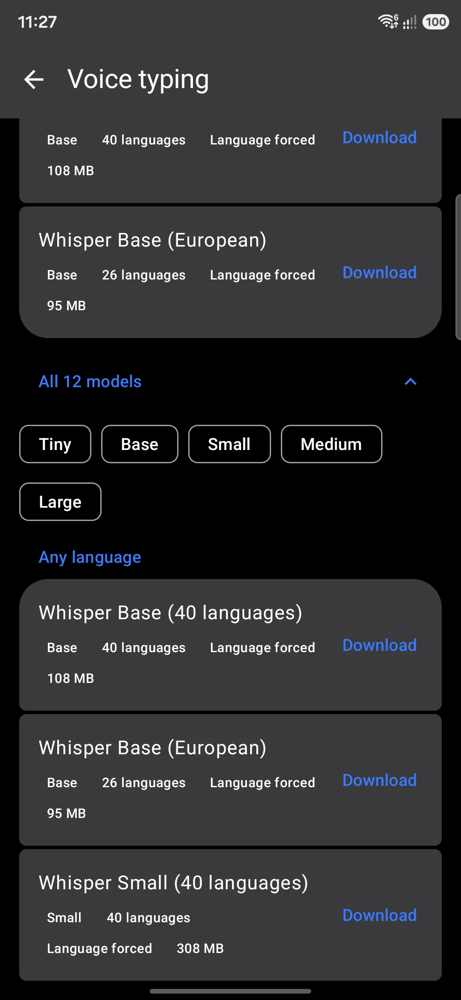

import { Card, CardGrid, LinkCard } from '@astrojs/starlight/components';
import { LinkButton } from 'starlight-theme-black/components';
import FeatureRow from '@components/FeatureRow.astro';
import GestureDemo from '@components/GestureDemo.astro';
import LayoutExplorer from '@components/LayoutExplorer.astro';
import PhoneFrame from '@components/PhoneFrame.astro';
import languages from '@data/languages.json';
import wordlists from '@data/wordlists.json';
import bengali from '../../../../app/src/main/assets/layouts/bpy_bengali.wmlayout.json';

{/* 352 and 333 are computed from the generated data files; the rest are the
    code-verified figures from CONTENT_GUIDE.md (checked 2026-07-28). */}

	<a href="/languages/overview/"><strong>{languages.length}</strong> languages</a>
	<a href="/languages/custom-layouts/"><strong>393</strong> layouts</a>
	<a href="/languages/dictionaries/"><strong>{wordlists.length}</strong> wordlists</a>
	<a href="/tools/overview/"><strong>60</strong> toolbar tools</a>
	<a href="/tools/whisper/"><strong>27</strong> Whisper models</a>
	<a href="/tools/ai/"><strong>8</strong> local LLMs</a>

The short version

## Why WM Keyboard

<CardGrid>
	<Card title="Offline first" icon="padlock">
		Dictionaries, prediction, autocorrect, transliteration and emoji search all run on
		device. No telemetry, no cloud round-trips. The network is opt-in, one tool at a time.
	</Card>
	<Card title="350+ languages" icon="translate">
		You start in the languages your phone is already set to. Avro-style Bangla phonetic
		typing, CJK input and downloadable dictionaries for 330+ languages are all here, plus
		musical notation, braille chording and Morse.
	</Card>
	<Card title="A real tool belt" icon="setting">
		Clipboard manager, translator, OCR & QR scanner, voice typing (online and offline
		Whisper), handwriting, GIFs & stickers, calculator, media controls, even an
		on-device LLM.
	</Card>
	<Card title="Yours to shape" icon="puzzle">
		Material You themes with a full editor, icon packs, addon repositories you can
		self-host, and sandboxed Lua plugins that add new tools to the keyboard.
	</Card>
</CardGrid>

<FeatureRow kicker="Glide typing" title="Slide to type" href="/typing/gestures/" linkText="All the gestures">
	<Fragment slot="media"><GestureDemo type="glide" /></Fragment>
	Trace a path over the letters and lift your finger. The glide engine runs on the
	same dictionaries as prediction, so it works in every language, Bangla included.
	Cursor swipes, long-press popups and spacebar gestures ride along.
</FeatureRow>

<FeatureRow kicker="Voice typing" title="Speech that stays on the phone" href="/tools/whisper/" linkText="Set up Whisper" flip>
	<Fragment slot="media">
		<PhoneFrame caption="The Whisper model catalog">
			
		</PhoneFrame>
	</Fragment>
	Dictate with Whisper running entirely on device. Pick from 27 models, tiny ones
	for older phones up to big multilingual ones, and nothing you say leaves the
	device. There is a lighter online engine too, if you want it.
</FeatureRow>

<FeatureRow kicker="Languages" title="352 languages, one keyboard" href="/languages/overview/" linkText="Browse the languages">
	<Fragment slot="media"><LayoutExplorer layout={bengali} /></Fragment>
	This layout is rendered from the same file the app ships, live on this page.
	Hover any key to peek at its long-press alternates. Custom layouts, phonetic
	typing and per-field language detection are all part of the same system.
</FeatureRow>

<FeatureRow kicker="Privacy" title="Private by construction" href="/privacy/overview/" linkText="Read the privacy tour" flip>
	<Fragment slot="media">
		<PhoneFrame caption="On-device learning, under your control">
			
		</PhoneFrame>
	</Fragment>
	Prediction, autocorrect and learning all happen offline. Every tool that touches
	the network says so up front and stays off until you switch it on. Learned words
	can be inspected, exported or cleared at any time.
</FeatureRow>

Pick a door

## Jump in

<CardGrid>
	<LinkCard
		title="Install & set up"
		description="Get the APK, enable the keyboard, and pick your languages."
		href="/start/installation/"
	/>
	<LinkCard
		title="A two-minute tour"
		description="The strip, the toolbar and the panels, in the order you'll meet them."
		href="/start/tour/"
	/>
	<LinkCard
		title="Languages & layouts"
		description="Add languages, switch between them, and edit or build your own layout."
		href="/languages/overview/"
	/>
	<LinkCard
		title="The tool belt"
		description="Clipboard, translate, voice, OCR, handwriting and the rest of the panels."
		href="/tools/overview/"
	/>
	<LinkCard
		title="Suggestions & autocorrect"
		description="Tune prediction, autocorrect confidence, smart chips and your personal dictionary."
		href="/smart/suggestions/"
	/>
	<LinkCard
		title="Themes & appearance"
		description="Material You themes, the theme editor, fonts, icon packs and backgrounds."
		href="/themes/overview/"
	/>
	<LinkCard
		title="Privacy at a glance"
		description="What stays on device, what the network is used for, and how to turn it off."
		href="/privacy/overview/"
	/>
	<LinkCard
		title="Every setting, explained"
		description="The reference section documents every screen, toggle and slider."
		href="/reference/settings/"
	/>
</CardGrid>

	
Free and open source

	<h2>Get WM Keyboard</h2>
	
No ads, no tracking, MIT licensed. Grab the APK and make it yours.

	

		<LinkButton href="/start/installation/" icon="right-arrow">Install guide</LinkButton>
		<LinkButton href="https://github.com/wasi-master/wmkeyboard/releases" variant="secondary" icon="external">Latest release</LinkButton>
	

